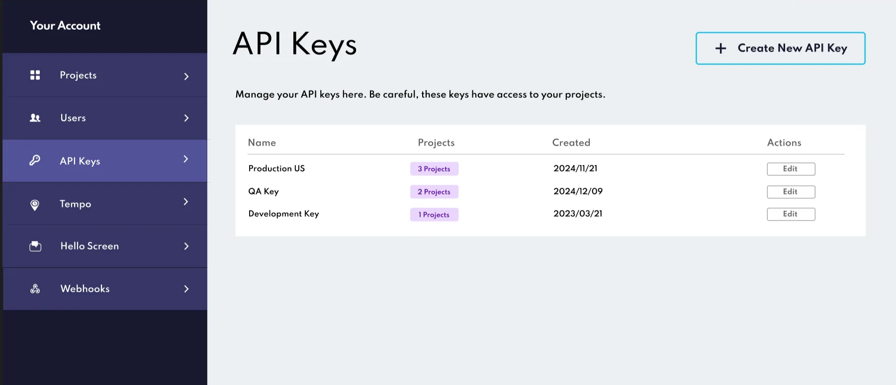
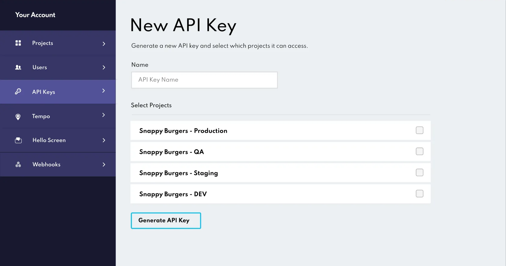
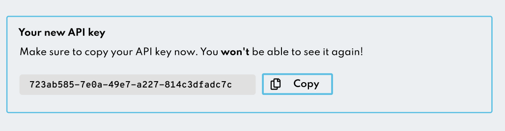
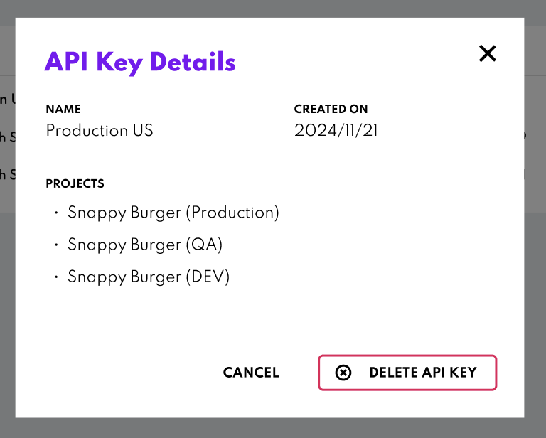

API Keys management
===================

The **API Keys** section is where you create, manage and revoke API Keys to securely interact with **Orders API.** API Keys are critical for authenticating your Orders API requests and controlling which projects those keys can access. Here’s how you can use this section effectively.

## Accessing the API Keys Section

To get started, navigate to the **API Keys** section from the left-hand menu of Canvas. This page give you an overview of all existing API Keys, including their name, the number of projects they’re linked to, and the date they were created.

## Creating a New API Key

Creating an API Key is simple and takes only a few steps:

1. Click the “Create New API Key” button.
2. Enter a descriptive name for the API Key to help you identify its purpose (e.g. “QA Key” or “Production Key ”).
3. Select the projects this will have access to by checking the boxes next to the relevant projects.

Once you’ve completed these steps, click the **Generate API Key** button. Your new API Key will appear on the screen.

:::info
**Important**

This is the only time you’ll be able to view the API Key. Make sure to copy it and store it securely. Once you leave the page, the key will no longer be accessible. 
:::

## Managing Existing API Keys

In this section, you can view the configuration of your existing keys, including their name and the projects the have access to. However, you can’t modify the permissions or details of an existing key. If you need a key with different permissions, we recommend creating a new API Key with the desired configuration. This ensures that the integrity of your existing keys remain intact. 

To update your Orders API implementation, we recommend revoking the old key (if it’s no longer needed) after creating the new one.

### Revoking API Keys

If an API Key is no longer required, you can delete it directly from the API Keys list. Once revoked, the key will become invalid immediately, and any applications using it will lose access to the the associated projects.

