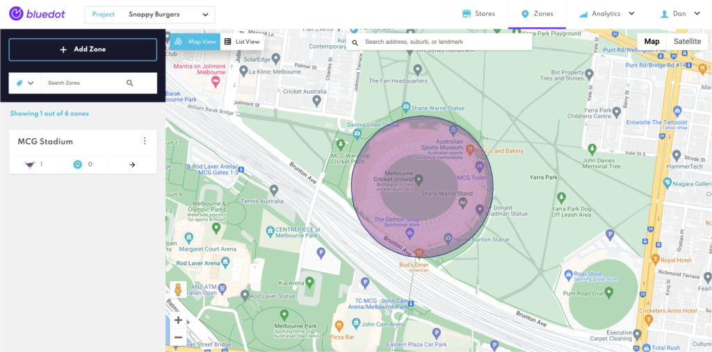

Adding a Zone
=============

You’ll need to create a **Zone** before you can start adding in specific **Geofences**. Each Zone can have one or many **Geofences** – that’s up to you and your use case.

1\. Head to the Dashboard screen

2\. Check you’re using the right Project (the Project dropdown is at the top of the screen)

3\. Click the _+ Add Zone_ button

4\. Give your Zone a name

5\. Search for the address or point of interest (POI) where you’d like to create the geo-fence

6\. Add at least one Geo-fence (learn more here)

7\. Click Create

At any time you head back into a Zone to:

*   Add a new, additional geofence to the Zone
*   Tag the Zone
*   Rename the Zone
*   Edit the size of the geofence

Geofeatures Size Limits
-----------------------

When creating a **Geofence**, it's important to be aware of the size limitations depending on the type of geofeature you are choosing:

* For type `circle`, the minimum radius is 5 meters.
* For types `boundingBox` and `polygon`, the minimum area must be at least 70 square meters.

These limitations ensure that your Geofences are effective and accurate for your use case. Make sure to take these into account when adding a new Geofence to your Zone.

:::info
You can also create Zones programmatically using our Config API. [Learn more about Config API](../APIs/Config%20API/Overview.md).
:::