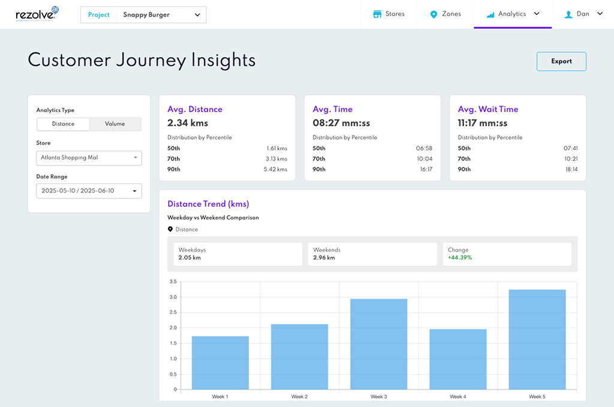
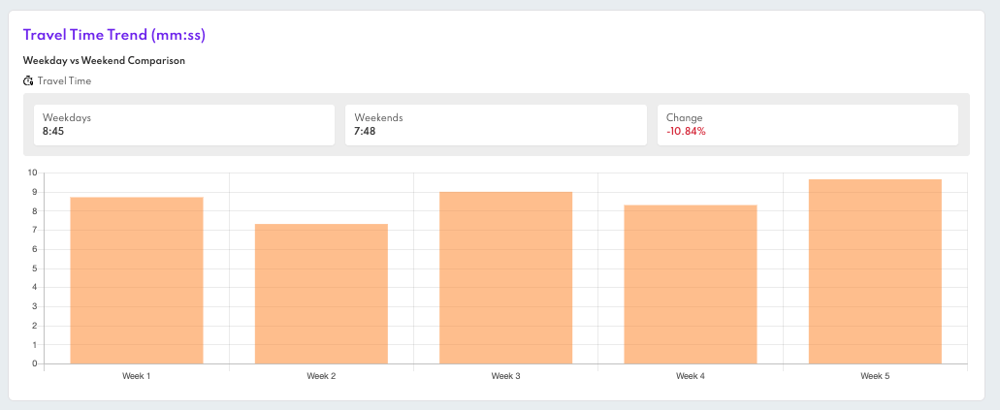
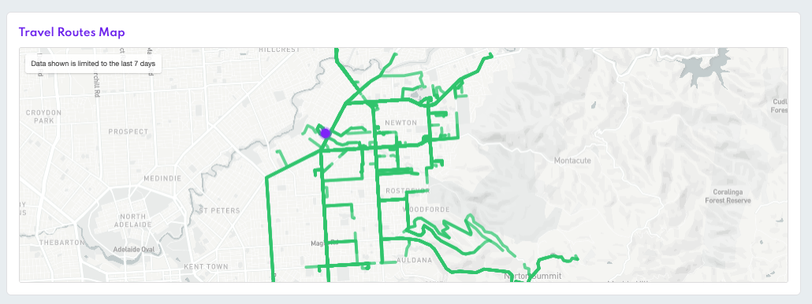
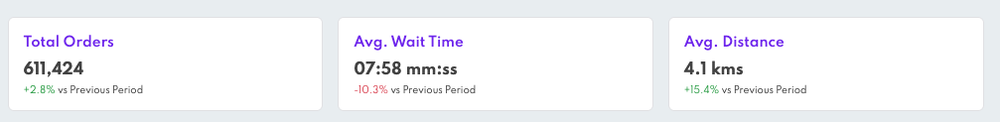
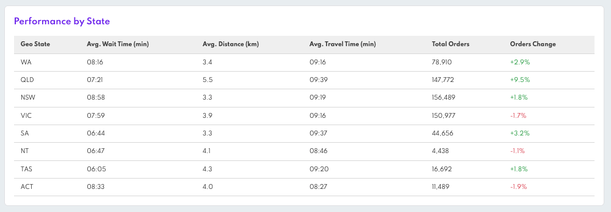

# Customer Journey Insights

### Overview

Customer Journey Insights in Canvas helps you understand how your customers travel, how your stores perform, and how order volumes change across locations. Use it to identify patterns, compare performance, and make informed decisions to improve your last-mile experience.

You can use this feature to:

- Track how far and how long customers travel for pickups
- Compare weekdays and weekends
- Spot changes in travel and wait times over time  
- Benchmark store performance by State, city, or other custom groupings
- Monitor order volume trends and percentage changes

### Accessing Customer Journey Insights

- **Step 1:** Go to Canvas and navigate to the Analytics section from the left sidebar.
- **Step 2:** Open the Insights tab.
- **Step 3:** Choose between two analysis modes using the Analytics Type toggle:
  - **Distance:** See how far customers are travelling to each store.
  - **Volume:** Compare performance metrics grouped by custom data (like State or market).

## Distance Analysis (Per Store)

### How Distance Analysis Works

In the Distance view, you can select a specific store to analyse customer travel patterns, including how far they travel, which route they used to get to the store, the duration of those trips, and how long they wait after arrival.

To begin, select a store from the dropdown menu. Then, choose your desired date range and specify how you want the data to be grouped—by hour, day, or week. You can also filter the data by day type, such as weekdays or weekends, to focus on particular timeframes.

At the top of the dashboard, you will find summary cards displaying the average distance, travel time, and wait time for the selected store. Each metric includes percentile breakdowns (50th, 70th, and 90th percentiles) to provide a more detailed view of performance.

Below the summary section, trend charts illustrate how each of these metrics changes over time. When viewing data for all days, you will also see comparison cards that highlight the differences between weekdays and weekends.

### Travel Route Map

An interactive map displays a sample of customer trips to the selected store. The store is pinned in the center. You can zoom in and out, but there are no individual trip details shown.

:::info
This view only includes trips from the last 7 days, regardless of the date range selected.
:::

## Volume Analysis (Across Stores)

### How Volume Analysis Works

The Volume view allows you to compare store performance across various groups such as state, city, market, or store type. These groups are defined by the Custom Data fields you have established in your project.

To begin, select:

- A Custom Data field to organize the results (for example, state or store type).
- A date range, which the system also uses to calculate the previous period for comparison.

At the top of the view, you will find summary metrics, including:

- **Total Orders**
- **Average Wait Time**
- **Average Distance**

Each summary includes the percentage change compared to the previous period, making it easy to observe trends over time.

Below this, the Performance Table provides a detailed breakdown of these metrics by group:

- **Total Orders**
- **Average Distance and Travel Time**
- **Average Wait Time**
- **Percentage Changes from the Previous Period**

Positive changes are indicated in green with an upward arrow, while negative changes are shown in red with a downward arrow. 

Only groups with data during the selected time range will be displayed. Any stores lacking the selected Custom Data field will be excluded from the results.

### Exporting Reports

You can export the data shown into a CSV file. The export includes:

- Distance and time traveled
- Custom data values for each store
- Local browser time zone
- The report is sent to the email address used to log into Canvas

Just click "Export" and you'll receive the report shortly by email. A modal will confirm the export is in progress.

