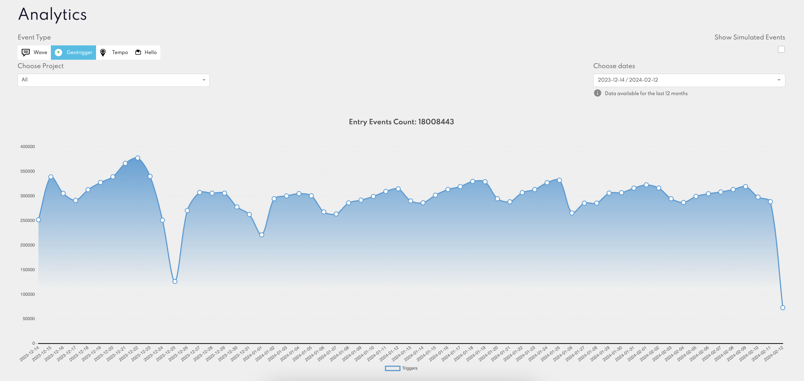

# Historical Event Tracking

### Overview

Our analytics platform's "Historical" feature enables users to track and visualise the number of events generated by Rezolve products over time. This tool lets you segment the visualised data by specific event types, such as Geo-triggering, Tempo, Wave API and Hello.

### Accessing Historical Analytics

- **Step 1:** Select the "Analytics" tab from the Navigation bar.
- **Step 2:** Click on "Historical" from the dropdown menu.

### Selecting Event Types for Visualisation

Within the Historical feature, users can filter the data to visualise the following event types:

- **Geo-triggering:** Tracks daily "Entry" events generated by the Mobile SDK.
- **Tempo:** Displays daily updates generated by our Mobile SDK, reflecting users' location updates.
- **Wave API:** Shows the daily count of Wave API events, indicating API usage levels.
- **Hello Screens:** Provides data on the daily events generated by the Hello Screens.

:::info
The displayed data only covers the past 12 months.
:::

### Filters

The line chart visualisation is designed for simplicity with the following filters:

- **Date Range Selection:** You specify the date range for the events they wish to view, allowing for flexible historical analysis.
- **Project Filter:** The visualisation supports filtering by Project.
- **Interactivity:** Hovering over any point on the line chart will reveal detailed information about the number of events for the selected date.

