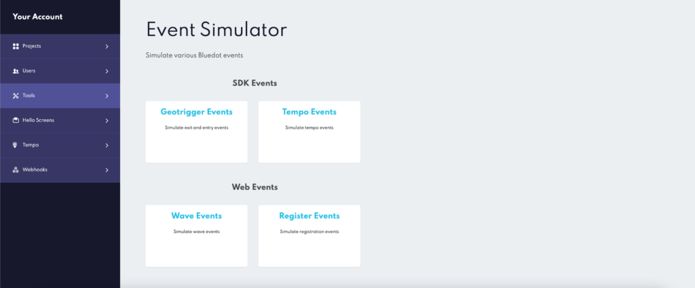
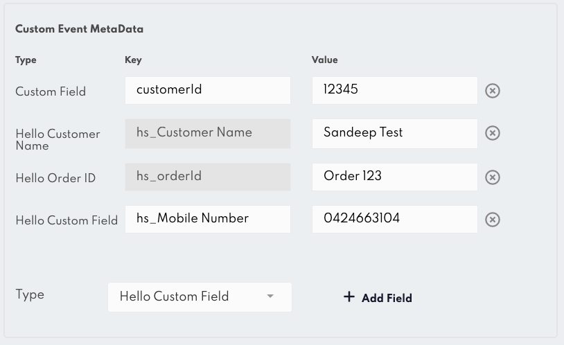
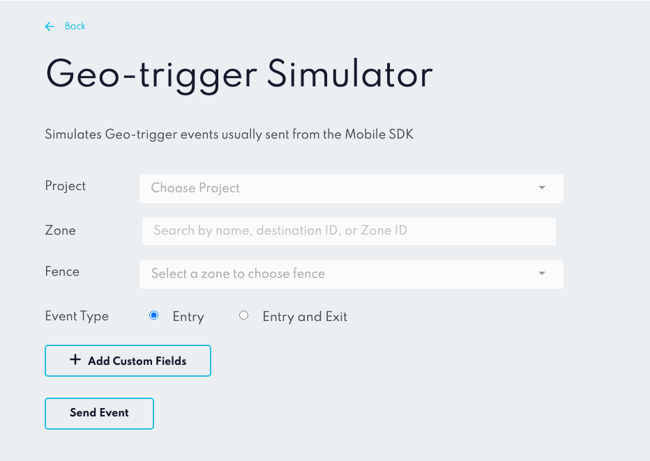
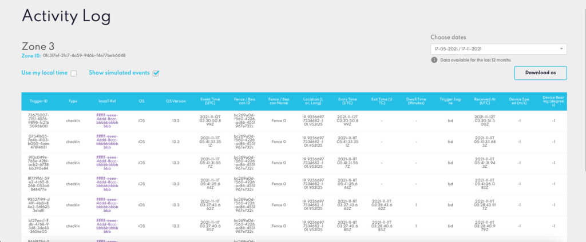
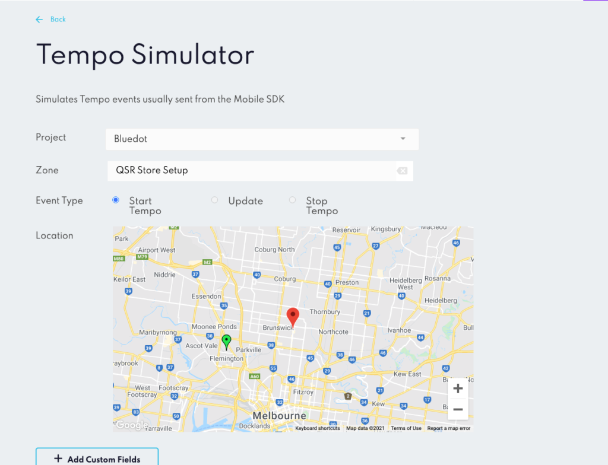
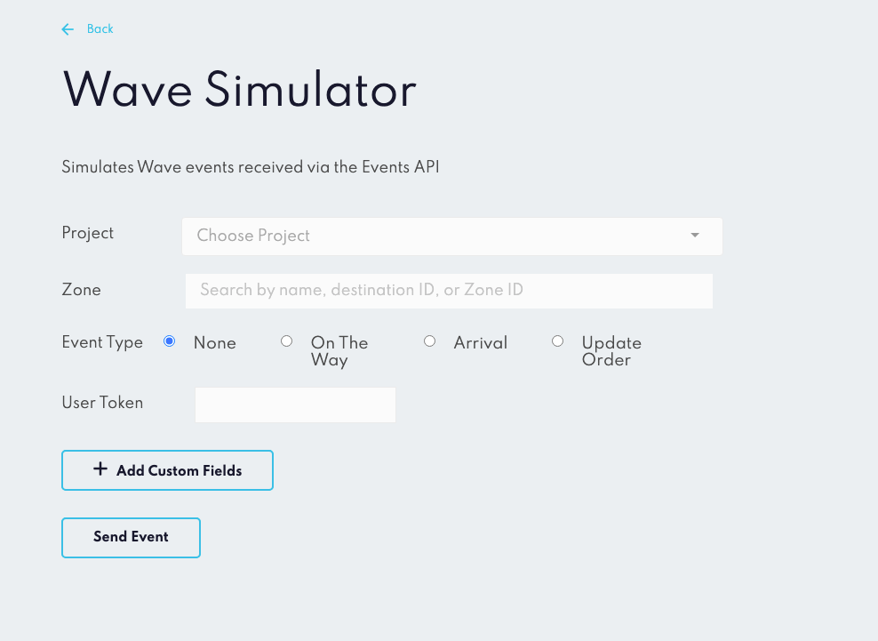
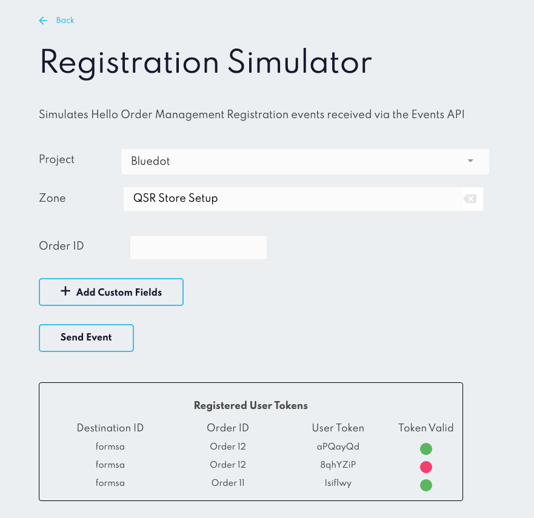

Event Simulator Guide
=====================

Canvas Event Simulator is a tool designed to help test your Bluedot setup. It simulates events which would usually be sent by the mobile SDK (Geo–trigger and Tempo events) as well as web events sent via the Events API. The simulator can help during project set up to confirm that your systems (such as webhook receivers, Tempo time ranges or Hello Screens set up) are correctly configured.

**Custom Meta Data in simulated events**
----------------------------------------

For each of the event types, you may optionally add any custom fields to be attached to the event. This represents the ability to add custom data in SDK and Web events via the `customEventMetaData` object. To add custom data fields first click the _Add Custom Fields_ button to open the interface.

When adding custom fields you can select the type of custom field from the _Type_ dropdown.  For these fields the keys are pre-defined, and you only need to input the value. If you want to define both the key and value select the “Custom Field” option.

:::info

Some custom data fields have a special meaning, such as those tied to Hello Screens or our SFMC and mParticle integrations. For more information check our [Hello Screens documentation](../Hello%20Screens/Overview.md) and [Integrations documentation](../Integrations/Overview.mdx)
:::

**Simulate Geo-trigger Events**
-------------------------------

The Geo-trigger Simulator simulates the core _Entry_ and _Exit_ events generated by the mobile SDK. These are the events that are sent when a mobile user enters or exits a Zone. To send a Geo-trigger event first select the target Project, Zone and Fence. If you wish to send an _Entry_ and _Exit_ event you will also be asked to specify a dwell time. In this case, two events will be sent, the first an _Entry_ event, and after that, an _Exit_ event with the event times separated by the specified dwell time.

Geo-trigger events are usually visible in the Analytics pages of Canvas, as well as the Activity Log pages for both individual zones and individual `installRef` (users). Simulated events are excluded by default from Analytics events to ensure they are not confused with production data. To view simulated events in the Activity Log pages via Canvas just select the Show simulated events checkbox on the Zone or Install Ref Activity Log pages. Simulated events are easy to identify by their fixed `installRef` value: `"ffffffff-eeee-4ddd-8ccc-bbbbbbbbbbbb"`.

**Simulate Tempo Events**
-------------------------

The Tempo Event simulate allows you to simulate Tempo events usually sent via the mobile SDK. As Tempo is an added value service, your account must have Tempo enabled for these events to be successfully received. To start a Tempo journey select a Project and valid destination Zone (Tempo destinations must have a `destinationId`). The first event of a Tempo journey must be a Start Tempo event.

After selecting a Zone, a map will appear with your destination Zone in the center. You can then select a location on the map to send your first Tempo event. If you have Hello Screens enabled (and have added the required Hello Screens custom data), you will then be able to see the resulting event within Hello Screens with the estimated time of arrival based on that location.

To continue sending events for the same journey you can select new locations on the map and send more Update events. If you want to send a `tempoStop` update, indicating the journey has been cancelled, select the Stop Tempo event type. After sending a Stop Tempo event you are free to create a new Tempo journey.

**Simulate Wave Events**
------------------------

Wave events are an alternate way to send updates without the use of the mobile SDK. They can be useful for reaching customers that do not wish to provide location permissions or download a mobile application. For Wave the only required fields are Project and Zone. Wave event Zones must have a `destinationId`, as this is used to identify the target when sending a Wave event.

Wave events can include an `eventType`, which allows them to be interpreted in specific ways in Hello Screens. They can also include a User Token, which is a value that must be included for updates to orders which have been registered via Registration events.

**Simulate Registration Events**
--------------------------------

Registration events are another form of event that is received via the Events API. These events allow `customEventMetaData` to be attached to an order at the time the order is placed, but before the customer indicated they have started journeying to the location via a Wave update.

Registration events return a `userToken` that is used to validate subsequent updates to that `orderId` are from the correct source, and also provide a mechanism for retrieving Hello API data for a specific order. Currently, their primary purpose is to support Now Ready Screens, which provides a customisable web interface for users to indicate when they are on the way or arrived at a location.

As Hello API orders are identified by `orderId`, if a registration event is sent with the same `orderId` as an existing order, the previous order will be overwritten by the most recent order. This is designed to support systems which may reuse `orderId` after a certain period. The simulator keeps track of these updates, letting you know when a more recent event has invalidated a previous `userToken` via the _Token Valid_ column.