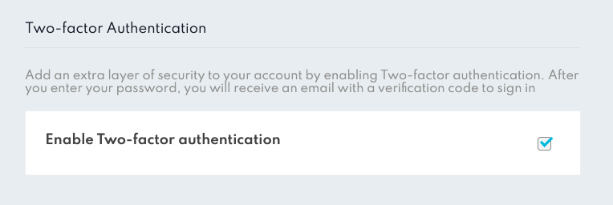
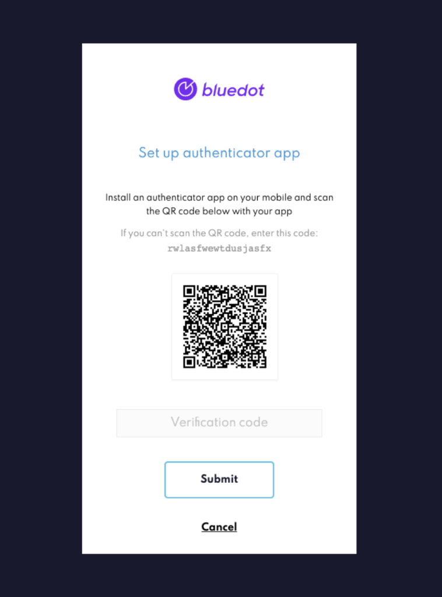
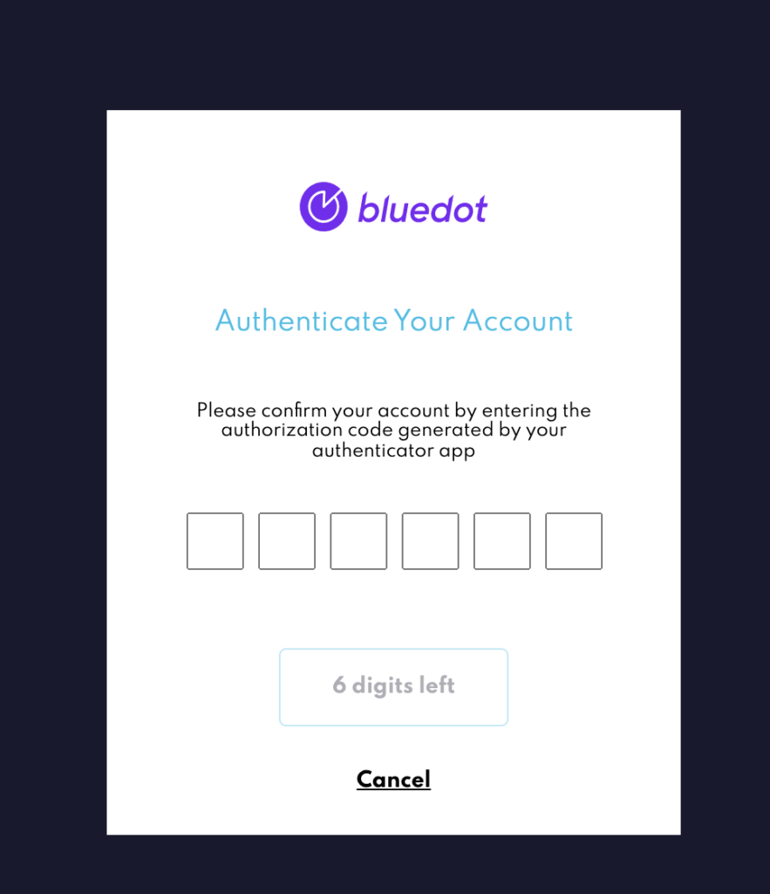

Mandatory Two-Factor Authentication
===================================

We are making it simpler for **Administrator** users to mandate that all members should set up 2FA to access Canvas. Enabling two-factor authentication means that Canvas will ask for an additional code, in addition to email and password, when authenticating. Admins can make 2FA required by turning on this preference inside _User_ settings.

Canvas two-factor authentication uses a time-based one-time password (TOTP). These authentication codes can be generated by using authenticator apps such as Google Authenticator, Microsoft Authenticator or any other authenticator app using the TOTP standard.

Enabling 2FA as required for a user
-----------------------------------

As an **Administrator**, you can turn on two-factor authentication from the “_Users_” section in Canvas.

Once 2FA is turned on, users in your account will need to set up the 2FA using a third-party authentication app.

The next time the user logs into Canvas, they will have to enter the 6 digit code as displayed inside the authenticator app.

