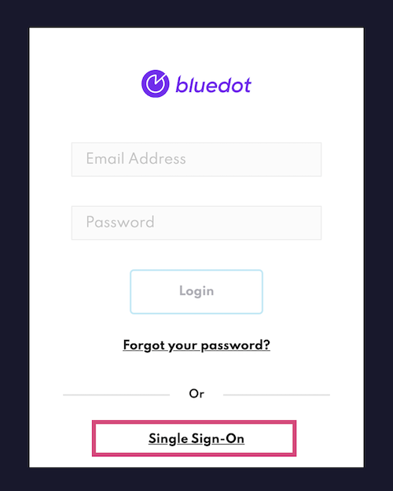

Single Sign-On (SSO) is a user authentication process that allows users to access multiple applications with one set of login credentials. In addition to the user authentication provided by Bluedot, you can also use single sign-on (SSO) to authenticate your users in **Canvas** and **Hello Screens** with your own Identity Provider (IdP).

Enabling Single Sign-On (SSO)
-----------------------------

If you want to enable SSO, get in touch with your Bluedot account manager, who will initiate the configuration accordingly. You can enable SSO for accessing Canvas, Hello Screens or both.

### Step 1: Confirm Your Identity Provider (IdP)

Confirm the Identity Provider (IdP) you're using, ensuring it supports standard protocols like SAML, OIDC, OAuth, or JWT.

### Step 2: Share Your SSO Details

For SSO setup on our platform, please provide the following:

- **Metadata Document:** If available, this document from your IdP contains all necessary configuration details.
- **Alternative Information:** If the metadata document isn't available, please provide:
    - Sign On URL
    - Signing Certificate
    - Entity ID

:::info
For enabling SSO in **Canvas**, we require the names of the attributes you'll send in your SAML assertion. Essential attributes **must** include email, first name (at least one character), and last name (at least one character). Defaults for names can be set if needed.
:::

### **User Authentication Flow**

- **Login Process:** Once SSO is enabled, users will be redirected to your IdP’s login page when accessing our platform. Post-authentication, they'll return to our platform.