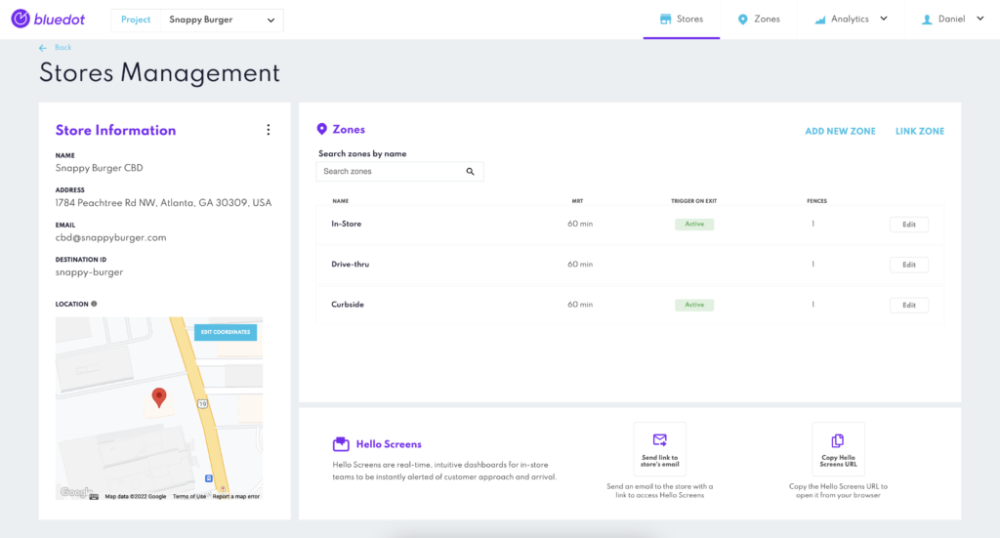
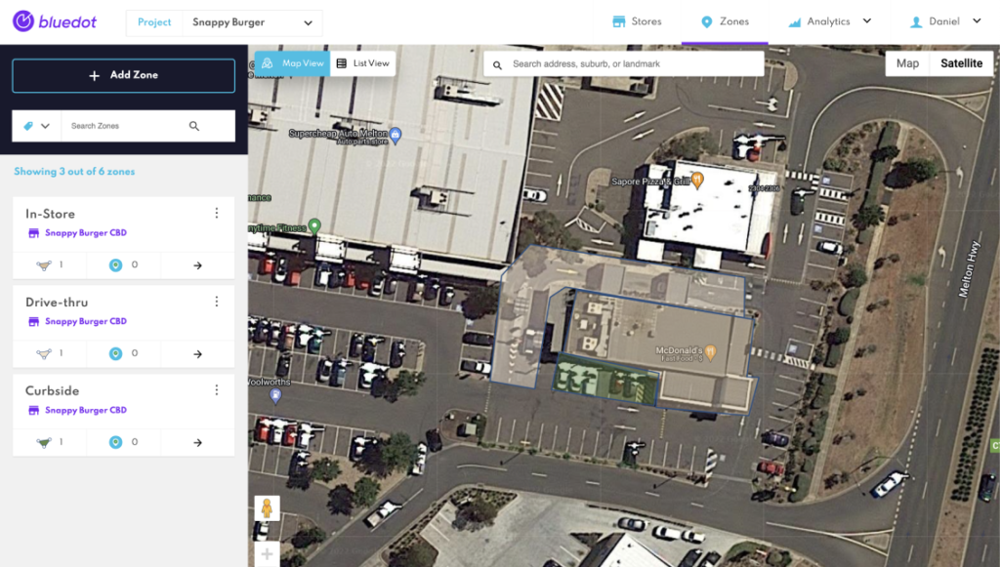
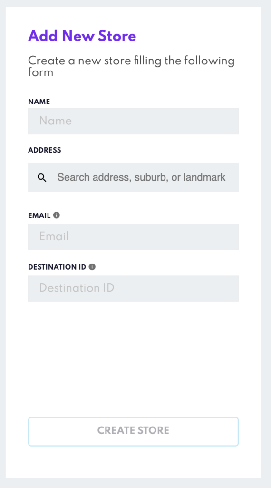
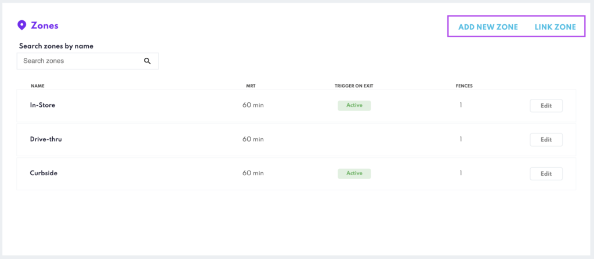
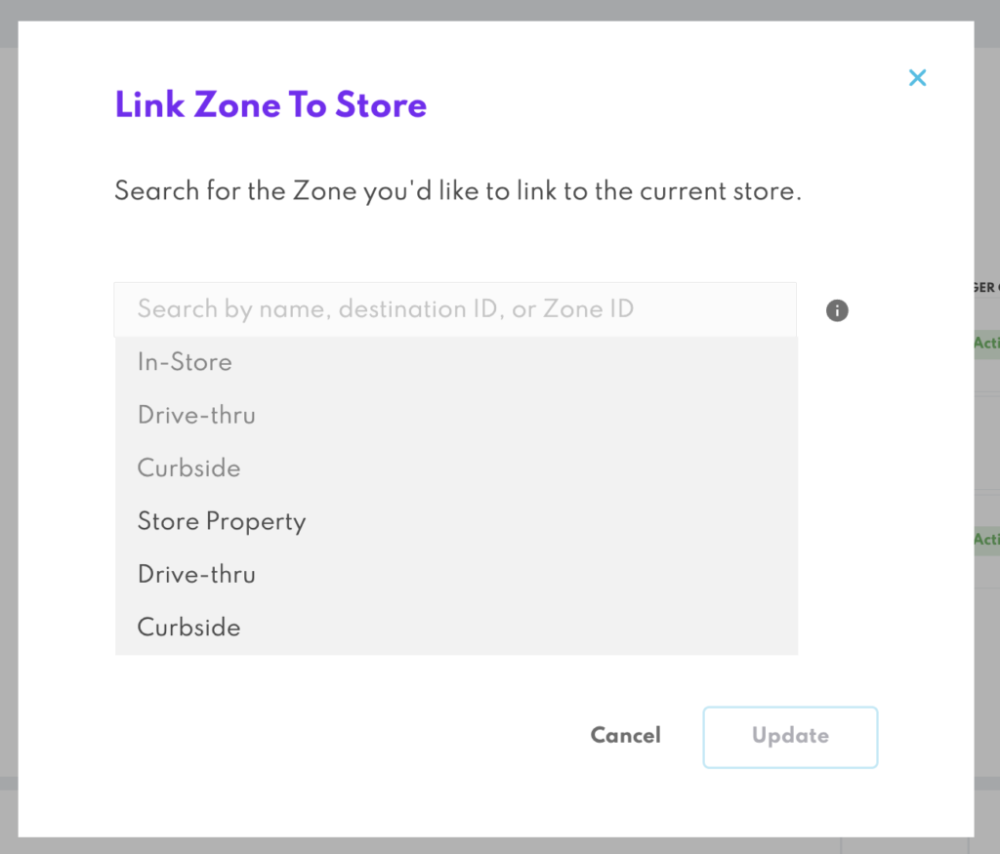
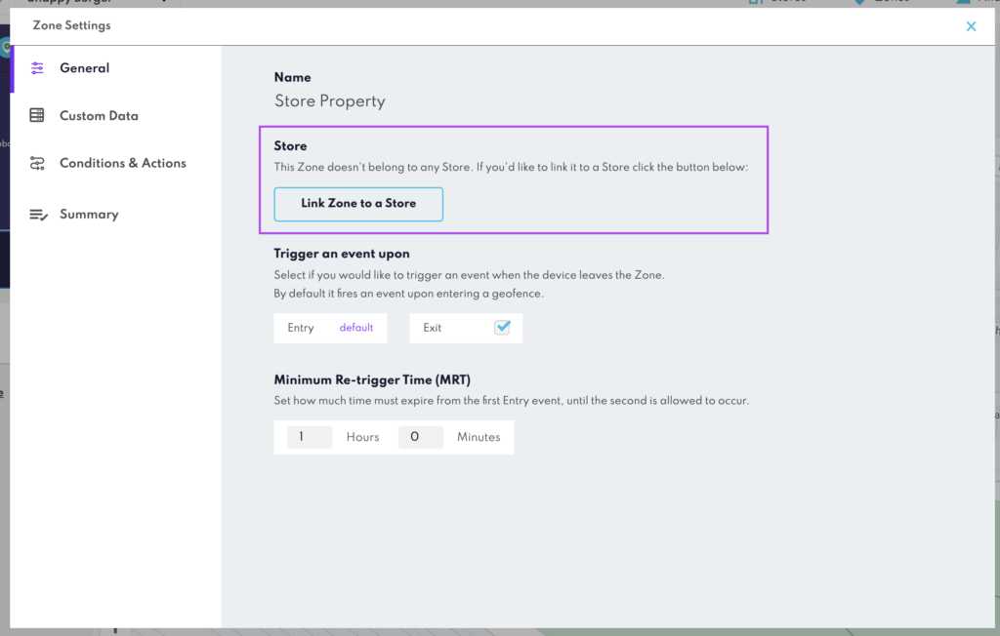
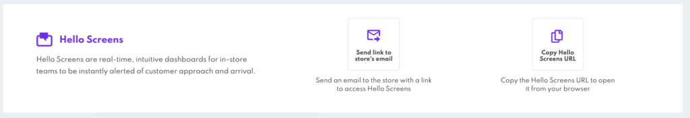
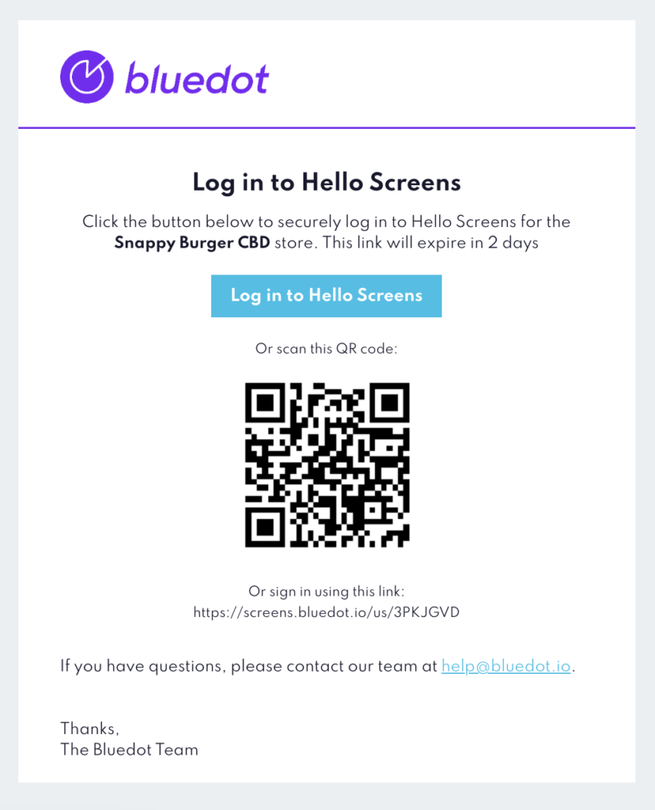
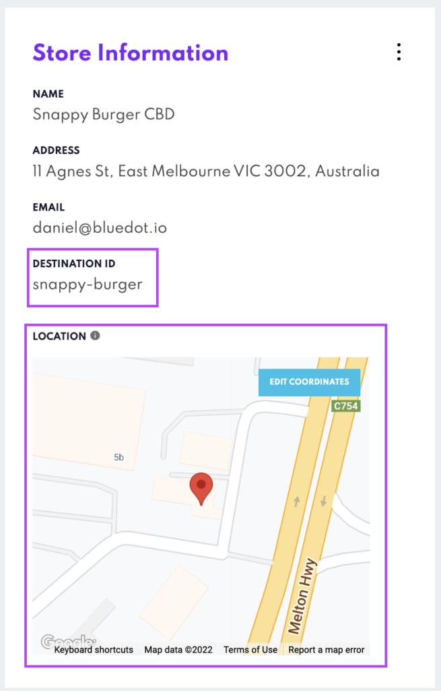

Store Management
================

Canvas now has available the Store Management feature. Store Management simplifies how you create, manage and group the Zones related to a store. It also makes it easier to send Hello Screen links to the stores.

Now it’s much simpler to organize your Zones for each store with the Store Management feature. You’ll simply create a Store and add or link Zones for the different use cases, for example, a curbside, drive-thru or in-store Zones.

Creating a Store
----------------

You can create stores from Canvas or programmatically with Config API.

### From Canvas

You’ll find a new “Stores” button on the main navigation bar to go to the Store Management section. From there, you’ll just need to fill out the “_Add New Store_” form with the basic details about the store, such as the address and the store’s email. We’ll use the address to calculate the customer’s ETA to your store and the store’s email to send the links and steps to access Hello Screens.

:::caution
The Destination ID must be unique; once created, _it can’t be changed_. If you want to change the Destination ID, you’ll need to delete the store and create a new store with a new destination ID. When deleting a store, you can keep the Zones and link them again to the new store.
:::

### From Config API

We’ve introduced a new set of endpoints to manage the stores in Config API: Destinations. You can use these endpoints to create, edit and delete stores. As the Destination ID is now part of a store instead of a Zone, you’ll need to:

1.  Create a store (A.K.A destination) using the `/destinations` endpoint
2.  Link Zones to the store by adding the `destinationId` to the Zones using the `/zones` endpoint

Check the Config API documentation for more details [here](https://config-docs.bluedot.io/)

Adding a Zone to a Store
------------------------

You can link a Zone to a store by clicking the “_Add New Zone_” if you’re creating the store for the first time. If you want to link an existing Zone, click the “_Link Zone_”.

*   *   Clicking on the Add New Zone button will take you to the Zone creation section. Once the Zone is created, it will automatically linked to the Store. To learn more about creating a Zone, check the [Adding a Zone documentation](../Canvas/Add%20a%20new%20zone.md).
    *   The Link Zone button will open a modal, where you can look up and select the Zone you’d like to link to the store  
        

*   You can also link Zones from the Zone Settings modal by clicking the _Link Zone to a Store_ button  
    

Send the Hello Screens links to the store
-----------------------------------------

Sharing the link to access Hello Screens with your stores is now simpler. There’s a new Hello Screens section at the bottom of each store where you can:

*   Send an email to the store with the steps to open Hello Screens
*   Get the link to open Hello Screens

In the email, you’ll find a link to open Hello Screens to track the orders for the store and a QR code you can scan. It will open the screens in your browser or the mobile app if installed on your device.

Calculating ETA to the Store’s location
---------------------------------------

As you can now link multiple Zones to a store, the Destination ID is no longer part of a Zone, instead are part of the Store. Each store will have a unique destination ID and location (coordinates) that the Mobile Point SDK will use to calculate the ETA of a customer to the store.

The store’s location can be adjusted to the coordinates by pressing the “Edit coordinates” button. Updating the location of the store doesn’t update its address. The coordinates are just the point of reference the SDK will use to calculate the ETA of the customer.