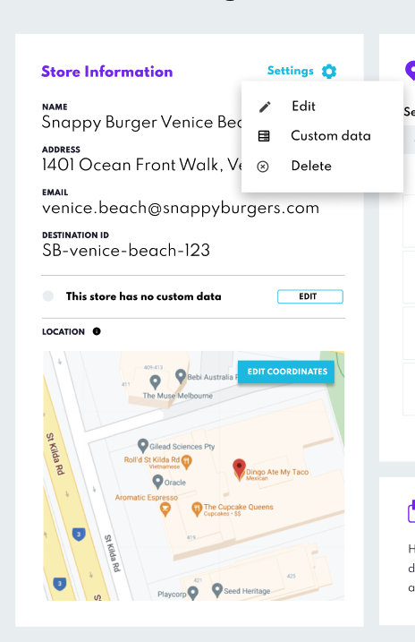
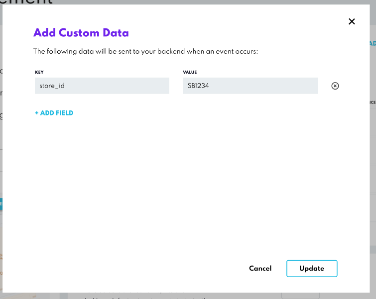

You can now attach **Custom Data** to your Stores (also known as Destinations) in both **Canvas** and via the **Config API**. This allows you to add useful metadata—like store type, region, or internal store IDs—directly to your location records.

Custom Data is also included in webhook payloads, making it easier to integrate this information into your own backend systems, and to support deeper analytics and insights.

### Use Cases

- Link internal store identifiers (e.g. `store_id: SB1234`) to match backend systems.
- Tag stores with additional info (e.g. `type: drive-thru`, `region: west-coast`).
- Power advanced analytics with consistent metadata across locations.

### Managing Custom Data in Canvas

You can manage Custom Data for any Store directly from the **Store Management** page in Canvas.

### How to Add or Edit Custom Data

1. Navigate to **Store Management** and open any Store.
2. From the **Settings** dropdown (or directly in the Store Info panel), select **Custom Data**.

3. Use the modal to add up to **20 key-value pairs**.
4. Click **Update** to save your changes.

### User Permissions

**Admin** and **Write** users can add, edit, and delete Custom Data. **Read-Only** users can view the custom data, but can’t make changes

### API Integration (Config API & Webhooks)

You can also manage Store Custom Data programmatically using the **Config API**, and receive this data in your **Webhook payloads**:

- Add or update Custom Data when creating or modifying a Store.
- Retrieve existing Custom Data when fetching Store details.
- Store metadata is automatically included in webhook payloads that contain Store information.

:::info
Store Custom Data is only included from Webhook payload version 2.1. Make sure to select this version when configuring your webhooks to receive the data.
:::

For more further details check  [Config API documentation](../../APIs/Config%20API/Overview.md) and [Webhooks documentation](../../Webhooks/Overview.md).
