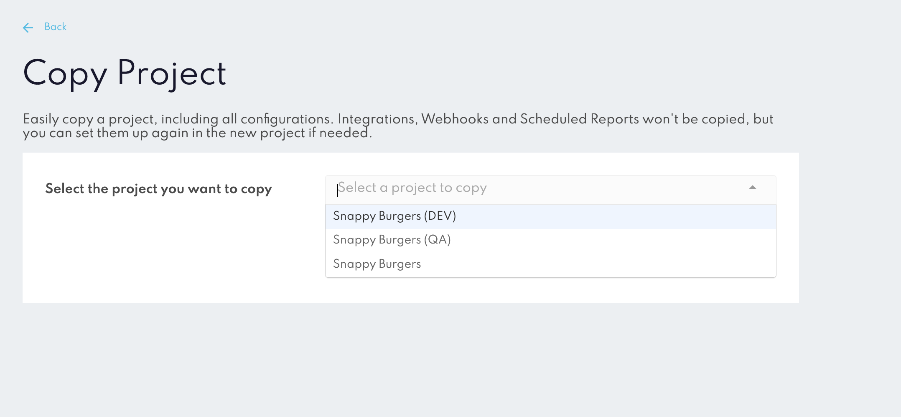
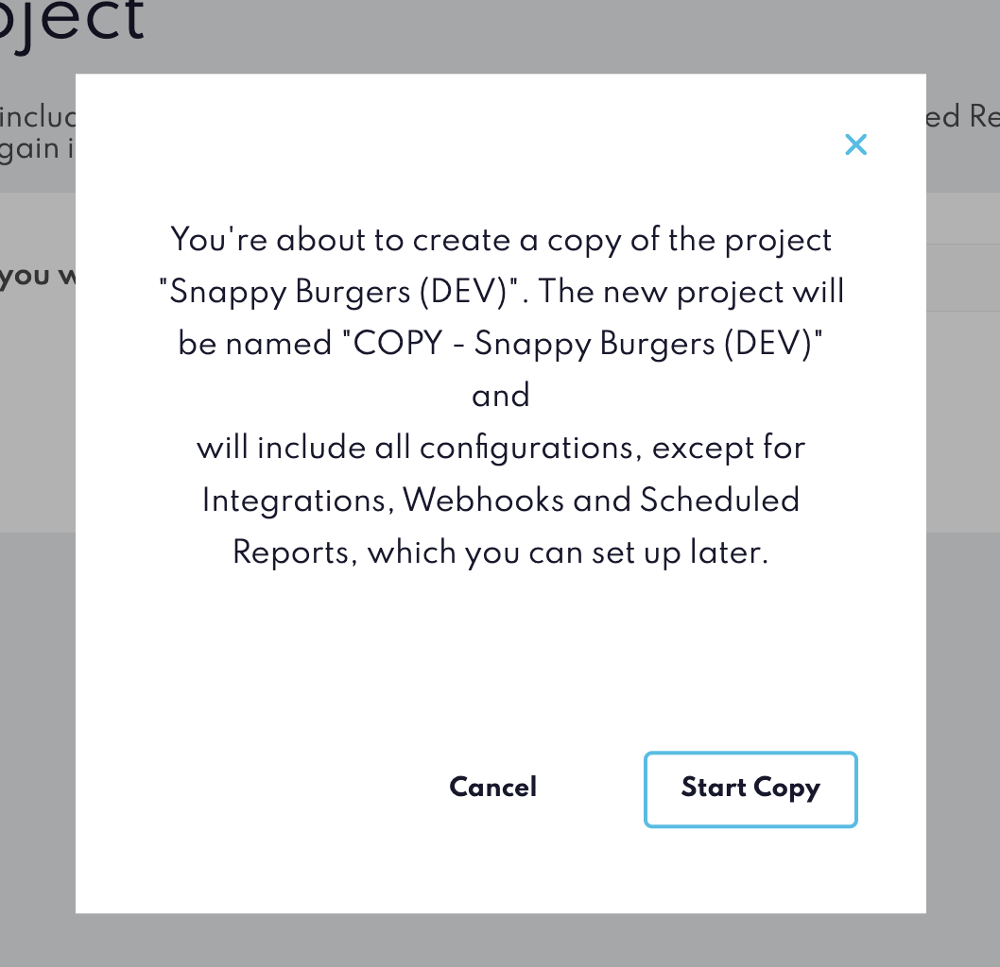

Copy Project
============

The Copy Project tool in Canvas allows users to duplicate entire projects quickly, providing a convenient way to create new projects based on existing templates.

### How to Use the Copy Project Tool

1. Select the Project to Copy :In the Copy Project interface, choose the project you want to duplicate from the dropdown list.

2. Once you’ve selected a project, click on the Copy Project button to start the duplication process.

3. A confirmation modal will appear, summarizing the operation. Confirm to start the process. You’ll be notified via email once the copy is complete.

The new project will automatically be named "COPY - [Project Name]". After copying, you can rename it in the project settings if desired.

:::info
Integrations, Webhooks, and Scheduled Reports will not be copied over. If needed, these will need to be set up again in the new project.
:::

Once you confirm, the copy will start in the background, allowing you to continue working in Canvas. You’ll receive an email notification when the copy process completes. If the copy process encounters an issue, you’ll receive an error email letting you know that the task wasn’t completed successfully.