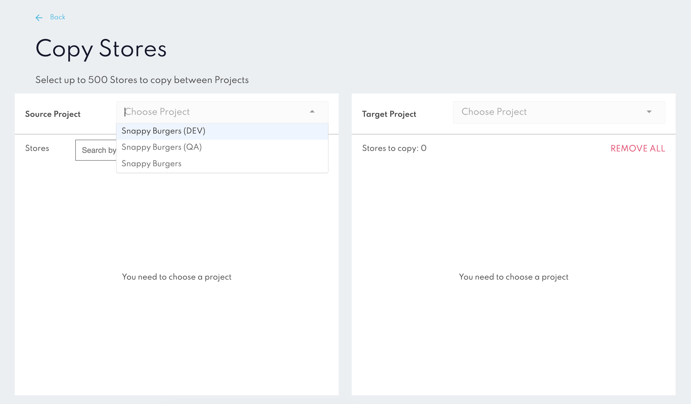
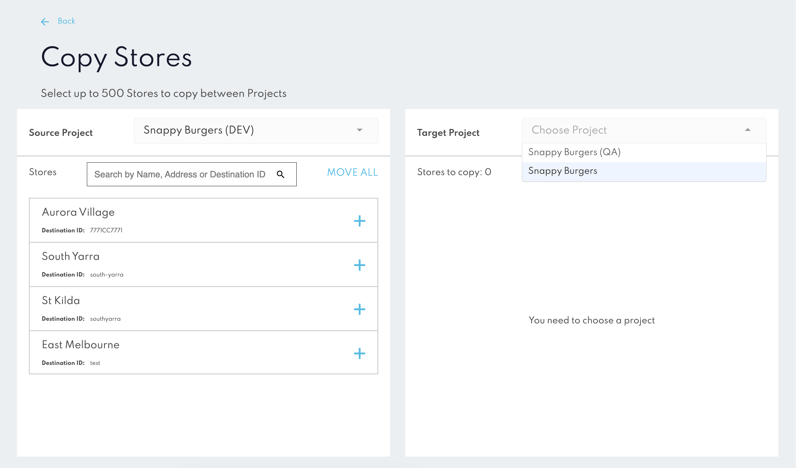
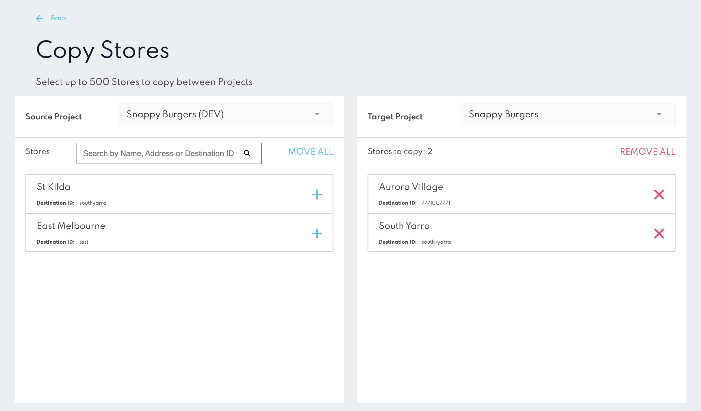

Copy Stores
===========

The **Copy Stores** tool in Canvas allows users to duplicate Stores from one project to another, simplifying the setup process across multiple projects.

### How to Use the Copy Stores Tool

1. **Select the Source Project:** In the Copy Stores tool, choose the project containing the Stores you want to copy.

2. **Select the Target Project:** Choose the target project where the Stores will be copied.

3. **Select Stores to Copy:** Select individual Stores or choose all Stores to copy, up to the maximum limit of 500.

4. **Confirm and Copy**: After reviewing selections, confirm to initiate the copy process. The tool will duplicate the selected Stores in the target project, maintaining all relevant configurations.

:::info
Do not close the browser tab or navigate away from the Canvas page while the copying process is in progress. Doing so may interrupt the operation and result in incomplete Store transfers.
:::

### Caveats and Limitations
* **Maximum Stores:** You can copy up to 500 Stores in one action. For larger transfers, multiple actions may be necessary.

* **Project Settings:** The Copy Stores tool only duplicates Store configurations. Other project-specific settings, integrations, and webhook setups are not affected.