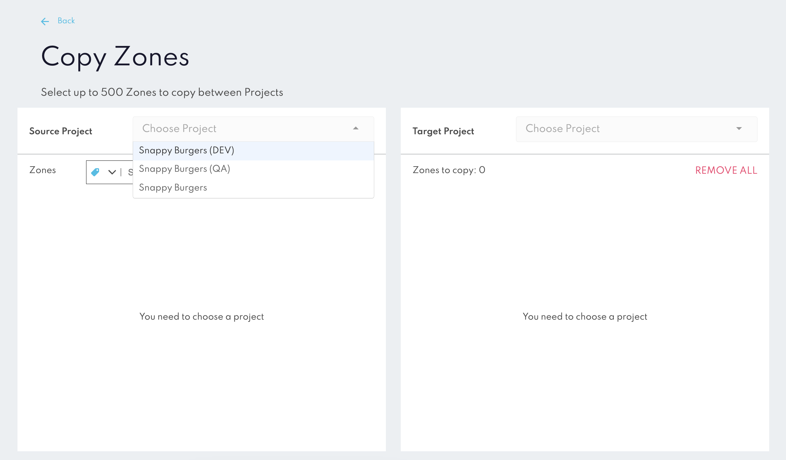
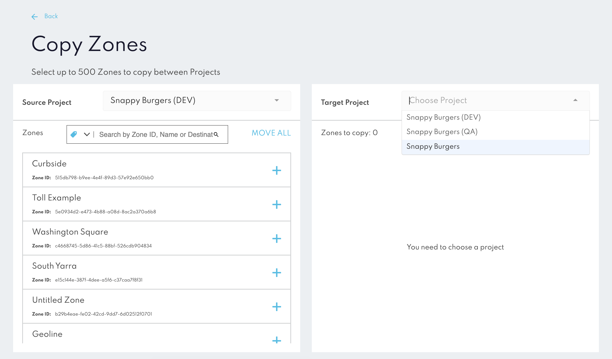

Copy Zones
==========

The **Copy Zones** tool in Canvas allows users to quickly duplicate zones between projects, making zone management efficient and minimizing manual setup.

### How to Use the Copy Zones Tool

1. **Select the Source Project:** In the Copy Zones interface, choose the project containing the zones you want to copy.

2. **Select the Target Project:** Choose the target project where the zones will be copied.

3. **Select Zones to Copy:** Users can either select individual zones or choose all zones up to the 500-zone limit.

4. **Confirm and Copy:** After reviewing selections, confirm to initiate the copy process. The tool will duplicate the zones in the target project, preserving configurations.

:::info
Do not close the browser tab or navigate away from the Canvas page while the copying process is in progress. Doing so may interrupt the operation and result in incomplete zone transfers.
:::

### Caveats and Limitations
* **Maximum Stores:** You can copy up to 500 Stores in one action. For larger transfers, multiple actions may be necessary.

* **Project Settings:** The Copy Stores tool only duplicates Store configurations. Other project-specific settings, integrations, and webhook setups are not affected.