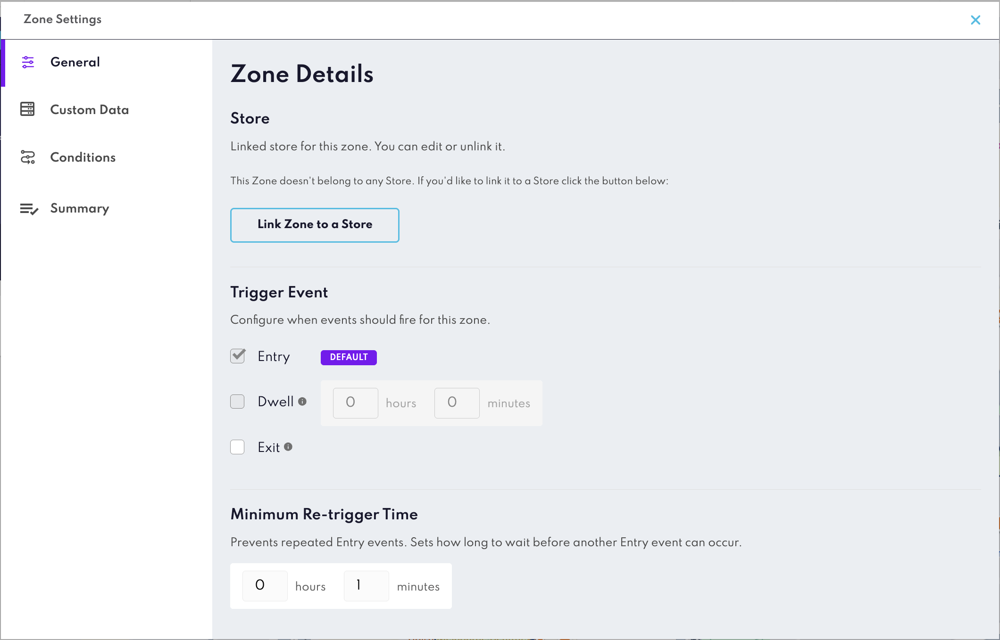
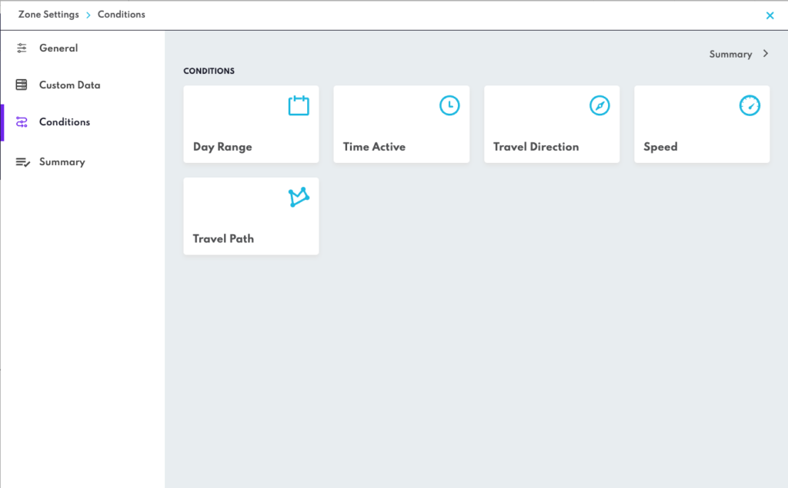

Zone Settings
==============

## What Are Zone Settings?
Zone Settings define how a Zone behaves when a user enters, exits, or dwells within a geofence. They allow you to control timing, conditions, and additional data for precise and personalized location-based experiences.

## Core Concepts

### Entry Event
Triggered when a user enters the Zone’s geofence.Ideal for welcoming users or initiating engagement as they arrive.  

**Example:** Send a push notification offering a discount when a customer enters your store.

---

### Exit Event
Triggered when a user leaves the Zone’s geofence. Useful for feedback or follow-up actions after a visit.  

**Example:** Prompt a survey after a customer exits the store.

---

### Dwell Event
Triggered when a user remains inside the Zone for a specified duration. Helps identify meaningful engagement rather than quick visits.  

**Configuration:** Set hours and minutes for the dwell threshold.  

**Example:** Offer a loyalty reward if a customer stays for more than 10 minutes.

---

### Minimum Retrigger Time (MRT)
Controls how often an **Entry event** can fire after the previous one. Prevents repeated triggers in quick succession, improving user experience.  

**How it works:**  
- MRT sets a cooldown period (e.g., 30 minutes, 1 hour) before the same Zone can trigger again for the same user.  
- Applies only to Entry events.  

**Example:** If MRT is set to 30 minutes, a user who re-enters within that time won’t receive duplicate notifications.

__

## Other Zone Settings
- **Conditions:** Rules that must be met for the Zone to trigger.
    - **Day Range & Time:** Schedule when the Zone is active.
    - **Travel Direction & Speed:** Detect movement patterns, such as entering vs. exiting or traveling above a certain speed.
    - **Travel Path:** Specify route-based triggers for more accurate targeting.
- **Custom Data:** Attach metadata to personalize campaigns or pass additional context to your app. [Learn more here](../Custom%20Data.md)

__

Click the **Summary** button in the top right corner of **Zone Settings** for an overview of all the Settings currently applied to your Zone.