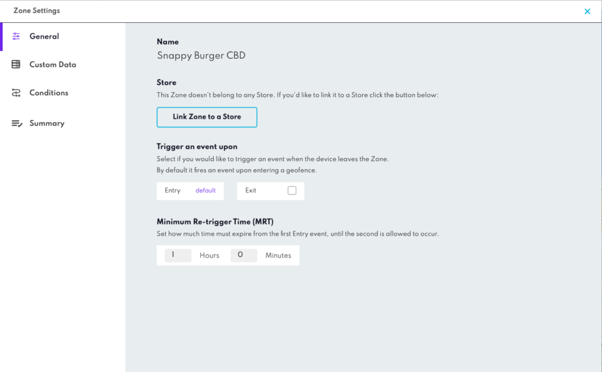

What are Zone Settings?
=======================

**Zone Settings** includes all the configurable settings available on a Zone that decide how all the geofences within a Zone will work.

Types of Zone Settings:

*   Name
*   Conditions
    *   Day Range & Time
    *   Travel Direction & Speed
    *   Travel Path
*   Retrigger Time
*   [Custom Data](../Custom%20Event%20Metadata.md)

__

_  
_

Click the **Summary** button in the top right corner of **Zone Settings** for an overview of all the Settings currently applied to your Zone.