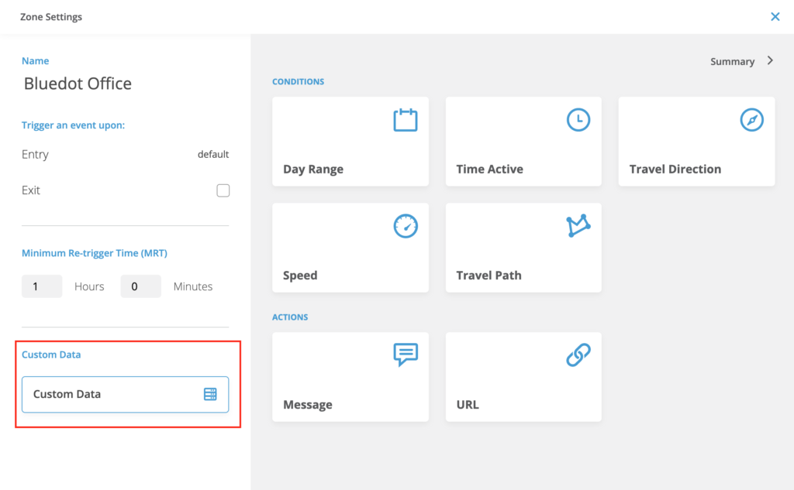
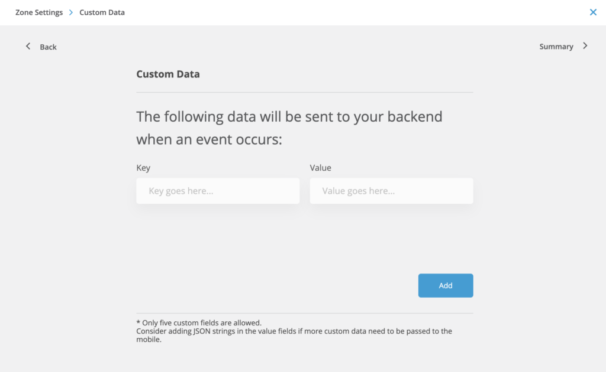
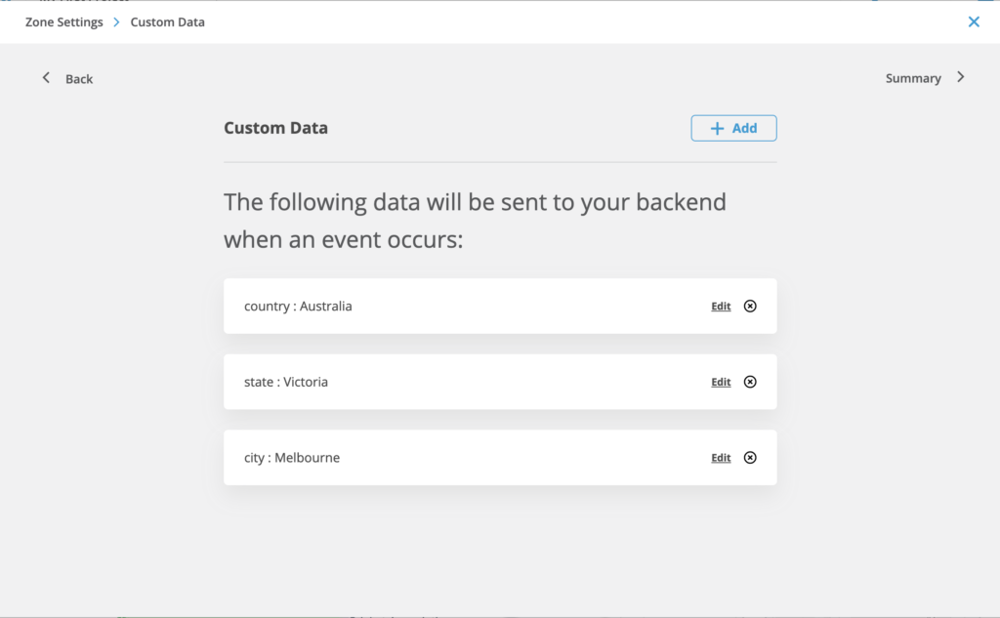
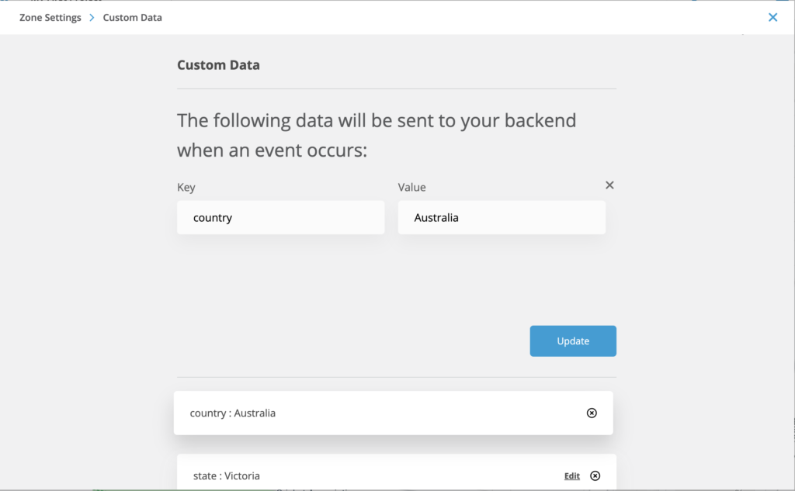

What is Zone custom data?
=========================

You can attach any type of metadata to a location that’s relevant to your location-based campaign. Tagging details about the location, the business, target customers and the campaign can add valuable context. This helps you easily analyze the success of campaigns and deliver ROI figures to your clients.

This metadata will be delivered to the mobile app at the time of entry (check-in) as part of the SDK callbacks. Add custom data fields to the Zone to receive it when a device moves into a Fence. The fields will be returned to the application as a map of keys and values by the SDK when the zone is triggered on the mobile device.

The metadata received in the entry (check-in) and exit (check-out) callbacks for Zone trigger on your application can be used to enhance your post-entry processing and help you provide a better context-aware solution to your customers.

:::info
Maximum 20 entries can be set in custom data. The add button will not be available if you have added 20 key-value pairs already.
:::

Add custom data fields to a Zone
--------------------------------

_Bluedot Canvas > Choose Zone > Zone Settings > Custom Data_

Edit or Delete custom data fields in a Zone
-------------------------------------------

_Bluedot Canvas > Choose Zone > Zone Settings > Custom Data_ 

Click on the “Edit” link of the custom data you want to update.

