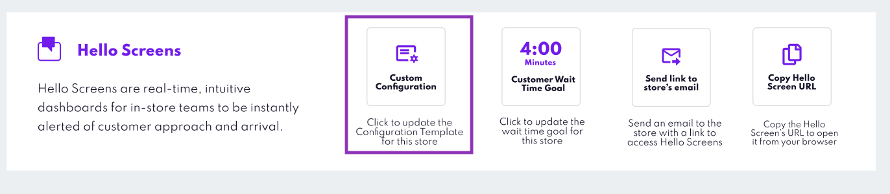

Hello Templates
===============

You can control what features Hello Screens has in each store. Suppose different stores have different operations or offer different services. In that case, you can activate or deactivate specific Hello Screens features store-by-store, enabling a controlled approach either for testing, fitting to each store's operations, or partially deploying new Hello Screen features.

### Customising Hello Screens Per Store via Canvas

From Canvas, users with admin permissions can adjust each store's Hello Screens' features. This is managed by switching between different pre-built templates containing a specific set of enabled features. To make these adjustments:

* From the Stores management view, access the "Custom Configuration" option under the "Hello Screens" section of the desired store's management view to modify the Hello Screens configuration.

* Within the Custom Configuration modal, you can select from a dropdown menu of available templates. Upon selection, the modal will display details about the template, such as its name and the specific features it enables.

    </img>

#### Updating the Configuration for All Stores
To ensure a consistent experience across multiple stores or to set a default configuration, administrators can apply templates at the project level:

* **Global Configuration Setting**: This option is available in the "Store Settings" section of Store Management. Here, administrators can select a default template that will apply to all stores within the project.
* **Overriding Global Settings**: If a store has a specific need that differs from the global settings, the store-specific template settings will take precedence over the global configuration.

    </img>

#### Understanding Hello Screen's Configuration Templates
To support the varied needs of different stores, Hello Screens can be customized through configuration templates. These templates are tailored to your operational requirements and feature sets.

* **Template Creation and Management:** Currently, the creation and management of these templates are handled collaboratively. You will need to communicate with your Bluedot CX representative to discuss and define the features you want included in each template.

If you have any questions just contact our Support Team.

