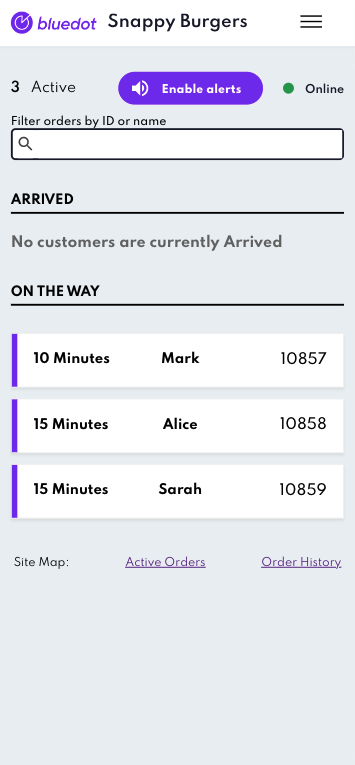

Hello Screens App
=================

Rezolve’s Hello Screens are a super-fast & super simple dashboard that your team can use to view a customer’s ETA and receive both visual and audible notifications upon customer arrival. Now you can access Hello Screens via your iOS or Android device and receive timely push-notifications to assist your team in anticipating customer arrival and delivering excellent customer service.

**Installing the Hello Screens application**
--------------------------------------------

### Downloading the Hello Screens App

| **Platform** | **App Store**                                                                                                |
|--------------|--------------------------------------------------------------------------------------------------------------|
| Android      | [Download from Google Play Store](https://play.google.com/store/apps/details?id=au.com.bluedot.HelloScreens) |
| iOS          | [Download from Apple App Store](https://apps.apple.com/app/hello-screens/id1632552856)                       |

Enabling notifications
----------------------

When you open your Hello Screens application for the first time, you will be prompted to allow push notifications. Be sure to allow push notifications to receive timely alerts upon customer arrival.

Now that you have installed the Hello Screens application, there are two distinct ways to link your device to your `destinationId` (your store):

*   **Connect with link**: Generate a link to connect multiple instances of Hello Screens to a destination **(_recommended_)**. 
*   **Connect with one-time code:** Use the one-time code to connect to a Hello Screen.

### **Connect with link**

This method will generate a time-limited URL that can be opened on your device to seamlessly link your Hello Screens application to a specified store. To ‘_Connect with link_’ your Rezolve Canvas administrator will first need to generate a URL in Canvas.

Generating Linking URL (for administrator users):

1.  Login to Canvas
2.  Open Your Account (you’ll find when you tap on your username in the top right corner)
3.  Select Hello screen from the side menu
4.  Select the Generate URL card
5.  Choose your Project
6.  Search for your Zone
7.  Select how long you want the generated URL to be active
8.  Click Generate button

**Linking your device with ‘Connect with link’:**

Now that your administrator has generated and distributed the linking URL, you can open the URL within your device’s web browser. You will be seamlessly linked into the Hello Screens application, where you can view your Hello Screens Dashboard.

### **Connect with one-time code**

Using this method, you will generate a one-time code within the Hello Screens application. Your Rezolve Canvas administrator will then connect your device to a specified `destinationId` (store) by entering the code within Rezolve Canvas. 

**Generating the one-time code on your device**

After enabling notifications on your device, you will be prompted to select your region.   

After selecting your region, you will receive your one-time code. Pass this on to your Rezolve Canvas administrator to connect your device.

Connecting with time one-time code on Canvas

1.  Login to Canvas
2.  Open Your Account (you’ll find when you tap on your username in the top right corner)
3.  Select Hello screen from the side menu
4.  Select the Link card
5.  Choose your Project
6.  Search for your Zone
7.  Add in the one-time code
8.  Link

After the one-time code is entered on Canvas, the respective device will instantly access the Hello Screens dashboard.

**Your Hello Screens dashboard**
--------------------------------

Once your Hello Screens application is installed and connected to your specified store, you will be able to view your Hello Screens dashboard. As shown below, orders will be segregated by their order status.

Order statuses include:

*   Arrived
*   On the way

An audible alert will play if the Hello Screens application is open upon a customer’s arrival. This alert will keep playing until the ticket is opened/acknowledged.

To enable these alerts, tap the Enable Alerts button after opening the page. Alternatively, you can leave the alerts muted, it is recommended to leave alerts enabled.

### Order states flow & Notifications

If the Hello Screens application is in the background, whenever an order transitions from:

*   From _Ready to collect_ to **_I’m on my way  
      
    _**
*   _or I’m on my way_ to **_arrived  
    _**

A push notification will trigger. If Rezolve is tracking customer ETA, the customer’s ETA will be displayed within the notification.

**I’m on my way  
**

When a customer confirms that they are on the way to collect their order through [Now Ready](../Now%20Ready/Overview.md) or your app, the order’s ticket will move from _Ready to Collect_ to the _On The Way_ section.  

Push Notification: Customer is on their way with ETA information

Hello Screens dashboard: Multiple customers on their way with ETA information

Each ticket will display the following:

*   The expected time of arrival to the store
*   The customer’s name
*   The order’s number

**I’ve arrived**

When the customer arrives at the store the order’s ticket will move from _On the Way_ to the _Arrived_ section.

*   If the application is in the foreground, Hello Screens will flash the ticket and play an audible tone that will keep playing until the ticket is opened/acknowledged by a team member.
*   If the application is in the background the device will receive a push notification.

Push Notification: Customer arrival

Hello Screens dashboard: customer Stephanie has arrived

In order to acknowledge the customers arrival and stop the ongoing alert for a particular ticket, tap or click the blinking card and open up the ticket’s details on Hello Screens

**Complete the order & Historical Orders**

To confirm the order has been successfully fulfilled, press the “Fulfilled” button.

When an order is closed off, it will disappear from the main screen view. To view any historic orders, team members will have to navigate to the Hello Screens menu via the button on the top right of the screen to find the order “_History_” view.

Once the history view has been selected, all historical orders for that store will be displayed in chronological order, with the most recent ones at the top. After 24 hours, all orders will be cleared from Hello Screens.

### Manually updating order collection status

Team members can also manually update the status of any order. A menu with the order details will pop up when a ticket is selected. At the bottom are two buttons, one to close the menu and the second to update the order status.

After selecting “_Update Order Status_”, a list of possible statuses will be displayed. A team member can select the new state of the order and then confirm the change by pressing the “Update” button.

If a team member accidentally deletes an order from the main view and wishes to revive it, they can update the ticket from the “_History_” section and select which status the ticket should be placed in.

### Searching orders

As the Hello Screens dashboard may display many tickets, a user can enter a keyword in the search bar that will filter orders displayed on the screen based on the term entered. 

This filter will only apply to the customer’s name and order number, not any further details about the customer’s order contained within the tickets.  

When such a filter is applied, it will stay current and filter out any existing or new events appearing on Hello Screens until the search term is cleared from the bar.

### Customer waiting times indicator

:::info
This is an optional feature that you can ask your CX representative to enable and set up for you.
:::

Once a customer has arrived at the store, Hello Screens will keep track of the time from the moment of the arrival to the moment when the team member marks the order as Complete. 

Hello Screens will provide visual feedback to the team members to identify which orders have been waiting too long to be completed, highlighting the order tickets with the following colors:

| **Color** | **Waiting Times example**                                           | **Example**                                                                       |
|-----------|---------------------------------------------------------------------|-----------------------------------------------------------------------------------|
| Green     | Customer has been waiting up to 0 to 5 mins to collect the order    |  |
| Amber     | Customer has been waiting up to 5 to 8 mins to collect the order    |    |
| Red       | Customer has been waiting for more than 8 mins to collect the order |    |

:::info
You can define the Waiting Times ranges that fits better your store operations. The times above are just for illustration purposes. Check with your Rezolve CX representative about the Waiting Times ranges when enabling this feature.
:::

If you have any questions about using the Hello Screens app reach out to our team.