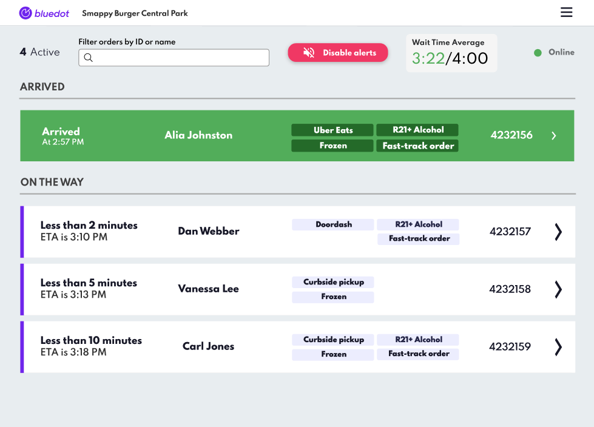
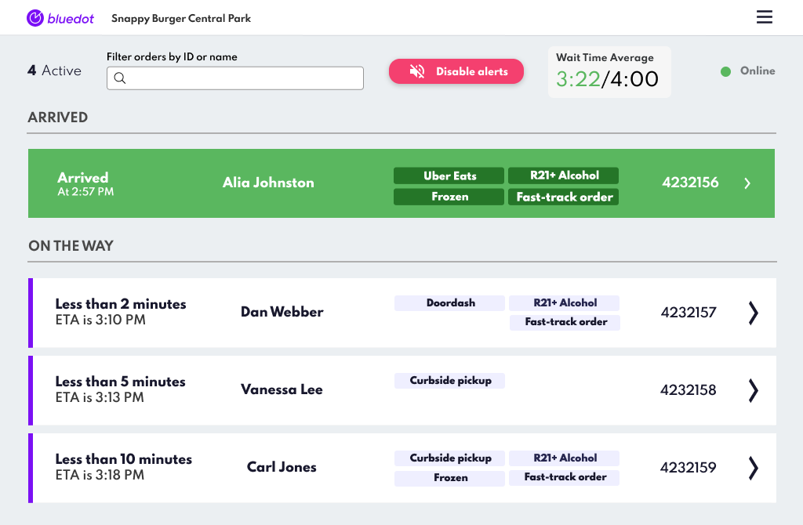

Order Ticket Details
====================

Add a more informative and customisable display on the main screen of Hello Screens. You have the flexibility to select up to four crucial fields from the order tickets for immediate visibility. This streamlined approach aids in quicker decision-making and reduces the need to navigate through each order.

Customising Your Order Tickets Display
--------------------------------------

1. **Select Fields:** Choose up to four `hs_` fields from the the data you’re including in the Custom Event Meta Data that are most relevant to your daily operations. The additional data on the ticket will be delivered from the value of the selected `hs_` fields. For instance, if you select the `hs_Order Type` and the the Custom Event Metadata includes the following property `"hs_Order Type" : "Curbside pickup"` , the ticket will display “Curbside pickup”.

2. **Configuration Update:** Relay your selection to your Bluedot account manager, who will update the Hello Screens configuration accordingly.
   
3. **Optimised Viewing Experience:** Once configured, your chosen fields will be prominently displayed on each order ticket on the main screen.

If you have any questions just contact our Support Team at [help@bluedot.io](mailto:help@bluedot.io).