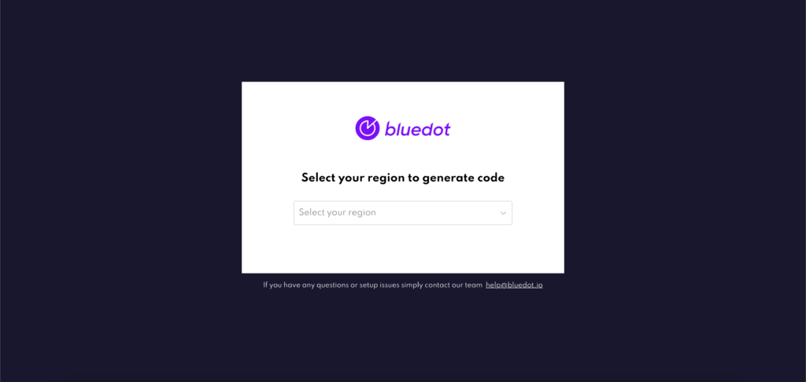
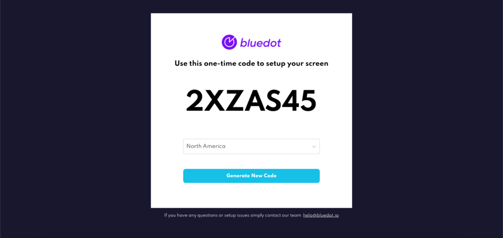

Overview
========

By leveraging Bluedot’s predicted time-based arrival technology and advanced geofencing you can see exactly when customers are going to arrive – powering a seamless curbside, drive-thru and pick-up experience. But a challenge is often how you share these insights with your store associates; POS integration is hard and depending on what insights or notifications you’d like to surface, it simply may not be possible. Enter Hello screens.

Bluedot’s Hello screens are a super fast & super simple dashboard that your team can use to see a customer’s ETA and get visual and audible notifications exactly when they Arrive.

We know not all your locations across the country have exactly the same technology-stack; hardware updates roll-out over months & some stores may have the latest POS update, while others don’t. With this in mind, you can also use Hello screens in parallel with our flexible webhooks, giving you deployment options. Depending on each store’s unique setup you can modify the specific Bluedot configuration while still empowering your store associates with the customer insights they need.

And like all aspects of the Bluedot platform Hello screens are hardware-free. Hellos Screens can run in-browser or as an app that you can use an existing device you have on-site – this may be a tablet from a 3rd party ordering app, the web browser on your POS hardware, or even the mobile device in your Floor Managers pocket. It’s your choice.

Access Hello screens
--------------------

You can access Hello Screen by:

*   **Browser**: A simple visit to the URL [https://screens.bluedot.io/](https://screens.bluedot.io/) on any compatible browser – recommend Safari or Chrome.
*   **Native App:** Download the Hello Screen app to your Android or iOS device. Check the [Hello Screen App documentation here](./Mobile%20app.md)

You will be asked to choose a region. If you’re not sure which region your screen is in, [contact our Support Team](mailto:help@bluedot.io). Once selected you will be displayed your one-time-code.

The first time you visit the URL on a new device (or after a logout) you’ll need to set up the screen with your Bluedot Administrator.

But after that, you’re all set to start receiving customer ETA and Arrival insights!

Configure a Hello screen
------------------------

### Method 1 – With one-time code

Every time you set up a Hello screen, you’ll need to complete a simple and fast setup process. This process links that specific instance of the screen to a specific Bluedot Zone and DestinationID (Eg. this is your store or restaurant).

1.  On your device, open the Hello screen URL (Quick link [here](https://screens.bluedot.io/))
2.  Choose your region & generate a new one-time-code
3.  In Canvas, add the one-time-code in the Link section under Hello Screens

The screen is now authenticated & linked to that destination. If you accidentally link the screen to the wrong Zone (aka Destination) you can simply log out of the Hello screen on your device and repeat the process.

#### Link Hello screens to a destination in Canvas

1.  Login to Canvas
2.  Open Your Account (you’ll find when you tap on your username in the top right corner)
3.  Select Hello screen from the side menu\*
4.  Select the **Link** card
5.  Choose your Project
6.  Search for your Zone
7.  Add in the one-time-code
8.  Link

\*If you can’t see Hello screens in the side menu, please contact our team at [help@bluedot.io](mailto:help@bluedot.io) to enable this feature.

### Method 2 – Generate a URL

This method will generate a time-limited code that can be used to register access to Hello API for a particular destinationId. Useful for linking a client web-application to a destinationId by attaching the code to a URL.

1.  Login to Canvas
2.  Open Your Account (you’ll find when you tap on your username in the top right corner)
3.  Select Hello screen from the side menu\*
4.  Select the **Generate URL** card
5.  Choose your Project
6.  Search for your Zone
7.  Select how long you want the generated URL to be active
8.  Click **Generate** button

The link, then, can be shared and opened on multiple devices.

**Note**: the URL must be used within the time specified when you generate it.

\*If you can’t see Hello screens in the side menu, please contact our team at [help@bluedot.io](mailto:help@bluedot.io) to enable this feature.

Sending Events to Hello Screen
------------------------------

To send order updates to Hello Screens you just need to add the following properties in the Custom Event Meta Data, either from the Point SDK or Wave API.

| **Property**      | **Example**               | **Required** |
|-------------------|---------------------------|--------------|
| `hs_orderId`      | `hs_orderId: "Lfjew13j"`  | Yes          |
| `hs_customerName` | `hs_customerName: "Josh"` | No           |

### Custom Hello Screen Fields

To display custom fields in Hello Screens, you’ll need to add the prefix `hs_` to the property’s key in the Custom Event Meta Data. This information will be displayed in the order details modal.

| **Property**           | **Example**                    |
|------------------------|--------------------------------|
| `hs_Vehicle Color`     | `"hs_Vehicle Color": "Silver"` |
| `hs_Pickup Bay Number` | `"hs_Pickup Bay Number": "3"`  |

To learn more about Custom Event Meta Data check the documentation [here](../Custom%20Data.md).