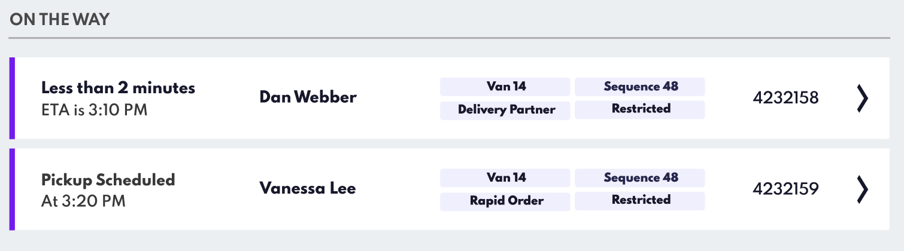

Scheduled Pickup Time
=====================


The "Scheduled Pickup Time" feature enhances the customer service experience by allowing your customers to specify a predetermined pickup time. This feature ensures that staff and customers are synchronised regarding pickup schedules when the user didn’t provide Location Permissions to your app. 

### Scheduled Pickup Time on Hello Screens

This feature displays the scheduled pickup time on the Hello Screens when the order is in the "On The Way" state.



Unlike other scenarios where an ETA can be calculated based on the customer's location tracked by our Tempo service in the mobile Point SDK, the "Scheduled Pickup Time" feature is independent of location tracking. This feature is particularly useful when customers haven't provided Location Permissions to the app, making it impossible to track their ETA. Instead, it allows customers to provide their own approximate time of arrival.


### Implementing Scheduled Pickup Time in Wave API

After understanding the importance and functionality of the "Scheduled Time for Collection" feature, here's how to implement it within your system using the Wave API.

#### Update Your Wave API Payload

To integrate a scheduled pickup time into your system, add the `hs_scheduledTimeForCollection` in the **`customEventMetaData`** section of your Wave API payload as follows:

```json
{
  "destinationId": "dest-id",
  "customEventMetaData": {
    "hs_Customer Name": "Customer Name",
    "hs_scheduledTimeForCollection": "YYYY-MM-DDTHH:MM:SS.000Z",
    "eventType": "Event Type",
    "hs_orderId": "Order ID"
  },
  "eventTime": "YYYY-MM-DDTHH:MM:SS.000Z"
}

```

- **`hs_scheduledTimeForCollection`**: Include the scheduled pickup time using an ISO timestamp in UTC format (e.g., `2024-03-04T05:15:00.000Z`). This standardisation ensures accuracy across different time zones.

#### Local Time Conversion

The feature automatically converts the scheduled time from UTC to the local time of the Hello Screen.
