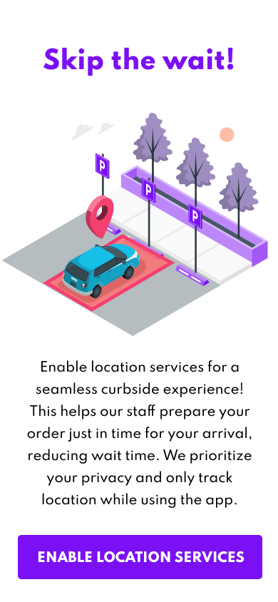
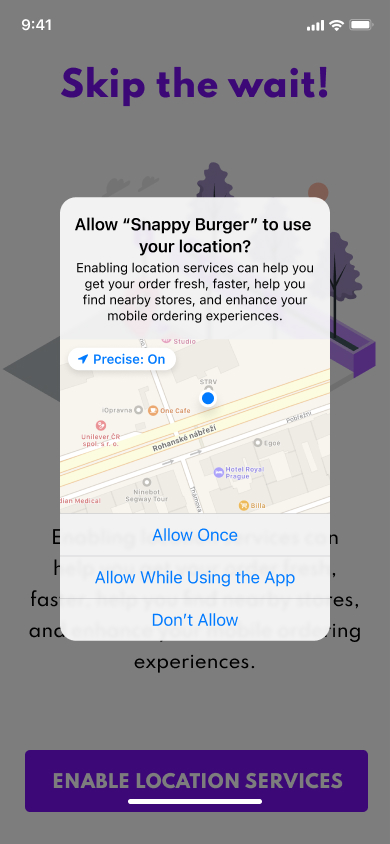

Guide to submitting apps with location services
===============================================

If you’re building an app with Rezolve Point SDK that uses location services, you’ll want to make sure you follow the best practices when submitting it to the App marketplaces (Apple App Store and Google Play Store). This guide will cover important aspects like justifying location services, asking users for permission, providing the right App metadata, and being prepared for the App review process.

*   **Explain your value proposition:** Clearly explain the purpose of using location services in your app and how they benefit the user. Ensure you communicate why location tracking is integral to the app’s functionality. This will speed up the app review process and as well will highly increase the likelihood a customer will grant the location permissions. If your App requires “Always” permissions, clarify to your customer why and how their location will be used.

*   **Request user permission:** When requesting location permissions, craft a friendly and engaging purpose message that tells users why your app needs their location. Make it easy for them to see the value in granting permission.

*   **Background location access best practices:** If your app requires background location access, clearly explain the necessity and how it improves the user experience in the app description.
*   **Provide accurate metadata:** In your App submission, provide accurate and relevant information, such as app description, keywords, and screenshots. Mention the use of location services and their benefits for the user in the app description.
*   **Offer testing instructions for the location-based features:** Include clear steps to test your app’s location-based features for the review team. This will speed up the reviewing process and increase the chances of quick approval.
*   **Be prepared for App review:** The App marketplace review team might have some questions about your app’s use of location services. Be ready to provide clear documentation, privacy policy details, or examples of how location data is used in the app. Being prepared will help speed up the review process and increase your chances of getting approved.

By following the best practices in this friendly guide, you can create an enjoyable user experience, protect user privacy, and boost your chances of a quick and successful submission. Remember to keep things clear and focused on the benefits of location services for your users.