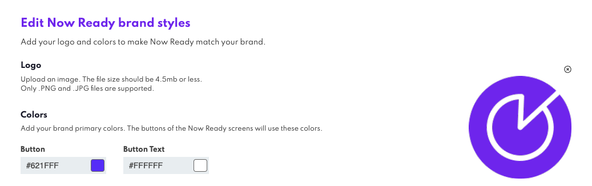
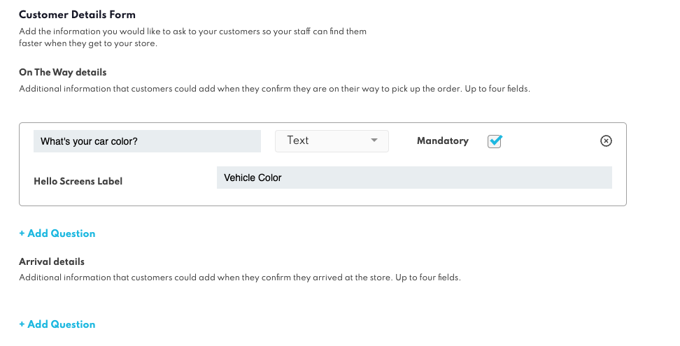
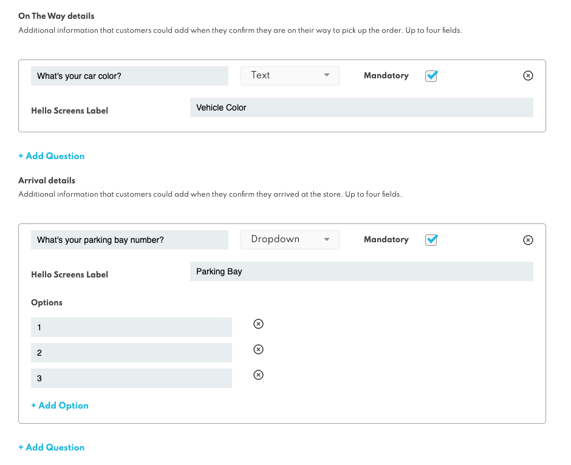
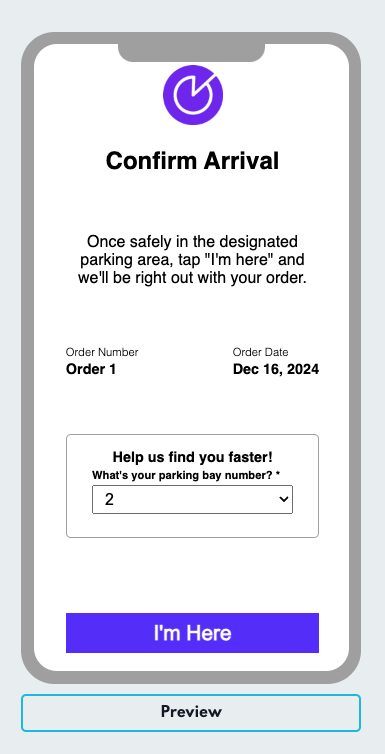

Configure Now Ready
===================

Now Ready allows businesses to streamline customer arrivals by capturing key details during two critical points in the customer journey:

* **On The Way** — When customers confirm they are on their way.
* **Arrival** — When customers confirm they have arrived at the pickup location.

This process is fully customisable, allowing admins to control the questions displayed to customers, configure dropdowns, and determine which fields are required. Businesses can also customise the branding and design of Now Ready to align with their brand’s visual identity, ensuring a seamless customer experience.

### Customisable Branding

The Now Ready UI can be customised directly from Canvas to match your brand’s visual identity, ensuring a consistent look and feel for customers.

#### What Can Be Customised?
* Logo — Upload a brand logo to display on the Now Ready screens.
    * Supported formats: PNG and JPG.
    * Recommended file size: 4.5 MB or less.
* Button Colors — Customise the button color and text color to match your brand’s palette.

#### How to Configure Branding
1. In Canvas, navigate to the Now Ready configuration section.
2. Upload your brand logo using the Logo field. Ensure it meets the supported format and file size requirements.
3. Select the Button Color and Button Text Color fields to apply your brand’s colors. You can enter the color codes directly (e.g., #000000 for black).
4. Changes will be reflected in the Preview section when pressing the "Preview" button, allowing you to see exactly how the screens will appear to customers.

### Configurable Question Sets
Admins can configure two sets of questions to capture essential information at different points in the customer journey:

* **On The Way** — These questions are displayed when customers confirm they are on their way.
* **Arrival** — These questions are displayed when customers confirm they have arrived at the pickup location.

Each question set can contain up to 4 questions. This limit ensures the right amount of information is collected while avoiding overwhelm for the customer.

### Customising Questions
Admins have the flexibility to customise each question to better align with business needs and improve the customer experience. Questions can be presented as either text inputs or dropdown selections. 
* Text inputs allow for free-form answers, like "What's your vehicle make and model?", 
* while dropdowns provide a pre-set list of selectable options, like "Select your parking spot: Spot 1, Spot 2, Spot 3". 
* Admins can toggle between question types, add, edit, or delete dropdown options, and set any question as mandatory or optional. 
* Dropdown options are fully configurable, allowing for renaming, reordering, and removal. This approach provides a balance of flexibility and structure, ensuring customers can quickly provide the right information while minimising errors.

### Hello Screen Labels
To ensure information is presented clearly to staff, each question can have a Hello Screen Label, which controls how customer responses are displayed on Hello Screens. Instead of using the full question text as the label, admins can define a shorter, more concise label. For instance, instead of showing "What is your vehicle make and model?", in Hello Screens it can be displayed as "Vehicle", offering a cleaner and more readable view for staff. If no label is provided, the system defaults to displaying the original question text. This option helps avoid unnecessary clutter on the Hello Screen while keeping key information visible. 

### Live Preview
The Live Preview feature allows users to see how the customer-facing screens will appear based on the current configuration. This ensures users can verify question setups, branding, and layouts before they are finalised.

#### What You Need to Know:
* **Triggering the Preview:** The preview panel is empty by default. Users **must click the "Preview" button** to load the configured screen.
* **What’s Displayed:** The preview will reflect the most recently saved configuration, including questions, dropdown options, and branding (logos and button colors).

