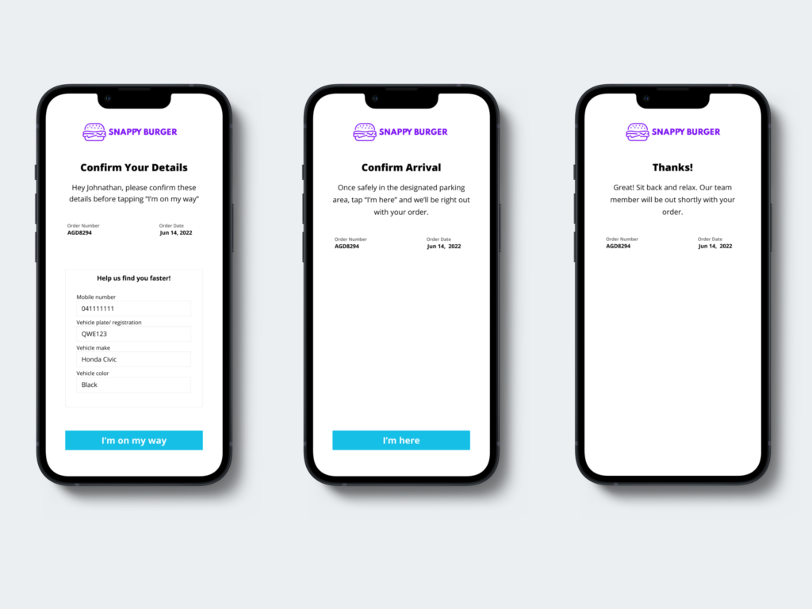
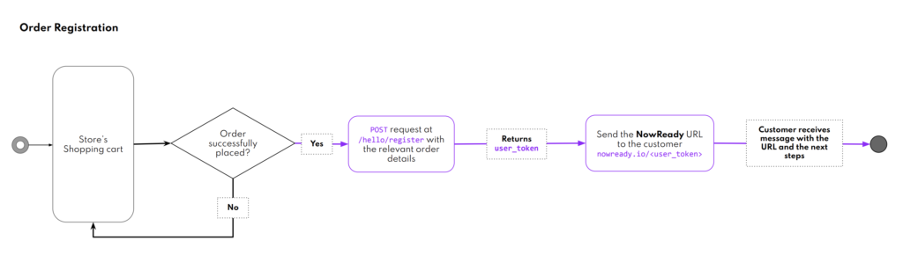

Overview
=========

[Curbside pickup](https://bluedot.io/solutions/curbside-pickup/) is placing an order online – via web or mobile and then driving to the store to pick it up. Sometimes this means parking, going inside the store, and waiting in a “mobile order” or “online order” queue. Other times, the curbside pickup might mean walking up to an outdoor locker, table, or tent where staff verifies your order before handing it to you. Curbside pickup or in-store pickup (AKA click and collect) is supposed to save customers time.

You don’t have a mobile app to integrate the Bluedot Point SDK and/or don’t have resources to the Wave API to power Curbside.

We present Now Ready which is built using [Bluedot Javascript SDK](../Web%20SDK/Overview.md). Now Ready is a white label version of Customer pickup screens. You can apply your branding to the screens and provide a quick solution to power your curbside use case.

Architecture & User flow
------------------------

### Order Registration

Getting started in 4 steps
--------------------------

1.  [Configure Now Ready](./Configure%20Now%20Ready.md)

Your branding can be added to the Now Ready UI. Provide us with your logo and primary color and you are good to go.

2\. [Create your Destination(s)](../Tempo/Create%20your%20destinations.md)

The Destination is the store or restaurant where your customer is collecting their mobile order from. Every Destination has a set of lat/long coordinates & a unique `DestinationId` (which you choose). You can create a Destination in the Canvas dashboard or using the Config API.

3\. [Link your Destination to a Hello Screen](../Hello%20Screens/Overview.md)

You’ll need to complete a simple and fast setup process. This process links that specific instance of the screen to a specific Bluedot Zone and `DestinationId`

4\. [Integrate Register endpoint](./Integrate%20register%20endpoint.md)

You’ll call the Register API when the customer places an order in your app or web page, define the `DestinationId` & attach any `customEventMetadata` (Eg. the Order ID and the customer’s name). You will be retuned a `userToken` that can be used in the unique Now Ready URL for the order.