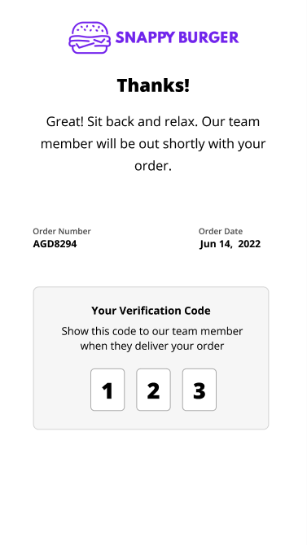

# Verification Code

The Verification Code feature is designed to enhance the security and reliability of order collection. When customers arrive at the store and press the **"I've arrived"** button in **Now Ready**, they will see a unique 3-digit code displayed on their screen. This code must be shared with the store staff for verification.

Staff can then input this code into **Hello Screens** to validate it, ensuring that only the correct individual collects the order. 

### **How It Works**

When customers arrive at the store and press the **"I've arrived"** button in the Now Ready app, a unique 3-digit verification code is instantly displayed on their screen. This code is presented on a confirmation screen, alongside a clear message explaining that they should share the code with the store staff upon order collection.

For staff, verifying an order is just as simple. Once the customer provides the code, staff can input it directly into Hello Screens. If the code matches the one generated for that order, they can confirm the handoff and complete the process. In case the customer is unable to provide the code, fallback options are available to ensure the order can still be securely processed.

The Verification Code feature is built to make order collection more secure and reliable:

- **For Customers**: See a unique 3-digit code on the app when you arrive at the store. Just show this code to staff to collect your order.
- **For Store Staff**: Easily verify orders by entering the customer’s code into Hello Screens. Fallback options ensure orders can still be processed if the code isn’t available.
- **For Account Managers**: Enable or disable the feature in the Canvas configuration screen and track all verification events.

### **How to Enable the Feature**

To enable the Verification Code feature, follow these steps:

1. In **Canvas**, navigate to the **"Now Ready"** section from the main menu.
2. Locate the option labeled **"Enable verification code for order collection"** and check the box to turn it on. This setting applies **only** to Now Ready.
3. Save your changes to activate the feature.

:::caution
**Important:** The Verification Code feature must also be enabled in Hello Screens for it to work seamlessly. Please check with your Bluedot account representative or reach out to our team at help@bluedot.io for assistance with this configuration.
:::

