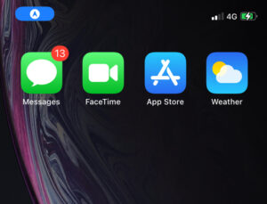

Features
==================

*   Custom Event Metadata
*   Enable / Disable Zones
*   Android features
    *   Foreground Notification
*   iOS features
    *   Background Location Access

Custom Event Metadata
---------------------

Custom event metadata is a feature which is available in the Bluedot Point SDK for our customers to set additional event-specific metadata to our location events. For further information refer to [Custom Event Metadata](../../Custom%20Data.md)

It is recommended to set the Custom Event Meta Data before starting GeoTriggering or Tempo.


:::info
Maximum 20 entries can be set in custom event metadata. If more than 20 entries are set, Bluedot SDK throws an error as: Only 20 CustomEventMetaData fields are allowed.
:::

```dart
const metadata = {
  'hs_orderId': 'Order Id',
  'hs_Customer Name': 'Customer Name'
};

BluedotPointSdk.instance.setCustomEventMetaData(metadata);
```

### Fetch Custom Event Metadata

The API `getCustomEventMetaData` allows fetching custom event metadata set for a Bluedot session. For more details on Custom Event Metadata.

```dart
BluedotPointSdk.getCustomEventMetaData().then((metadata) => {  
   const message = `CustomEventMetaData: ${JSON.stringify(metadata)}`; 
});
```

Enable / Disable Zones
----------------------

An app may optionally disable (and later re-enable) Zones by calling `setZoneDisableByApplication`. For further information refer to Enable or disable Zones documentation ([Android](../Android/Features/Enable%20or%20disable%20zones.md) | [iOS](../iOS/Features/Enable%20or%20disable%20zones.md)) 

```dart
const zoneIdToDisable = "your_zone_id";
const disableZone = true;

BluedotPointSdk.instance.setZoneDisableByApplication(zoneIdToDisable, disableZone);
```

Android Features
----------------

### Foreground Notification

Given the restrictions on accessing location data from the background, it is recommended that the Geo-triggering service be run as a foreground service, and the Tempo service must be run as a foreground service. For more information refer to [Android – Location Permission & Notifications Best Practices](../Android/Location%20Permission%20&%20Notifications%20Best%20Practices.md)

The Foreground Notification method (`androidNotification`) is included in the `GeoTriggeringBuilder` and the `TempoBuilder` classes. It should be set up before starting any of the Geo-triggering or Tempo services as below.

**Geo-triggering**
```dart
// GeoTriggering
String channelId = 'Your channel Id';
String channelName = 'Your channel Name';
String androidNotificationTitle = 'Your notification title';
String androidNotificationContent = 'Your notification content';
int androidNotificationId = 123; // Will be -1 by default if set to null. BluedotPointSdk.instance.geoTriggeringBuilder()
   .androidNotification(channelId, channelName, androidNotificationChannel, androidNotificationContent, androidNotificationId)
   .start().then((value) { 
   //Handle geo triggering started successfully 
   debugPrint('Geo-triggering has been started'); 
}).catchError((error) { 
  //Handle error when start geo-triggering 
  debugPrint('Failed to start geo-triggering. Error $error'); 
});
```

**Tempo**
```dart
// Tempo
String destinationId = 'Your destination Id';
String channelId = 'Your channel Id';
String channelName = 'Your channel Name';
String androidNotificationTitle = 'Your notification title';
String androidNotificationContent = 'Your notification content';
int androidNotificationId = 123; // Will be -1 by default if set to null.

BluedotPointSdk.instance
    .tempoBuilder()
    .androidNotification(channelId, channelName, androidNotificationTitle,
    androidNotificationContent, androidNotificationId)
    .start(destinationId)
    .then((value) {
  // Successfully started tempo tracking
  debugPrint('Tempo has been started successfully');
}).catchError((error) {
  // Failed to start tempo tracking, handle error here
  debugPrint('Failed to start tempo. Error $error');
});
```

iOS Features
------------

### Background Location Access

#### What is the background location usage indicator?

The background location usage indicator (Blue Bar) is an iOS feature that allows an app to access location data when the user has selected _While using the app_ location authorization and the app is in the background.

The background location usage indicator will be displayed as a blue pill or bar at the top of the screen – either behind the clock or across the status bar (the event display changes between iPhone models). This notification lets the user know that an app is accessing location data.




:::info
If the user has selected the _Always_ location authorization, the background location usage indicator will not be displayed.
:::

### When to use the background location usage indicator?

Background location usage indicator should be enabled when usage requires location updates even when the App is running in background and the user has granted the _While using the app_ location authorization.

**Enable background location usage indicator:**     

```dart
BluedotPointSdk.instance.backgroundLocationAccessForWhileUsing(true);
```

For the background location usage indicator to work, `backgroundLocationAccessForWhileUsing` must be set to `true` while the app is in the foreground if the app has _While using the app_ location authorization. 

The default value of `backgroundLocationAccessForWhileUsing` is `false`, and it can be disabled while the app is either in the foreground or the background.

#### Background location use cases

It may be beneficial to switch the background location usage indicator on and off during app operation to maximise location data availability during mission-critical flows.

For example:

On an app that handles ordering and pickup there may be value in starting Bluedot Geo-triggering on app start without the background location usage indicator enabled in order to power a marketing use case when the user grants Always location authorization or is actively using the app. When the user places an order and there is greater necessity and value in collecting location data to maximise the likelihood the user is detected upon arrival at the collection point, the background location usage indicator should be enabled. Upon completion of the order and collection process, the background location usage indicator should be disabled, removing unauthorized background location data collection and the visible indicator.

Example steps to implement:

1.  Start Geo-triggering without background location usage indicator enabled.
2.  User places an order.
3.  Enable background location usage indicator.
4.  User travels to the pickup location.
5.  Order is completed.
6.  Disable background location usage indicator.