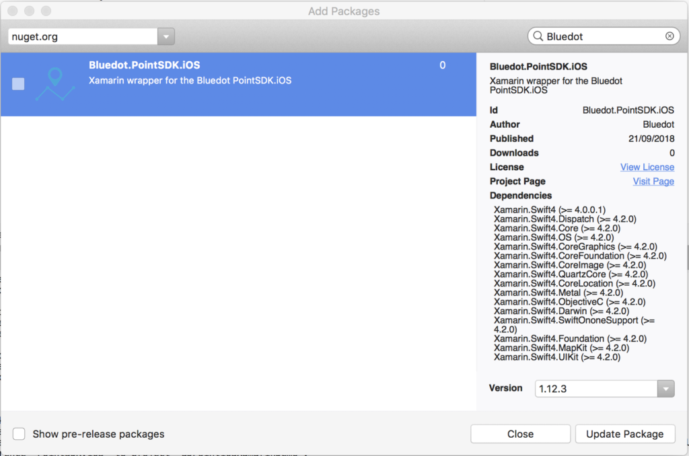

iOS – Quick start
===============================

In order to successfully integrate the Xamarin wrapper for Point SDK, you would require a Bluedot account. Please contact our sales team by requesting for a [demo](https://bluedot.io/contact-us/).  Please also ensure that you also meet the [iOS requirements](../../Point%20SDK/iOS/Quick%20Start.md).

The Bluedot Point SDK enables geo-location capability for apps by delivering accurate location awareness, while substantially reducing battery consumption compared to Android Location API or other standard methods. The Point SDK connects to the Bluedot’s backend system, Canvas, to download your pre-configured Geofences, GEOLINE™, Bluetooth Beacons, conditions, and actions.

The Point SDK enables rapid development of location-aware apps. It delivers precise location awareness to the mobile application, but without the usual battery drain that would typically occur. There’s also no need for additional hardware, making it highly scalable. This means the Point SDK enables location-based apps and experiences that were previously impossible. The rest is up to you.

* * *

Step 1: Creating the Xamarin iOS project
----------------------------------------

Create the Xamarin iOS project:

1\. Note: Ensure that your Visual Studio version is at least 15.3, and your Xamarin.iOS version is 10.12.0.18 or greater.

2\. Start a new Xamarin Visual Studio project, using whichever template is appropriate for the app.

3. Enter a Product Name, Solution Name, and other required details.

4. Choose a folder to save the project (e.g. ‘Projects’) and select ‘**Create**’.

* * *

Step 2: Add Bluedot.PointSDK.iOS package
----------------------------------------

Right click on Packages folder, select ‘_Add Packages…_‘. In the search box type Bluedot.



* * *

Step 3: Configure the Xamarin Project Solution
----------------------------------------------

Follow the steps below to configure the Xamarin Project Options

1\. Go to ‘_Project_‘ in the menu bar, and select _Project Option_, in our example here its ‘_BDHelloPointSDK Options_‘.

2\. Select _‘iOS Build_‘ on the left pane.

3\. In the Linker behavior, select ‘_Link Framework SDKs Only_‘.


4. Bitcode was introduced in iOS 9 for App thinning. Point SDK is compatible with iOS versions prior to this and can therefore not be built with Bitcode enabled. This entails that an app utilizing Point SDK must have Bitcode set to **`NO`**

* * *

Step 4: Configure the Info.plist settings
-----------------------------------------

Follow the steps below to configure the Info.plist settings:

**1. Device capabilities**

Point SDK requires Location Services with GPS accuracy to operate as intended. This should be declared in the `Info.plist` of any integrating app.

To declare the requirement:

1.  Locate the app’s `Info.plist` file.
2.  In the ‘_Source_‘ tab of Info.plist, find the existing entry titled ‘**Required Device Capabilities**’ or create one if it does not exist.
3.  Select the (+) icon to add new Item lines containing the following values:
    1.  `gps`
    2.  `location-services`
    3.  `accelerometer`

**2\. Required background modes**

Point SDK requires access to location updates at all times (including when the app is in the background).

Apple has restricted the ability of apps to execute in the background to reduce battery consumption. As part of iOS 4.0, Apple introduced a number of managed background execution modes, including delivery of location updates while in the background.

To declare the background execution modes:

1.  Locate the app’s `Info.plist` file.
2.  In the ‘_Source_‘ tab of info.plist, find an existing entry titled ‘**Required background modes**‘ or create one if it does not exist.
3.  Select the (+) icon and select from the drop-down list provided: **App registers for location updates**

**3\. Required background updates description**

Starting from iOS 8, a usage description is required when utilizing Location services; this is also provided in `Info.plist`

1.  Locate the app’s `Info.plist` file.
2.  In the ‘_Source_‘ tab of Info.plist, find an existing entry titled ‘**NSLocationAlwaysUsageDescription**‘ or create one if it does not exist.
3.  Select the type of String.
4.  Enter a usage description that denotes the use of location services by your app. For example, **Your location is used by the app to get you deals closer to you while in the background** (This message will be prompted to the user when location services are first requested).

**4\. (Optional) Local Notification Permission Prompt**

The Local Notification Permission Prompt is enabled by default to make sure the SDK delivers local notifications for the ‘Message Action’ or/and ‘URL Action’ set on a Zone through the Canvas dashboard.

Optional: To disable the notification permission prompt, the following key should be declared in the `Info.plist` of any integrating app.

1.  Locate the app’s `Info.plist` file
2.  Select the (+) icon to add a new key BDPointLocalNotificationEnabled, and set the value to `Boolean` Type.
    1.  set the value to `YES` to enable default notification prompt.
    2.  set the value to `NO` to disable default notification prompt.

* * *

Step 5: Integration Checklist
-----------------------------

**1. Xcode Project Configuration Checklist**

The following is a checklist of the project configurations that must be made for successful integration of Point SDK into an app.

*   The following keys are added to the UIRequiredDeviceCapabilities section of the `Info.plist`:
    *   `gps`
    *   `location-services`
    *   `accelerometer`
*   The following keys are added to the UIBackgroundModes section of the `Info.plist`:
    *   `location`
*   The following key is added the Information Property List in the `Info.plist`:
    *   `NSLocationAlwaysUsageDescription`
        *   Type: String
        *   A description of the usage of location services by your app in the Value field.
*   The Linker behavior is set to ‘_Link Framework SDK only_‘.

**2\. Source Checklist**

The following is a checklist of the source code implementations that will assist in making a successful integration of Point SDK into an app.

*   Implement the IBDPGeoTriggeringEventDelegate or IBDPTempoDelegate
*   Assign an object implementing the protocols to a class (for example, AppDelegate)

```csharp
BDLocationManager.Instance().GeoTriggeringEventDelegate = myDelegateImplementation;
BDLocationManager.Instance().TempoTrackingDelegate = myDelegateImplementation;
```
* * *

Step 6: Next Steps
------------------

**Essential Guides:**

*   For a list of detailed iOS Features, please refer to the documentation section on [iOS – Features](../../Point%20SDK/iOS/Features/App%20restart%20notification.md)
*   For interacting with our Canvas backend, please refer to the documentation on [iOS – Quick Start](../../Point%20SDK/iOS/Quick%20Start.md)

**Xamarin iOS integration examples on GitHub** 

You can refer to Xamarin iOS integration examples via the link below:

**[GitHub Examples](https://github.com/Bluedot-Innovation "GitHub Examples")**

API Documentation can be assessed via the link below:

**[API Documentation](https://ios-docs.bluedot.io "API Documentation")**

Point SDK 16 Migration Guide
------------------
**1\.  Geo Triggering**

Replace the callbacks of `IBDPGeoTriggeringEventDelegate` with the new callbacks.
 
```csharp
public override void DidUpdateZoneInfo()
{
	Console.WriteLine("Zone info has been updated");
}

public override void DidEnterZone(GeoTriggerEvent enterEvent)
{
	Console.WriteLine("Zone: " + enterEvent.ZoneInfo.Name + " Entered");
}

public override void DidExitZone(GeoTriggerEvent exitEvent)
{
	Console.WriteLine("Zone: " + exitEvent.ZoneInfo.Name + " Exited");
}
```

**2\. Tempo**

Add callbacks to your implementation of `IBDPTempoTrackingDelegate`.
```csharp
public override void TempoTrackingDidUpdate(TempoTrackingUpdate tempoUpdate)
{
	Console.WriteLine("TempoTrackingDidUpdate: " + tempoUpdate.Description);
}

public override void TempoTrackingDidExpire()
{
	Console.WriteLine("Tempo Tracking has expired");
}

public override void DidStopTrackingWithError(NSError error)
{
	Console.WriteLine(""There was an error continuing to track with the Bluedot SDK: " + error.LocalizedDescription);
}
```

