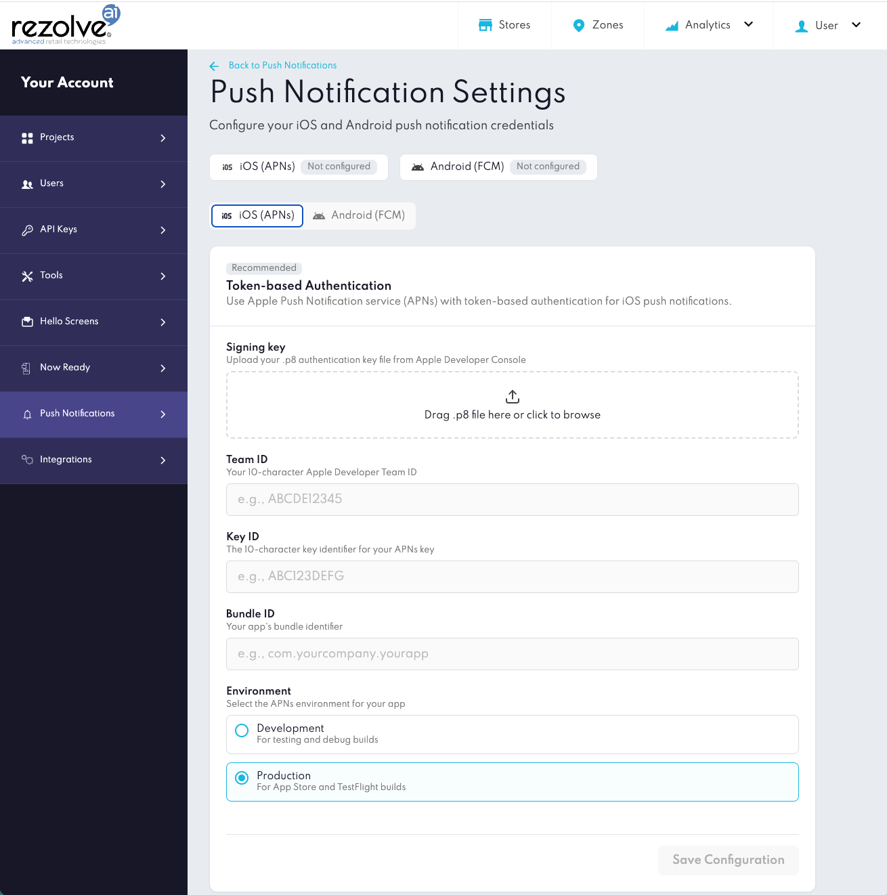

Push Notifications
==================

**Point SDK** can receive and process **Push Notifications** received from Location Events.

Requirements
------------

| Requirement | Value |
| --- | --- |
| Minimum version | iOS 15+ |
| Point SDK | Embedded and initialized in the app |
| APNs Setup | APNs enabled for the App ID and its Provision Profile |

Setup Checklist
---------------

* Point SDK is setup & initialized.
* Push Notifications feature is enabled in the Xcode's app target.
* A valid `aps-environment` entitlement is included in the app's Provision Profile.

Overview
--------

1. Configure iOS Push Notifications credentials in Canvas.
2. Request user permission and register for remote notifications.
3. Register the device push token with Point SDK.
4. Forward received and clicked notifications to Point SDK.
5. Handle Point SDK notification callbacks.

Step 1 — Setup APNs Credentials in Canvas
-----------------------------------------

Before **Push Notifications** can be delivered to the application, Apple Push Notification Service (APNs) credentials must be entered in **Canvas**.

Go to `Project Settings -> Push Notification Settings -> iOS (APNs)`, and upload the required Apple Push Notifications credentials. Use the Canvas Push Notification Settings screen (iOS (APNs) tab) to confirm the iOS credential set is selected before saving.



_Canvas Push Notification Settings screen with the iOS (APNs) tab selected._

### Required fields

| Field | Description |
| --- | --- |
| **Signing key (.p8)** | Upload the APNs authentication key downloaded from the Apple Developer portal |
| **Team ID** | Your Apple Developer Team ID |
| **Bundle ID** | The bundle identifier of your iOS application |
| **Key ID** | The Key ID associated with your APNs authentication key |

Once saved, Rezolve uses these credentials to deliver **Push Notifications**.

Step 2 — Request Permission
---------------------------

The application must request **Push Notifications** permission from the user.

```swift
UNUserNotificationCenter.current().requestAuthorization(
    options: [.alert, .sound, .badge]
) { granted, error in
    guard error == nil, granted else {
        // Handle permission error/denial
        return
    }

    DispatchQueue.main.async {
        UIApplication.shared.registerForRemoteNotifications()
    }
}
```

Remote Notifications
--------------------

After permission is granted, register the application for remote notifications.

```swift
UIApplication.shared.registerForRemoteNotifications()
```

Configure the notification center delegate during application startup.

```swift
func application(
    _ application: UIApplication,
    didFinishLaunchingWithOptions launchOptions: [UIApplication.LaunchOptionsKey: Any]?
) -> Bool {

    UNUserNotificationCenter.current().delegate = self

    return true
}
```

Step 3 — Forward Push Notification Token to SDK
-----------------------------------------------

When a device token is provided, forward it to **Point SDK**.

```swift
func application(_ application: UIApplication,
                 didRegisterForRemoteNotificationsWithDeviceToken deviceToken: Data) {

    BDLocationManager.instance()?.pushNotifications.register(deviceToken: deviceToken)
}
```

**APNs Tokens** can change over time; for example after a restore, or a reinstall of the app. Make sure to forward the latest **Token** whenever iOS provides a new one.

Step 4 — Forward Push Notifications to the SDK
----------------------------------------------

When a **Push Notification** is received, forward the event to the SDK so it can process Rezolve-specific notifications.

### Notification received

```swift
func userNotificationCenter(
    _ center: UNUserNotificationCenter,
    willPresent notification: UNNotification
) async -> UNNotificationPresentationOptions {

    let handled = BDLocationManager.instance()?
        .pushNotifications
        .handleForeground(notification) ?? false

    return handled ? [.banner, .sound] : []
}
```

### Notification clicked

```swift
func userNotificationCenter(
    _ center: UNUserNotificationCenter,
    didReceive response: UNNotificationResponse,
    withCompletionHandler completionHandler: @escaping () -> Void
) {

    BDLocationManager.instance()?.pushNotifications.handleResponse(response)
    completionHandler()
}
```

Step 5 — Receive SDK Callbacks
------------------------------

The SDK exposes callbacks when a Rezolve **Push Notification** is received or clicked.

```swift
BDLocationManager.instance()?.pushNotifications.onNotificationReceived = { payload in
    print("Rezolve push received. zoneID: \(payload.zoneID ?? \"unknown\")")
}

BDLocationManager.instance()?.pushNotifications.onNotificationClicked = { payload in
    print("Rezolve push clicked. zoneID: \(payload.zoneID ?? \"unknown\")")
}
```

These callbacks can be used to update the UI, app navigation, or perform other actions. The callback content can include standard notification content and custom data configured in **Canvas**.

Complete Example
----------------

```swift
class AppDelegate: UIResponder, UIApplicationDelegate, UNUserNotificationCenterDelegate {

    func application(
        _ application: UIApplication,
        didFinishLaunchingWithOptions launchOptions: [UIApplication.LaunchOptionsKey: Any]?
    ) -> Bool {

        UNUserNotificationCenter.current().delegate = self

        UNUserNotificationCenter.current().requestAuthorization(
            options: [.alert, .sound, .badge]
        ) { granted, error in
            guard error == nil, granted else { return }
            DispatchQueue.main.async {
                UIApplication.shared.registerForRemoteNotifications()
            }
        }

        BDLocationManager.instance()?.pushNotifications.onNotificationReceived = { payload in
            print("Push received. zoneID: \(payload.zoneID ?? \"unknown\")")
        }

        BDLocationManager.instance()?.pushNotifications.onNotificationClicked = { payload in
            print("Push clicked. zoneID: \(payload.zoneID ?? \"unknown\")")
        }

        return true
    }

    func application(_ application: UIApplication,
                     didRegisterForRemoteNotificationsWithDeviceToken deviceToken: Data) {

        BDLocationManager.instance()?.pushNotifications.register(deviceToken: deviceToken)
    }

    func userNotificationCenter(
        _ center: UNUserNotificationCenter,
        willPresent notification: UNNotification
    ) async -> UNNotificationPresentationOptions {

        let handled = BDLocationManager.instance()?
            .pushNotifications
            .handleForeground(notification) ?? false

        return handled ? [.banner, .sound] : []
    }

    func userNotificationCenter(
        _ center: UNUserNotificationCenter,
        didReceive response: UNNotificationResponse,
        withCompletionHandler completionHandler: @escaping () -> Void
    ) {

        BDLocationManager.instance()?.pushNotifications.handleResponse(response)
        completionHandler()
    }
}
```

Notes
-----

**Point SDK** works alongside the app's existing **Push Notifications** setup. Your app continues to control permission prompts and APNs registration, while the SDK focuses on handling Rezolve notifications and providing callbacks that can be used for UI updates, app navigation, or perform other actions.

Troubleshoot
------------

If notifications are not received as expected, check:

* The APNs credentials in Canvas match the app's **Team ID** and **Bundle ID**.
* The app build uses a **Provision Profile** that contains the `aps-environment` entitlement.
* Push Notifications permission has been granted from the user and remote notifications are active.
* The latest and updated APNs Token has been forwarded to Point SDK.