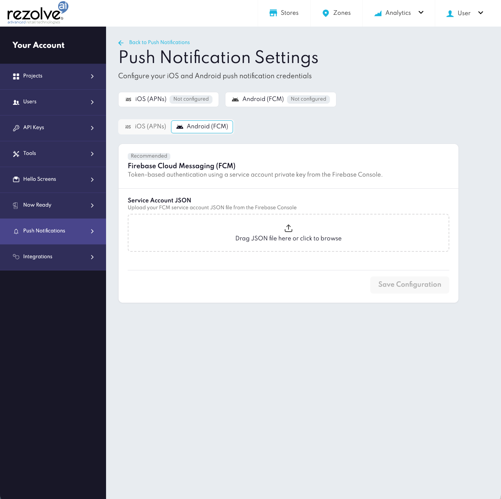
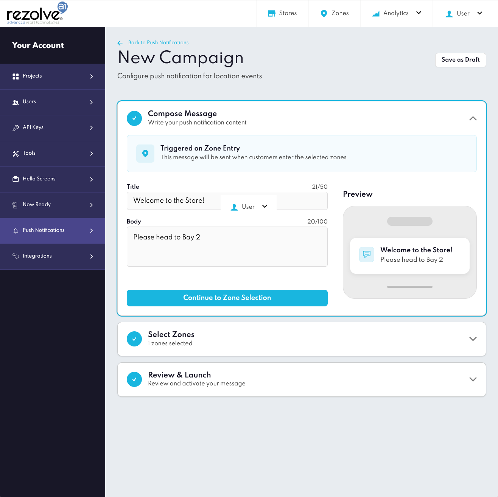
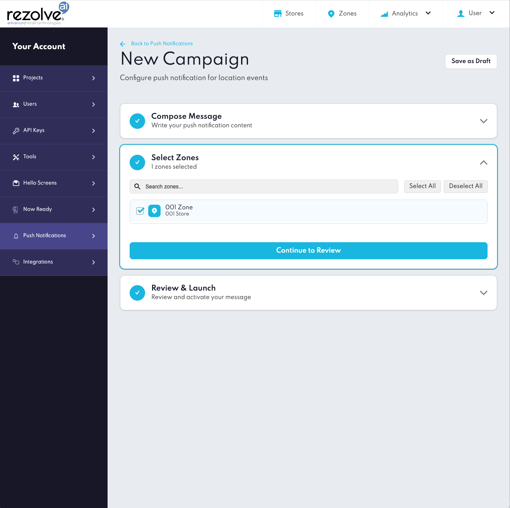
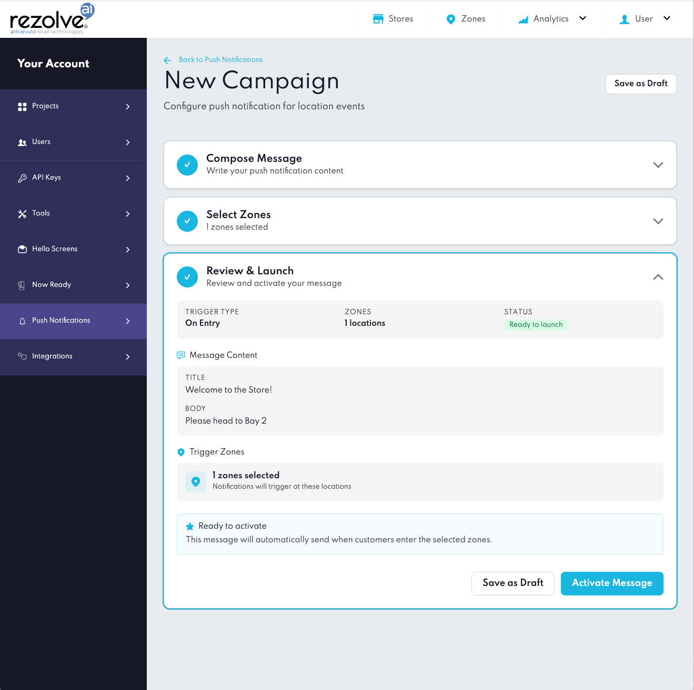
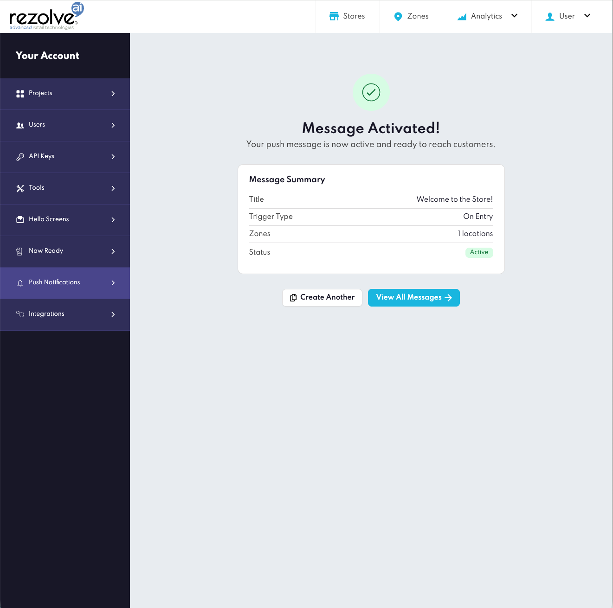
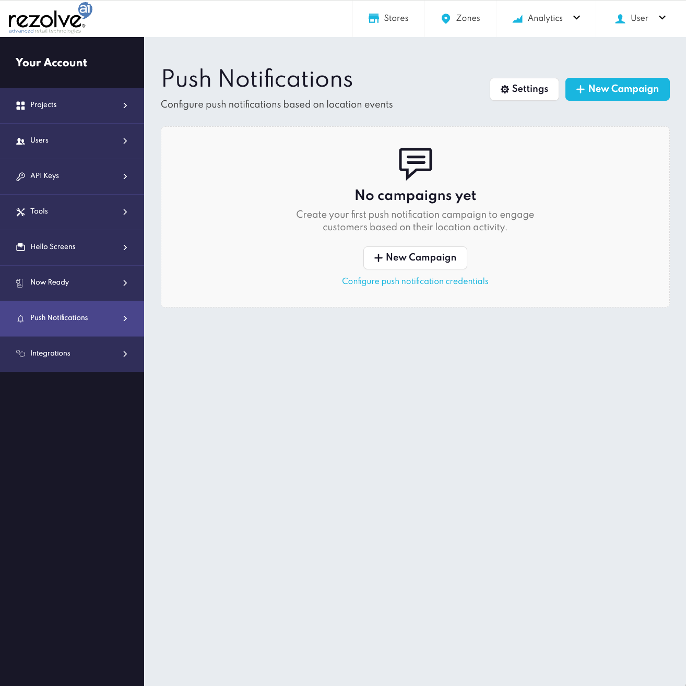
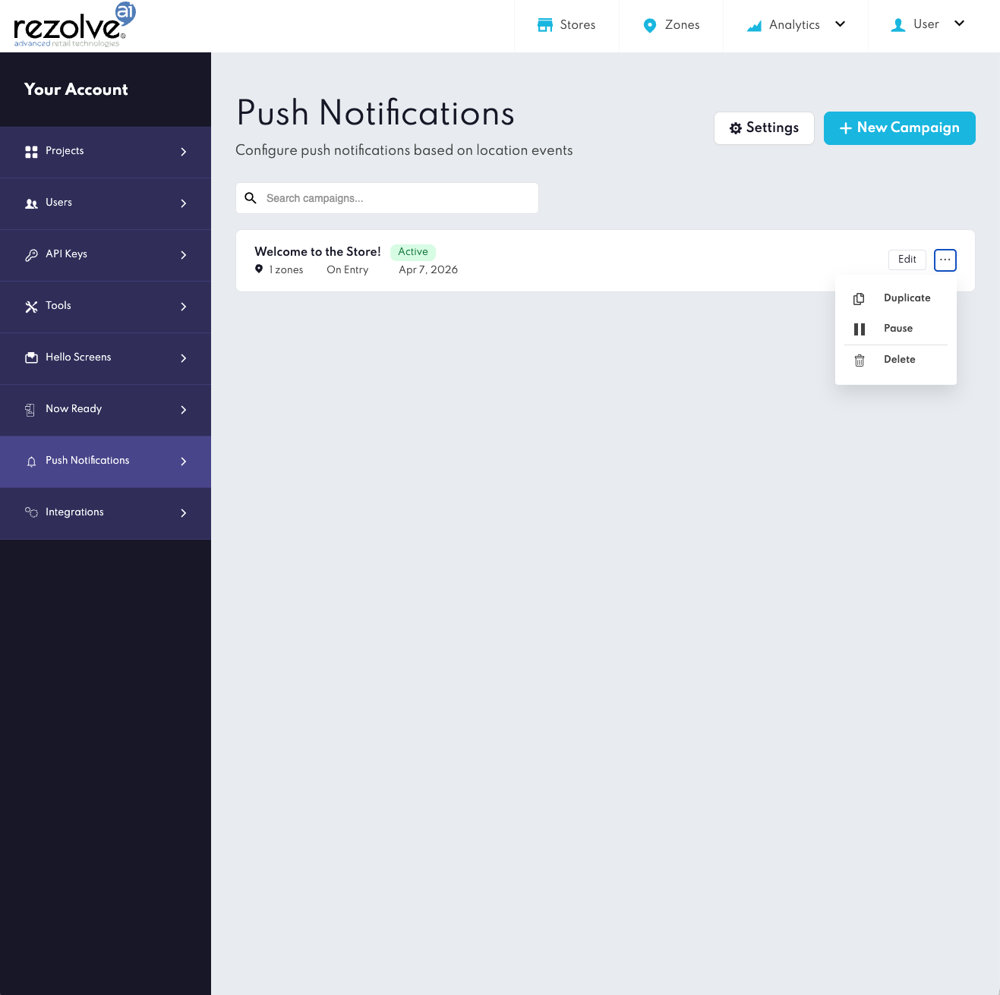

# Overview

Not all push notifications are equal. Generic promotional messages have trained customers to ignore -- or opt out of -- notifications entirely. Location-triggered, transactional notifications sent at the exact moment of relevance are a different proposition: they deliver information the customer actually needs, exactly when they need it, without requiring any action on their part.

For Click & Collect, that moment is arrival. Today, most teams bridge it with manual staff processes, static SMS, or customer-triggered check-ins. These approaches are slow, error-prone, and depend entirely on the customer taking action. When timing is off -- an order handed out too early, a notification sent too late -- both the customer experience and operational efficiency suffer.

**Push Notifications** is a feature of the **Point SDK** that closes this loop. When a customer enters a geofence zone configured in Canvas, the SDK detects the event and Rezolve delivers a push notification to their device in real time -- no customer action required.

---

## How It Works

Push Notifications integrates into the existing Rezolve Geo location stack. No separate infrastructure is required.

```
Customer's app (Point SDK)
	|
	|  Zone entry detected
	v
Rezolve backend
	|
	|  Evaluates configured campaigns in Canvas
	v
Push delivery (APNs / FCM)
	|
	v
Customer's device -- notification displayed
```

1. **Point SDK** is embedded in your app and detects when a customer enters a configured geofence zone.
2. The SDK sends the entry event to the **Rezolve backend**, which evaluates active push notification campaigns configured in **Canvas**.
3. If a matching campaign is found, Rezolve delivers the notification via **Apple Push Notification service (APNs)** for iOS or **Firebase Cloud Messaging (FCM)** for Android.
4. The notification appears on the customer's device. The SDK provides callbacks your app can use to handle the notification -- updating the UI, navigating to a specific screen, or logging the event.

Push Notifications works alongside your app's existing notification setup. Your app remains in full control of permission prompts and device token registration; the SDK handles Rezolve-specific delivery and provides structured callbacks.

---

## End-User Permissions

Push Notifications depends on two permissions that the end user must grant. If either is missing, notifications will not be delivered.

| Permission | Why it's needed | What happens without it |
| --- | --- | --- |
| **Location (Always / When in Use)** | The Point SDK must be able to detect when a user enters a geofence zone. Without location access, the SDK cannot fire zone entry events and the delivery pipeline never starts. | No zone events are triggered. No notifications are sent, regardless of campaign configuration. |
| **Push Notifications** | The device must be registered to receive push notifications via APNs (iOS) or FCM (Android). | The device token cannot be registered. Notifications are not delivered even if a zone entry is detected. |

Both permissions must be granted by the user. Neither can be forced -- they can only be requested through your app's standard permission prompts.

### What this means for your app

Your app is responsible for requesting both permissions at the right moment and with the right context. Users who understand *why* a permission is needed are significantly more likely to grant it. Consider:

- **Explaining the value before prompting** -- e.g. *"Allow location access so we can notify you when your order is ready to collect -- no need to check the app."*
- **Requesting push permission after location** -- the user has already committed to the experience; the second prompt feels natural
- **Handling denial gracefully** -- if a user denies either permission, surface an in-app prompt that directs them to device Settings to enable it later

On **Android 13+**, push notification permission (`POST_NOTIFICATIONS`) must also be explicitly requested at runtime in addition to being declared in the manifest.

---

## Requirements

| Requirement | iOS | Android |
| --- | --- | --- |
| Minimum OS | iOS 15+ | Android 10 (API 29+) |
| Point SDK | 18.x, embedded and initialised | Core SDK 18.x + `pushnotifications` module 18.x |
| Push service | APNs enabled for App ID + Provision Profile | Firebase project with FCM enabled (`firebase-messaging:25.x`) |
| Canvas configuration | APNs credentials uploaded + campaign configured | FCM credentials uploaded + campaign configured |

> **Android:** Push Notifications is delivered as a separate, optional module (`au.com.bluedot:pushnotifications`) starting from SDK 18.x. It must be added to your app-level `build.gradle` alongside the core Point SDK.

---

## Quick Start

Getting from zero to first value requires completing four steps:

1. **Upload push credentials to Canvas** -- Configure platform credentials in `Project Settings -> Push Notification Settings`: APNs credentials for iOS, FCM credentials for Android (or both if supporting both platforms). This authorises Rezolve to deliver notifications on behalf of your app. Then create a campaign and assign it to the zones that should trigger notifications.

2. **Add the SDK module** -- On iOS, Push Notifications is built into the core Point SDK. On Android, add the separate `pushnotifications` module to your app-level `build.gradle` alongside the core SDK.

3. **Bridge push service events to the SDK** -- On iOS, forward the APNs device token and received notifications to Point SDK. On Android, bridge FCM token and message events via your `FirebaseMessagingService`; the module uses `isRezolvePushNotification()` to filter only Rezolve messages so your own notifications are unaffected.

4. **(Optional) Handle SDK callbacks** -- Use `onNotificationReceived` and `onNotificationClicked` (iOS) or extend `PushNotificationsEventReceiver` (Android) if you need to react to notifications in-app -- for example to update the UI or navigate to a specific screen. The SDK delivers the notification without these callbacks; they are only needed if your app requires custom behaviour on receipt or tap.

For detailed implementation steps, see the platform-specific guides below.

---

## Platform Implementation Guides

### iOS

-> [Push Notifications - iOS](../Point%20SDK/iOS/Push%20Notifications.md)

Covers APNs credential setup, permission requests, device token registration, foreground and background notification handling, SDK callbacks, a complete `AppDelegate` example, and troubleshooting.

### Android

-> [Push Notifications - Android](../Point%20SDK/Android/Push%20Notifications.md)

Covers FCM credential setup, `FirebaseMessagingService` integration, device token registration, foreground and background notification handling, SDK callbacks, a complete example, and troubleshooting.

---

## Canvas Configuration

Canvas is the control plane for Push Notifications. There are two areas to configure: **credentials** and **campaigns**. Campaign management via the Config API is not supported at this time.

### Step 1 -- Push Notification Credentials

Go to `Project Settings -> Push Notification Settings`. Credentials are configured per platform under separate tabs.

**iOS (APNs) tab:**


| Field | Description |
| --- | --- |
| **Signing key (.p8)** | APNs authentication key downloaded from the Apple Developer portal |
| **Team ID** | Your Apple Developer Team ID |
| **Key ID** | The Key ID associated with your APNs authentication key |
| **Bundle ID** | The bundle identifier of your iOS application |
| **Environment** | Select Development (for testing and debug builds) or Production (for App Store and TestFlight builds) |

**Android (FCM) tab:**



| Field | Description |
| --- | --- |
| **Service Account JSON** | Upload the FCM service account JSON file downloaded from the Firebase Console |

### Step 2 -- Push Notification Campaigns

Campaigns are created and managed from the **Push Notifications** section in Canvas. Click **+ New Campaign** to open the campaign wizard, which walks through three steps.

> **Note:** Push notification campaigns are scoped to the project currently selected in Canvas. If you need to create a campaign for a different project, navigate to another page in Canvas first, select the correct project from the top navigation, then return to Push Notifications.

**Step 1 -- Compose Message**



Campaigns in the current release are triggered on zone entry. Enter the notification content:

| Field | Limit | Description |
| --- | --- | --- |
| **Title** | 50 characters | The notification title displayed on the device |
| **Body** | 100 characters | The notification message body |

A live preview updates as you type, showing how the notification will appear on the device.

**Step 2 -- Select Zones**



Search for and select the geofence zones that should trigger this campaign. At least one zone must be selected before proceeding.

**Step 3 -- Review & Launch**



Review the campaign summary -- trigger type, zones, and message content -- then either **Save as Draft** or **Activate Message**. Only active campaigns deliver notifications.

**Activating a campaign**

Once you click **Activate Message**, Canvas confirms the campaign is live with a message summary showing the title, trigger type, zone count, and status.



**Managing campaigns**

The Push Notifications list shows all campaigns with their status, zone count, trigger type, and creation date. Each campaign can be **Edited**, **Duplicated**, **Paused**, or **Deleted** from the action menu.





---

## Need Something Custom?

Most Click & Collect use cases can be implemented using the standard SDK and Canvas setup. If you have requirements outside of the standard configuration, contact the Rezolve Customer Success team at [support@rezolve.com](mailto:support@rezolve.com).

---

## Troubleshooting

| Symptom | Check |
| --- | --- |
| Notifications not delivered | Credentials in Canvas match the app's signing configuration (Team ID / Bundle ID for iOS; FCM project for Android) |
| No notifications despite active campaign | Confirm the end user has granted both location permission and push notification permission on their device |
| Notifications stopped after app update or OS upgrade | User may have been re-prompted and denied a permission; check device Settings for location and notification status |
| Notifications not delivered on Android 13+ | Confirm `POST_NOTIFICATIONS` permission is declared in the manifest and has been granted at runtime |
| Notifications received but SDK callbacks not firing | Confirm that received and clicked notifications are being forwarded to the SDK |
| Device token not registering | Ensure the latest token from APNs / FCM is being passed to the SDK on every launch; tokens can change after reinstalls or restores |
| Notifications received in wrong campaign zone | Verify zone configuration in Canvas; confirm SDK is initialised before zone entry |
| Customer receiving repeated notifications for the same zone | Check the **minimum retrigger time** configured on the zone in Canvas. Each time the zone's retrigger threshold is met, a new entry event fires and a notification is sent. Adjusting this setting on the zone controls how frequently the same device can trigger the campaign. |

For platform-specific troubleshooting, see the relevant implementation guide.

---

## Good to Know

**Saved credentials are not displayed after upload**

For security reasons, APNs and FCM credentials are not shown after they have been saved. However, Canvas does not currently indicate whether credentials have been configured for a given platform. If you are unsure whether credentials are in place, upload them again to overwrite, or contact [support@rezolve.com](mailto:support@rezolve.com) to confirm.

**No dedicated push notification analytics**

Campaign delivery and engagement metrics are not available in Canvas at this time. If you need visibility into notification delivery, this can be tracked via the SDK callbacks in your app.
