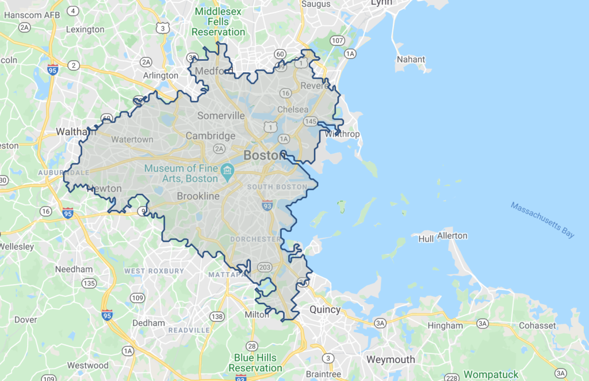

Configure Tempo isochrone time brackets
=======================================

An isochrone is a time-based map & geofence, showing how far a customer can travel (Eg. to get to your restaurant) in a certain number of minutes. It will usually look something like this:

In Tempo, isochrones help calculate a customer’s estimated-time-of-arrival (ETA) to their pick-up location (aka Destination). By default, for every  [Destination you create](../Tempo/Create%20your%20destinations.md), Tempo automatically builds 5 time-brackets to send ETA notifications at intervals or 15, 10, 5, 2 and 1 minute.

With Tempo, you can choose:

*   What your ETA updates are; and
*   How many intervals there are

These two variable are configured using the number of isochrones created for each Destination and the time-bracket for each isochrone.

For example, you want to know when are 10 mins, 5 mins, and then 3 mins away. Or you may simply want a single notification when the customer is 7 mins away. Tempo supports both of these different configurations out of the box.