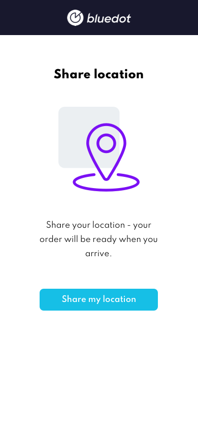

Location permissions and best practices
=============================================

Adding location to events
-------------------------

To add location to events, you must first enable location. This will immediately prompt the user for permission, see [Prompting for permission at the appropriate time](#prompting-for-permission-at-the-appropriate-time) for best practices on when to do this.

```js
import { bluedot } from "@bluedot-innovation/javascript-sdk"
bluedot.setLocationEnabled(true)
```

Location in web environments
----------------------------

In the web environment, location permission can only be requested once, and any subsequent location permission requests will be ignored.

Prompting for permission at the appropriate time
------------------------------------------------

Most users are distrustful of sites that simply show a prompt to give location access on page load. We suggest to always request access for location on a user action. Make sure that users understand why you’re asking for their location, and what the benefit to them will be. Asking for it immediately on the homepage as the site loads results in a poor user experience. Instead, give the user a clear call to action or an indication that an operation will require access to their location. The user can then more easily associate the system prompt for access with the action just initiated.

Below is an example of requesting location from the user.



[Resource](https://developers.google.com/web/fundamentals/native-hardware/user-location) on how to handle user location on the web.