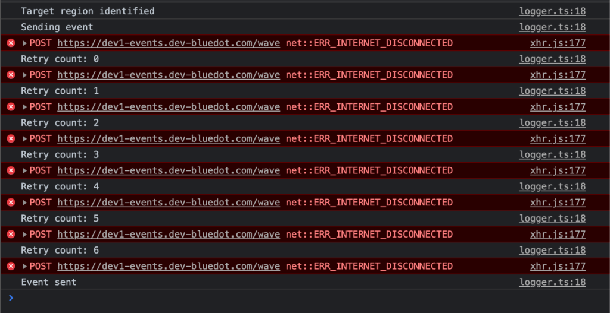

SDK Retry Behaviour
=========================

A key target environment is mobile browsers, which can have intermittent network connections due to poor coverage or transitioning between different network sources such as Wi-Fi and Cellular.

To ensure that events are sent with as high reliability as possible, the SDK will automatically attempt to resend each event in the event of a network failure or unexpected server response.

With debugging, mode enabled every time a failed network connection is retried it will log the current retry count to the console. The maximum amount of retries is currently set to **15**, with the delay between attempts increasing each time. The total amount of time the SDK will continue to attempt to send an event is just **under 2 minutes**, at which point if the event still has not been able to be sent an error will be thrown.

Below are some example logs where a network request initially failed due to an unavailable network connection but then manages to be sent after several attempts.

