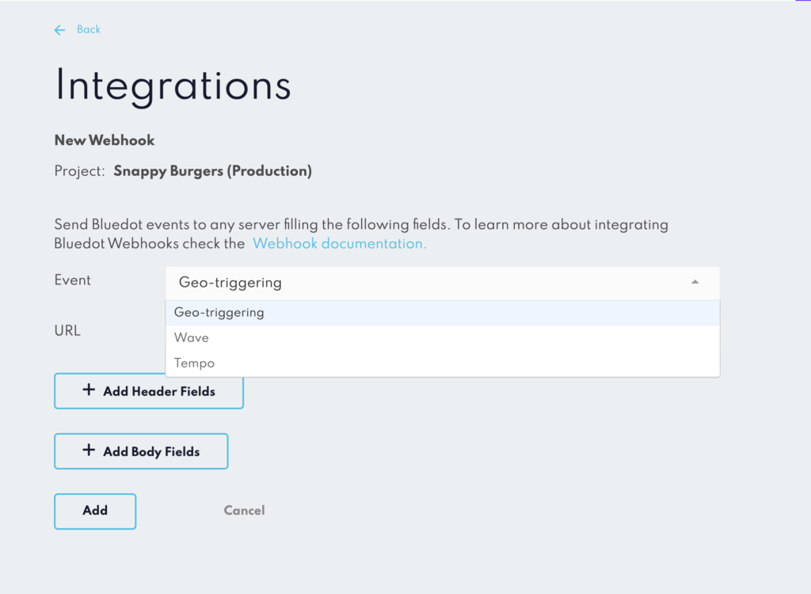
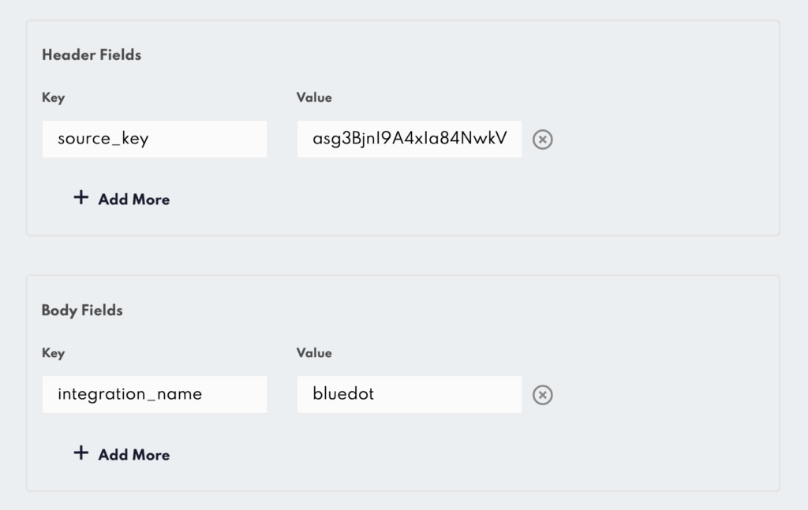

Geo-trigger webhook
====================

Register Geo-trigger Webhooks to receive real-time Entry/Exit notifications from your customers.

Configure a Geo-trigger Webhook
-------------------------------

From the Canvas Integration section, add a new Webhook and select Geo-trigger as the type in the dropdown.



### Additional Header and Body fields

You can have additional information in either the headers or the body of the webhook’s request by adding extra fields.



You can also configure a Geo-trigger Webhook through Config API (Information on using the Config API for registering a Webhook can be found [here](https://config-docs.bluedot.io/#operation/addProject).)

If you’d like to Create a Destination using [Config API](../APIs/Config%20API/Overview.md), you’ll use the following endpoints:


[**Add Geo-trigger Webhooks to a Project**](https://config-docs.bluedot.io/#tag/projects/operation/addProject)

When creating or editing a Project you can add Geo-trigger Webhooks within the webhooks property.
Set the type to trigger in the request.

Endpoint: https://config.bluedot.io/prod1/projects

Example of adding a Geo-trigger Webhook:
```json
"webhooks": [{
    "type": "trigger",
    "url": "<webhook URL goes here>"
}]
```

Webhook request JSON structure
------------------------------

### Entry JSON request
```json
{
    "type": "checkIn",
    "checkInId":"73cbdf0c-5523-46ec-bc15-c9ad362b2a85",
    "installRef":"c92f4a32dc35282d4471b42993f809fa",
    "checkInTime": "02-09-2018 00:08:16",
    "checkInTimeISO": "2018-09-02T00:08:16.000Z",
    "longitude":144.98173087835312,
    "latitude":-37.819805462370944,
    "fenceName":"Melbourne Cricket Ground Gate 1",
    "deviceSpeed":10,
    "fenceId":"80fc36ad-ee72-4450-ad96-b3fadfc26cb4",
    "zoneName":"Melbourne Cricket Ground",
    "zoneId":"ffece0a9-fd21-4148-892e-0a61d01a6bd4",
    "deviceType":"iPhone 9,3",
    "sdkVersion": "1.13.0",
    "os": "iOS",
    "osVersion": "12.1.2",
    "appBuildVersion": "2.8.0.639",
    "receivedAt": "2018-09-02T00:22:43.816Z"
}
```

### Entry JSON request with `customEventMetaData` and `customData`
```json
{
  "type": "checkIn",
  "checkInId":"73cbdf0c-5523-46ec-bc15-c9ad362b2a85",
  "installRef":"c92f4a32dc35282d4471b42993f809fa",
  "checkInTime": "02-09-2018 00:08:16",
  "checkInTimeISO": "2018-09-02T00:08:16.000Z",
  "longitude":144.98173087835312,
  "latitude":-37.819805462370944,
  "fenceName":"Melbourne Cricket Ground Gate 1",
  "deviceSpeed":10,
  "fenceId":"80fc36ad-ee72-4450-ad96-b3fadfc26cb4",
  "zoneName":"Melbourne Cricket Ground",
  "zoneId":"ffece0a9-fd21-4148-892e-0a61d01a6bd4",
  "deviceType":"iPhone 9,3",
  "sdkVersion": "1.13.0",
  "appBuildVersion": "2.8.0.639",
  "os": "iOS",
  "osVersion": "12.1.2",
  "receivedAt": "2018-09-02T00:22:43.816Z",
  "zoneCustomData": {
      "key1": "value1",
      "key2": "value2"
  },
  "eventMetaData": {
      "eKey1": "eValue1"
  }
}
```

### Exit JSON request
```json
{
    "type": "checkOut",
    "checkInId":"73cbdf0c-5523-46ec-bc15-c9ad362b2a85",
    "installRef":"c92f4a32dc35282d4471b42993f809fa",
    "checkInTime": "02-09-2016 00:08:16",
    "checkInTimeISO": "2016-09-02T00:08:16.000Z",
    "checkOutTime": "02-09-2016 02:25:47",
    "checkOutTimeISO": "2016-09-02T02:25:47.000Z",
    "dwellTime": 138, 
    "fenceName":"Melbourne Cricket Ground Gate 1",
    "fenceId":"80fc36ad-ee72-4450-ad96-b3fadfc26cb4",
    "zoneName":"Melbourne Cricket Ground",
    "zoneId":"ffece0a9-fd21-4148-892e-0a61d01a6bd4",
    "deviceType":"iPhone",
    "sdkVersion": "1.8.0",
    "appBuildVersion": "2.8.0.639",
    "receivedAt": "2016-09-02T02:25:47.816Z"
}
```

### Exit JSON request with `customEventMetaData` and `customData`
```json
{
    "type": "checkOut",
    "checkInId":"73cbdf0c-5523-46ec-bc15-c9ad362b2a85",
    "installRef":"c92f4a32dc35282d4471b42993f809fa",
    "checkInTime": "02-09-2016 00:08:16",
    "checkInTimeISO": "2016-09-02T00:08:16.000Z",
    "checkOutTime": "02-09-2016 02:25:47",
    "checkOutTimeISO": "2016-09-02T02:25:47.000Z",
    "dwellTime": 138, 
    "fenceName":"Melbourne Cricket Ground Gate 1",
    "fenceId":"80fc36ad-ee72-4450-ad96-b3fadfc26cb4",
    "zoneName":"Melbourne Cricket Ground",
    "zoneId":"ffece0a9-fd21-4148-892e-0a61d01a6bd4",
    "deviceType":"iPhone",
    "sdkVersion": "1.8.0",
    "appBuildVersion": "2.8.0.639",
    "receivedAt": "2016-09-02T02:25:47.816Z",
    "zoneCustomData": {
        "key1": "value1",
         "key2": "value2"
     },
     "eventMetaData": {
          "eKey1": "eValue1"
      }
}
```

Geo-trigger Webhook field description
-------------------------------------

Fields returned in Entry event JSON request

| **Field**         | **Type**    | **Description**                                                                                                                                                                | **Example**                              |
|-------------------|-------------|--------------------------------------------------------------------------------------------------------------------------------------------------------------------------------|------------------------------------------|
| `appBuildVersion` | String      | The app build version of the application using the Point SDK, which triggered the check-in. (Available only for check-ins of SDK version 1.8 and above.)                       | `"1.11.2"`                               |
| `checkInId`       | String      | The unique identifier of the Check-in record.                                                                                                                                  | `"73cbdf0c-5523-46ec-bc15-c9ad362b2a85"` |
| `checkInTime`     | String      | UTC date and time of the Check-in in DD-MM-YYYY hh:mm:ss format.                                                                                                               | `"02-09-2018 00:08:16"`                  |
| `checkInTimeISO`  | String      | UTC date and time of the Check-in in ISO format.                                                                                                                               | `"2016-09-02T00:08:16.000Z"`             |
| `deviceSpeed`     | Number      | The travel speed of the device at the time of Check-in reported as meters per second.                                                                                          | `10`                                     |
| `eventMetaData`   | JSON Object | Key/Value pairs passed from the application to Bluedot Point SDK. This will not be returned as part of the request if no data set on the Mobile SDK.                           | `{ “eKey1”: “eValue1” }`                 |
| `fenceId`         | String      | The unique identifier of the fence that triggered the Check-in.                                                                                                                | `"73cbdf0c-5523-46ec-bc15-c9ad362b2a85"` |
| `fenceName`       | String      | The name of the geofence that triggered the Check-in.                                                                                                                          | `"Fence Number 1"`                       |
| `installRef`      | String      | The unique app install reference on the device.                                                                                                                                | `"73cbdf0c-5523-46ec-bc15-c9ad362b2a85"` |
| `latitude`        | Number      | Latitude component of the coordinate at which the Entry event occurred.                                                                                                        | `144.981730`                             |
| `longitude`       | Number      | Longitude component of the coordinate at which the Entry event occurred.                                                                                                       | `-37.819805`                             |
| `os`              | String      | The OS of the device that triggered the Check-in event.                                                                                                                        | `android` `iOS`                          |
| `osVersion`       | String      | The OS Version of the device that triggered the Check-in event.                                                                                                                | `15.4.3`                                 |
| `receivedAt`      | String      | UTC date and time of the Check-in was received in our database in ISO format.                                                                                                  | `"2016-09-02T00:08:16.000Z"`             |
| `sdkVersion`      | String      | The Point SDK version number is being used in the application which has triggered the Entry event. (Available only for check-ins of SDK version 1.6 and above.)                | `"15.2.0"`                               |
| `type`            | String      | This field denotes the type of event being relayed from our servers to yours. For check-ins, the type will be “checkIn”.                                                       | `"checkIn"`                              |
| `zoneCustomData`  | JSON Object | Key/Value pair of Location specific data added to the custom action of the Zone. This will not be returned as part of the request if no data set for the Zone’s custom Action. | `{ “eKey1”: “eValue1” }`                 |
| `zoneId`          | String      | The unique identifier of the zone that triggered the Entry event.                                                                                                              | `"73cbdf0c-5523-46ec-bc15-c9ad362b2a85"` |
| `zoneName`        | String      | The name of the zone that triggered the Entry event.                                                                                                                           | `"Zone Restaurant"`                      |


Fields returned in Exit event JSON request

| **Field**         | **Type** | **Description**                                                                                                             | **Example**                  |
|-------------------|----------|-----------------------------------------------------------------------------------------------------------------------------|------------------------------|
| `checkOutTime`    | String   | UTC date and time of the Check-out in DD-MM-YYYY hh:mm:ss format.                                                           | `"02-09-2018 00:08:16"`      |
| `checkOutTimeISO` | String   | UTC date and time of the Check-out in ISO format.                                                                           | `"2016-09-02T00:08:16.000Z"` |
| `dwellTime`       | Number   | The dwell time is the number of minutes a device was within a fence.                                                        | `138`                        |
| `type`            | String   | This field denotes the type of event being relayed from our servers to yours. For Exit events, the type will be “checkOut”. | `"checkOut"`                 |