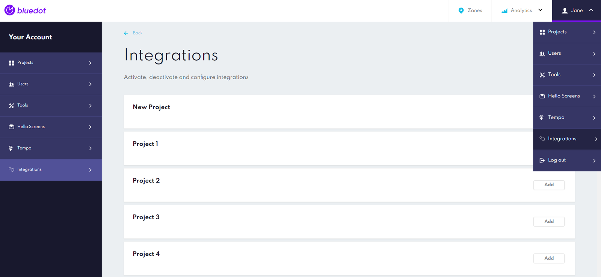
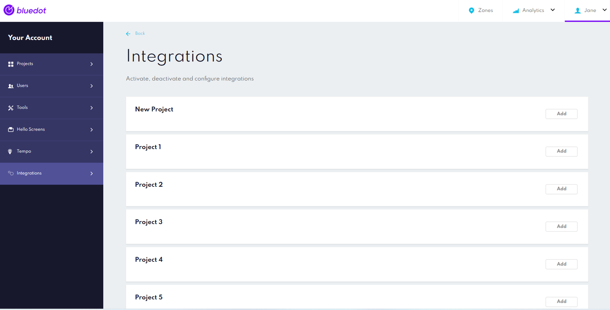
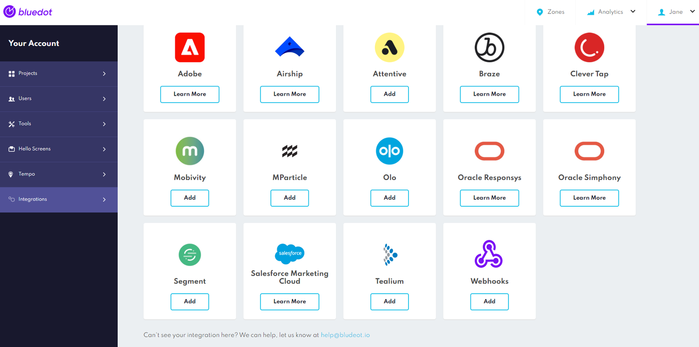
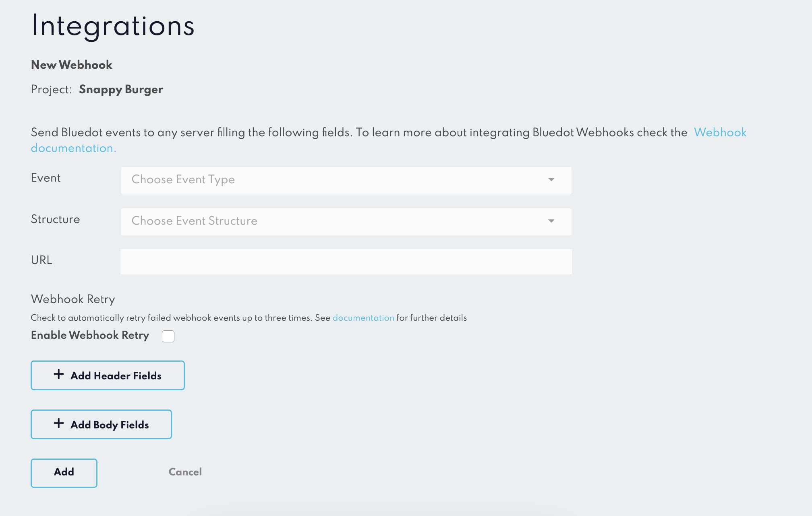
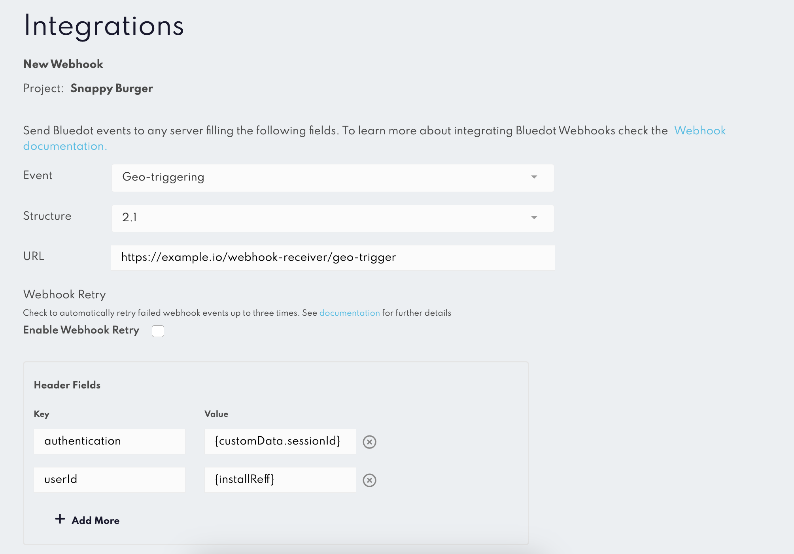

Overview
========

Register Webhooks to receive real-time notifications from your app user's activity. Webhooks can be used to send events for:

*   **Geo-trigger:** Entry and/or exit into a Zone/Geofence
*   **Tempo:** ETA calculations as a user moves towards a Zone
*   **Wave:** API events when a user notifies of their arrival
*   **Hello Orders:** events when the state of an order has been updated in Hello Screens

Please also note that:

*   Multiple Webhooks can be added to the project
*   Webhooks structure can be standard hierarchical or flat
*   Header fields can be set dynamically

Configure a Webhook
-------------------

There are two ways to configure a Webhook:

*   Through the Canvas UI
*   Using Config API (Learn more [here](https://config-docs.bluedot.io/#operation/addProject).)

Webhooks are configured at the Project level with a maximum of one webhook for each Event type.

To set up **Webhooks**, login to Canvas and head to the **Integrations** section**.**



1\. In the Integrations section, choose a Project where you would like to add a Webhook and click on the Add button



2\. In the list of the Integrations search for the Webhooks tab and click on adding a new Webhook



3\. Configure Event Type, Event Version, URL, Header and Body fields



4\. Webhook Payload Versions: we support multiple **payload versions**, allowing you to choose the structure that works best for your integration. We recommend selecting the **most recent version** to access the latest features and data fields. Older versions are still available to ensure we don't break existing implementations for customers already using webhooks.  


5\. Header Fields for the standard Webhooks can be set dynamically by adding the {} in the value field. By the way, the value itself can be set and injected from the additional event-specific **[Custom Event Meta Data](../Custom%20Data.md)** fields. The Dynamic Webhook Headers feature will pick up that value and attach it to the Webhook outputs.



| Property | Description |
|---|---|
| Event | Choose Event Type: - Geo-triggering - Wave - Tempo - Hello Order |
| URL | The URL of the server where the webhooks will be received. We suggest that the service has SSL enabled. |
| Header fields (optional) | Custom headers are sent along with the webhook request. Keys must not contain spaces.  The dynamic headers (available only for standard webhooks) will require a fixed property key; only the value can be programmatically set. By adding dynamic headers to the Webhook, you're setting up a pattern that will be picked up and populated from the webhook request body . It can be any property name that is present in the webhook request body. For example, to set a custom value included in the event, you can use `eventMetaData.key_name` for a Geo-trigger event or `customEventMetaData.key_name` for a Tempo or Wave event |
| Body fields (optional) | Custom fields and values which will be added to the body of the webhook when sent. Keys must not contain spaces |

5\. After finalizing your webhook configuration, click _'Add'_ to save and activate the webhook.

:::info
**Webhooks Retry Mechanism**: 
The Webhooks Retry Mechanism is an optional feature that resends failed webhook events automatically. Learn how to enable and use this feature [here](./Webhooks%20retry.md).
:::

Receiving a Webhook notification
================================

To receive a webhook, you would need a server, cloud function or any HTTP endpoint that can accept and process `POST` requests.

Webhook Event Headers
---------------------

You can make use of the **Token Key** and **Token Value** to add your own signature to the Webhook event. The Token Key and Token Value will be included in the Header of the HTTP request. 

```json
"tokenKey": "tokenValue"
```

We encourage you to make use of these Key/Value tokens to sign the events with our own values to verify the origin of the events.

### Example HTTP header in the request
```json
{
    "securitytoken": "72340732BlueDOT7297329-T0",
    "contenttype": "application/json"
}
```

### Example Dynamic headers in the request
```json
{
    "authentication_token": "Bearer {eventMetaData.auth_key}",
    "user_id": "{installRef}",
    "HeaderKey3": "HeaderValue3"
}
```

Security: Safelisting IPs
-------------------------

In an effort to enhance security, it's essential to know the source of the events you're receiving. This is where IP safelisting comes into play. For Bluedot events, they will come from a specific set of IP addresses. You can safelist these IPs in your webhook receiver services to ensure that you're only receiving events from a secure source.

Here are the lists of IPs where the Bluedot events will come from, categorized by account region:

| **Region**    | **IP Address**  |
|---------------|-----------------|
| APAC          | `34.87.240.222` |
| Europe        | `34.79.240.229` |
| North America | `35.229.85.242` |

If you have trouble finding out in which region your account is located, please reach out to us at [help@bluedot.io](mailto:help@bluedot.io) so that we can confirm this for you.

Webhook payload structure
------------------------------
Explore these links for detailed examples and explanations of the JSON structures used in our webhook events.

*   [Geo-trigger](./Geo-triggering.md)
*   [Tempo](./Tempo.md)
*   [Wave](./Wave.md)
*   [Hello Order](./Hello%20order.md)