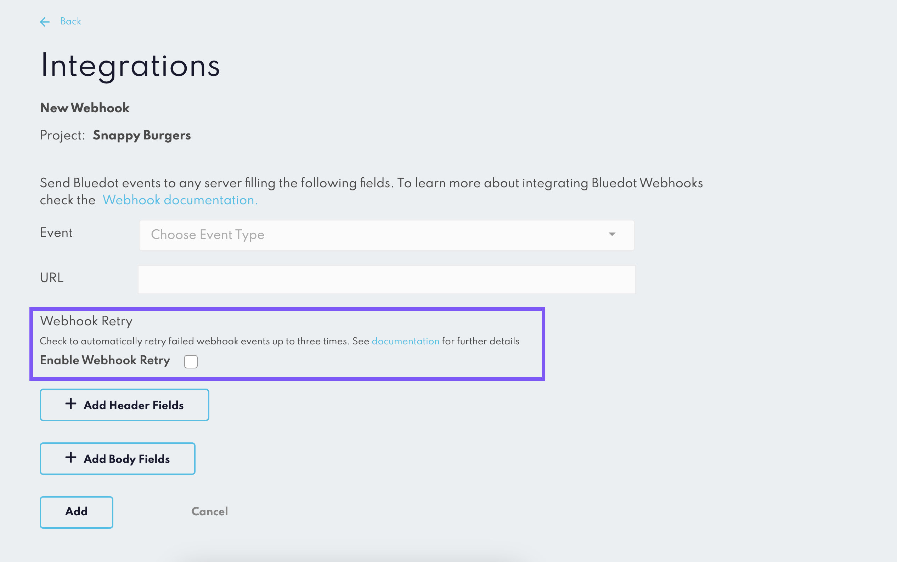

Webhooks Retry
========================

The Webhooks Retry Mechanism is an optional feature that enhances the reliability of your webhook events. By default, this feature is disabled, but it can be manually enabled by the user.

Enabling the Retry Mechanism
----------------------------

To enable the Webhooks Retry Mechanism, navigate to the Webhooks section on Canvas. Here, you will find a dedicated section for enabling the retry mechanism. Check the box in this section to activate the retry mechanism.

How Does the Retry Mechanism Work?
-----------------------------------

When the retry mechanism is enabled, all webhooks that fail to deliver will be resent according to an exponential retry schedule. This means that the system will attempt to resend the webhook 3 times. The delay between each attempt increases exponentially, following the formula 2^n.

To put it simply, the first retry will happen almost immediately. If this fails, the second retry will occur after 2 seconds. If the second attempt also fails, the third and final retry will be made after 4 seconds. This makes for a total of roughly 7 seconds for the entire retry process.

Deduplication of Webhook Events
-------------------------------

To help you manage your webhook events more effectively, each webhook event is assigned a unique deduplication ID when the Webhook Retry feature is enabled. This allows you to identify if an event has been sent before, helping to avoid processing the same event multiple times.

When the retry mechanism is enabled, the webhook payloads will include a `webhookUniqueId` property. You can use this unique ID to identify duplicate events and ensure each event is processed only once.