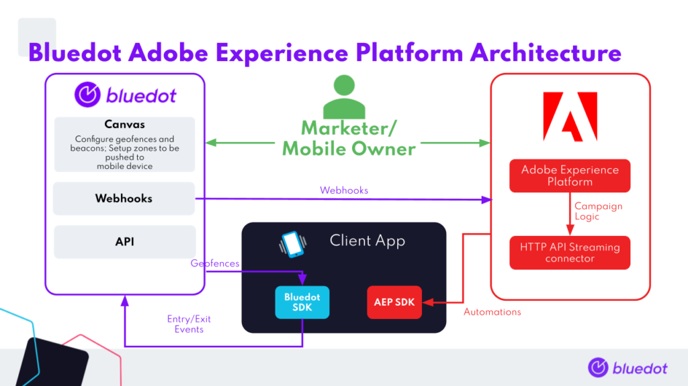

Adobe Experience Platform integration
=====================================

[Rezolve](https://rezolve.com/) is a location platform that provides an accurate and simple geofencing platform for apps. After integrating the Rezolve Point SDK and setting geofences, customer’s can create personalised location-based experiences for their users.

[Adobe Experience Platform](https://business.adobe.com/au/products/experience-platform/adobe-experience-platform.html), the foundation of Experience Cloud products, is an open system that transforms all your data — Adobe and non-Adobe — into robust customer profiles that update in real-time and uses AI-driven insights to help you to deliver the right experiences across every channel.

With Adobe Experience Platform + Rezolve together you can send Push messages when the customer arrives at your restaurant, trigger specific email campaigns based on visits to a rival’s store, or create an immersive game experience, engaging your customers as they move throughout real-world locations.

Integration Architecture Diagram
--------------------------------

Integration Overview
--------------------

Before you begin the integration please ensure you have an active customer account with both Rezolve & Adobe Experience Cloud.

We will be using an [**HTTP API streaming connector**](https://experienceleague.adobe.com/docs/experience-platform/sources/ui-tutorials/create/streaming/http.html?lang=en) to pass Rezolve Entry/Exit events to Adobe.

1.  Decide on the custom data you’ll be passing from Rezolve Entry/Exit (can also be called Check-in and Check-out Event) Events to Adobe:
    1.  [Custom Event Metadata](../Custom%20Data.md) (max. 20)
    2.  [Custom Zone Data](../Canvas/What%20is%20Zone%20custom%20data.md) (max. 20)
2.  Integrate the Rezolve SDK within your mobile app:
    1.  [Android integration guide](../Point%20SDK/Android/Quick%20Start.md)
    2.  [iOS integration guide](../Point%20SDK/iOS/Quick%20Start.md)
3.  Create a streaming connection using the UI to accept Rezolve events as per Adobe’s documentation.
    1.  Create a new HTTP API account
        *   **Account name:** Rezolve geo-trigger webhook
        *   **Description:** Real-time Entry/Exit notifications from your customers are received here.
        *   Disable authentication
        *   Uncheck XDM compatible
    2.  Work with the Rezolve team on creating a JSON file to upload
    3.  Create a new dataset
        *   **Target dataset name:** Rezolve Geo-trigger Webhook events
        *   **Description:** Rezolve Geo-trigger Webhook events
        *   **Schema:** streaming data prep
    4.  Follow [instructions](https://experienceleague.adobe.com/docs/experience-platform/sources/ui-tutorials/create/streaming/http.html?lang=en#map-standard-fields) to map the data fields
    5.  Follow [instructions](https://experienceleague.adobe.com/docs/experience-platform/sources/ui-tutorials/create/streaming/http.html?lang=en#dataflow-detail) to complete the Dataflow detail step
    6.  In the Review step, after confirming the details are correct, select Finish.
4.  Set up a Webhook for the project in Rezolve Canvas. Use the streaming endpoint URL available on the sources detail page. You can leave the Token key and value fields blank.

Once these steps are done, the integration is ready to go. Simply enter a geofence with a mobile device to trigger the Zone.

Custom Event Metadata in Rezolve events
---------------------------------------

More information on best practices of setting and using custom event metadata can be found [here](../Custom%20Data.md).

:::info
The custom event metadata is not persisted across SDK sessions. If the SDK is logged out the custom event metadata is cleared by the SDK. We suggest setting the custom data every time the SDK is authenticated in the app.
:::

Webhook fields passed to HTTP API Streaming connector
-----------------------------------------------------

More information on the fields passed via entry/exit events Rezolve webhooks are [here](../Webhooks/Overview.md).

* * *

If you have any questions about this guide or implementing Rezolve & Adobe Experience Platform together, reach out to our Engineering Support Team [help@bluedot.io](mailto:help@bluedot.io).