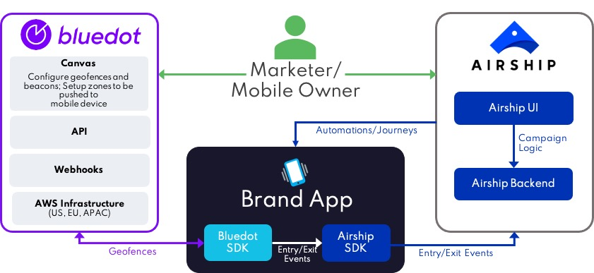

Overview
===================

With the combination of Airship’s leading mobile engagement platform and Bluedot’s best in class location technology, mobile engagement is taken to the next level. Combine the power of Airship with the precision and scalability of Bluedot’s location services to accelerate growth, drive loyalty engagement and revenue in your app and beyond.

Bluedot’s location marketing platform delivers a solution 20x more accurate, with negligible battery drain, unlimited locations and best in class privacy making it the only option that can deliver location-based 1:1 segmentation no matter how large your audience is.

Connectivity is at the heart of this chapter for mobile. But it’s more than just the ability to engage. It’s also about connecting to mobile users with discernment and insight. That’s what mobile engagement is about, and it’s exciting what we can do.

Integration architecture
------------------------

Airship Setup
-------------

### Creating a Project

If you have just registered for an Airship account the first step is to set up a project. If you have an existing account then either choose the project you wish to use or select the Create project button in the view all projects page to create a new one. More information on setting up a Project can be found [here](https://docs.airship.com/tutorials/getting-started/messaging/create-project/).

Rezolve setup
-------------

### Creating a new Project

Creating a Project is your first step. All your Zones and all geofeatures exist within a Project. More information on adding and managing Rezolve Canvas project can be found [here](../../Canvas/Creating%20a%20new%20project.md).

### Adding a Zone

You’ll need to create a Zone before you can start adding in specific Geofeatures. Each Zone can have one or many Geofeatures – that’s up to you and your use-case. More information on adding and managing Zones can be found [here](../../Canvas/Add%20a%20new%20zone.md).

:::info
The Zone name, Zone ID or a combination of both can be used as an event to be registered to Airship for triggering an Automation. Provide a descriptive name and possibly adopt a naming convention for the Zone name field.
:::

Configure an Entry Trigger
--------------------------

Information on configuring a trigger in Airship’s platform is [here](https://docs.airship.com/tutorials/orchestration/automation/event-triggers/).

In the Events textbox while setting up a trigger, enter the event names you want to use. These event names will be used in your app to create Airship’s custom events when entry or exit is triggered by the Rezolve Point SDK. For example: `rezolve_place_entered`, `rezolve_place_exited`

For an Entry event, we recommend setting the custom event as `rezolve_place_entered` in the App and trigger.

Configure an Exit trigger
-------------------------

For exit enabled Zones, you will have to set up a trigger similar to the entry event. Add another event, e.g. `rezolve_place_exited` if you want automation or journey to be triggered when the user leaves a Geofence.

Additional Information
----------------------

You can find additional information on the different features we support below:

*   [Airship Android Integration](./Android.md)
*   [Airship iOS Integration](./iOS.md)
*   [GitHub – Bluedot Airship Android example](https://github.com/Bluedot-Innovation/BluedotAirshipDemoApp-Android)
*   [GitHub – Bluedot Airship iOS example](https://github.com/Bluedot-Innovation/PointSDK-UrbanAirshipIntegrationExample-iOS)
*   [Drawing Geofences or Geolines™](../../Canvas/Add%20a%20new%20zone.md)
*   [Setting custom data fields](../../Canvas/What%20is%20Zone%20custom%20data.md)
*   [Zone Settings](../../Canvas/What%20are%20Zone%20settings.md)
*   You can use our [Config API](../../APIs/Config%20API/Overview.md) to create the Zones (including the Geofences, GEOLINE™, Custom Actions and Conditions).
*   [Airship Engage platform documentation](https://docs.airship.com/tutorials/getting-started/messaging/set-up-account/).