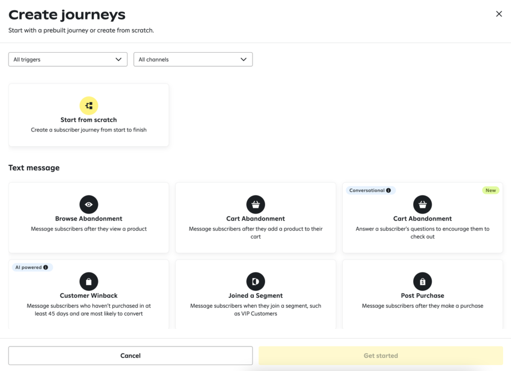
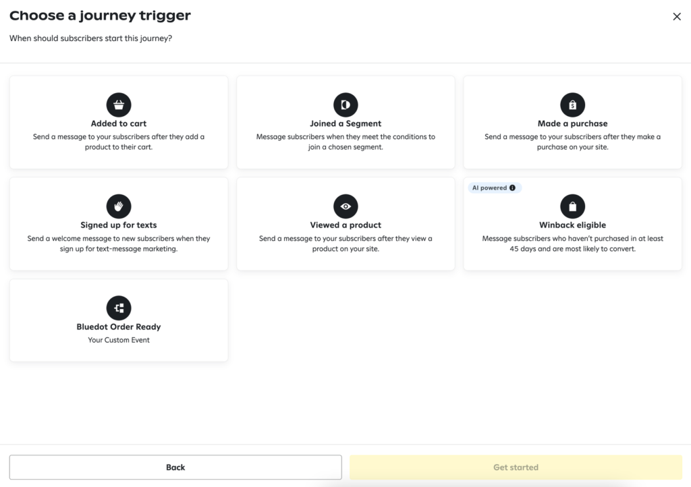
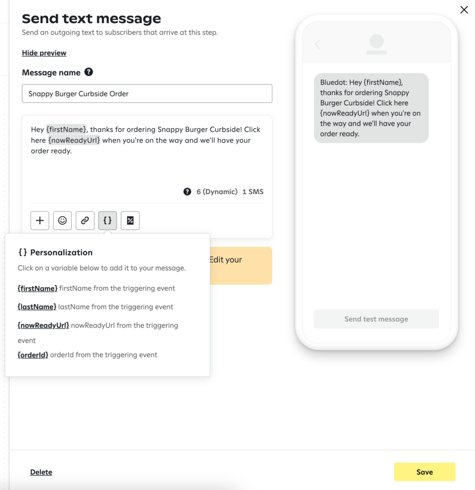

Attentive Curbside Experience
=============================

Take your Curbside & Pickup experience to the next level with Attentive’s personalized marketing messaging and Rezolve's best-in-class customer arrival technology. 

Send a personalized SMS to your customers to collect their curbside pickup orders with a link to our pre-built web app _Now Ready__,_ to let a store know when they’re on their way and when they’ve arrived.

How does it work?
-----------------

When a new order is registered, Rezolve will call [Attentive’s Custom Events API](https://docs.attentivemobile.com/openapi/reference/tag/Custom-Events/) to with the basic user and order details, then you can use [Attentive’s Journey Builder](https://www.attentivemobile.com/messaging) to craft the content of the SMS.

You can register orders from one of our Order Management partners (I.E., Olo) or [Rezolve’s Register Order API](https://events-docs.bluedot.io/#operation/registerOrder).

Create your Journeys to send messages
-------------------------------------

Once you’ve installed the Attentive & Rezolve (formerly Bluedot) integration, you can start creating Journeys to send SMS with the [Now Ready](../../Now%20Ready/Overview.md) link. 

1\. Create a new Journey and select the “Start from scratch” option.

2\. Select the _Bluedot Order Ready_ custom event.

3\. Add a “Send text message” option and edit the content of the message.  

Custom Properties
-----------------

You can add any of the variables in the {} Personalization option to customize your message. These are the list of variables available in the Rezolve Order Ready event:

**Variable**

**Description**

`firstName`

Customer’s first name used to register the order

`lastName`

Customer’s last name used to register the order

`orderId`

ID of the order registered

`nowReadyUrl`

Link to Now Ready for the order registered

When using the Rezolve's Wave API to register an order,  the fields `firstName`, `lastName` and `orderId` are required. Rezolve will take care of generating and then passing the `nowReadyUrl` to Attentive. If you’re using one of our order management integrations (i.e. Olo) Rezolve takes care of passing these fields to Attentive.

Important Notes
---------------

Here’s a list of known caveats that you need to take into account when designing your Curbside experience with Attentive & Rezolve to ensure your users will receive the SMS.

### Only Opt-in Users

Please make sure to collect the customer’s consent when collecting the phone number of the user during the order’s checkout process. Attentive will always ensure the number is opted in before sending the SMS, so there’s no chance of an un-opted user getting an SMS.  For further information check [Attentive’s documentation on legal requirements for transactional messages](https://docs.attentivemobile.com/pages/legal-docs/legal-transactional/).

### Missing Custom Properties in SMS

If a message includes variables from the {} Personalization options, but these are not populated when registering the order with Rezolve’s Wave API, then the message will not be sent. 