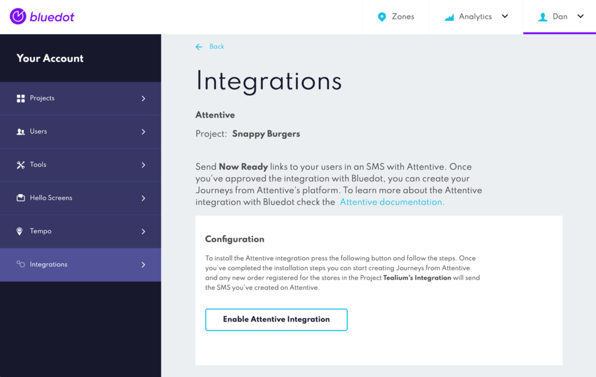
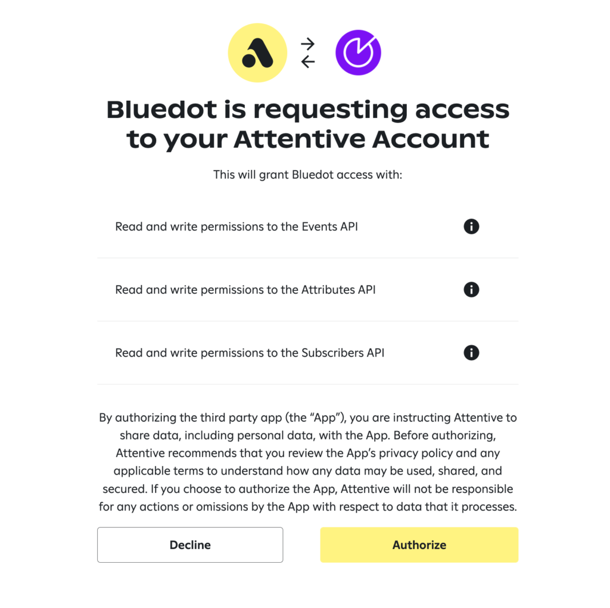

Attentive location-based messages
=================================

The Attentive - Rezolve Geofencing enables brands to deliver more personalized and effective messaging to their customers. This feature allow you to send SMS messages to your customers when they enter or exit a Geofence.

How does it work?
-----------------

When a user enters or exits a Zone, Rezolve will call [Attentive’s Custom Events](https://docs.attentivemobile.com/openapi/reference/tag/Custom-Events/) API with the basic user and the information about the Zone they’ve reached, then you can use the [Attentive’s Journey Builder](https://www.attentivemobile.com/messaging) to craft the content of the SMS.

Installing the Attentive & Rezolve integration
----------------------------------------------

To start using the Attentive integration you need to have an active account with Attentive, as well with Rezolve. 

You can install the integration either from Attentive’s marketplace or from Canvas in the integrations section.

### From Attentive’s Marketplace

From Attentive’s market place search for Bluedot and follow the steps to install the app.

### From Canvas Integrations

From Canvas, go to the Integrations section and select Attentive click on the “_Enable_ _Attentive Integration_” button and then follow the steps to complete the integration.

### Authorizing the Integration

If you are installing the integration from Attentive’s Market place, you’ll need to select the region where your Rezolve account is.

Rezolve Mobile Point SDK implementation best practices
------------------------------------------------

When implementing the Rezolve Point SDK in your app, ensure that you include the subscriber’s mobile number in the SDK’s Custom Event Meta Data. We’ll pass this number to Attentive to send the message to the right user.

For the integration to work, you’ll need to pass the subscriber mobile number in the Custom Event Meta Data with any of the following keys:

*   `mobileNumber`
*   `contactNumber`

Create your Journeys to send messages
-------------------------------------

Once you’ve installed the Attentive & Bluedot integration, and have implemented the Rezolve mobile SDK into your app, you can start creating Journeys to send an SMS when a user enters a Zone. 

1\. Create a new Journey and select the “_Start from scratch_” option.

2\. Select one of the _Bluedot Entered a Zone_ or _Bluedot Exit a Zone_ custom events.

3\. Add a “Send text message” option and edit the content of the message.  

Important Notes
--------------

Here’s a list of known caveats that you need to take into account when designing your Curbside experience with Attentive & Rezolve to ensure your users will receive the SMS.

### Only Opt-in Users

Please make sure to collect the customer’s consent when collecting the phone number of the user during the order’s checkout process. Attentive will always ensure the number is opted in before sending the SMS, so there’s no chance of an un-opted user getting an SMS.  For further information check [Attentive’s documentation on legal requirements for transactional messages](https://docs.attentivemobile.com/pages/legal-docs/legal-transactional/).

### Missing Custom Properties in SMS

If a message includes variables from the {} Personalization options, but these are not populated when registering the order with Rezolve's Wave API, then the message will not be sent. 
