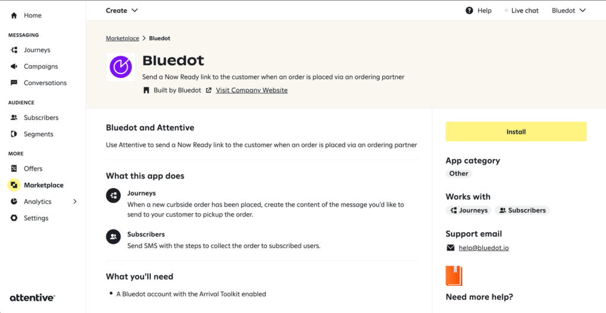

Installing the Attentive & Rezolve integration
==============================================

To start using the Attentive integration you need to have an active account with Attentive, as well with Rezolve. 

You can install the integration either from Attentive’s marketplace or from Canvas in the integrations section.

### From Attentive’s Marketplace

From Attentive’s market place search for Rezolve and follow the steps to install the app.

### From Canvas Integrations

From Canvas, go to the Integrations section and select Attentive click on the “_Enable_ _Attentive Integration_” button and then follow the steps to complete the integration.

### Authorizing the Integration

If installing the integration from Attentive’s Market place, you’ll need to select the region where your Rezolve account is. If you’re not sure what the region of your account is, let us know at [help@bluedot.io](mailto:help@bluedot.io).

Important Notes
---------------

Here’s a list of known caveats that you need to take into account when designing your Curbside experience with Attentive & Rezolve to ensure your users will receive the SMS.

### Only Opt-in Users

Please make sure to collect the customer’s consent when collecting the phone number of the user during the order’s checkout process. Attentive will always ensure the number is opted in before sending the SMS, so there’s no chance of an un-opted user getting an SMS.  For further information check [Attentive’s documentation on legal requirements for transactional messages](https://docs.attentivemobile.com/pages/legal-docs/legal-transactional/).

### Missing Custom Properties in SMS

If a message includes variables from the `{}` Personalization options, but these are not populated when registering the order with Bluedot’s Wave API, then the message will not be sent.