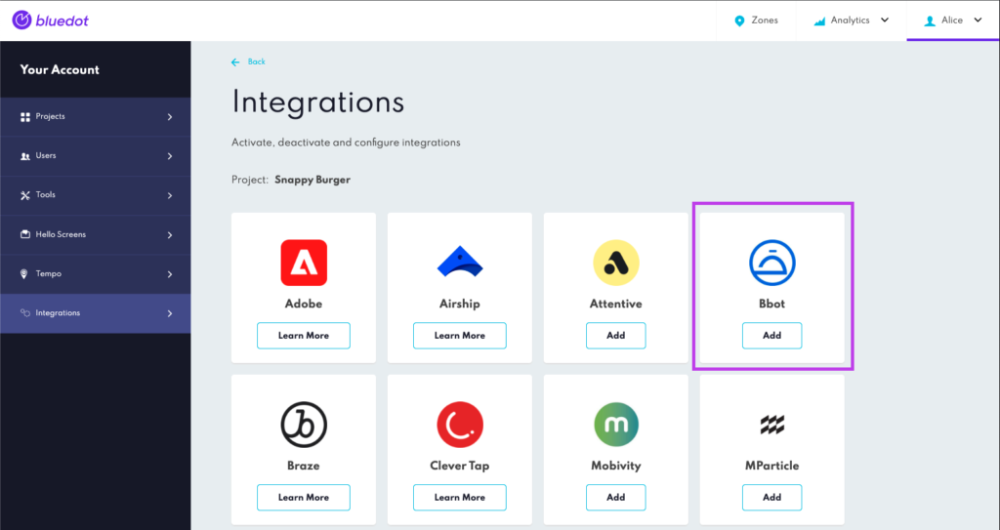

Bbot Integration
================

With Rezolve’s first-class arrival toolkit and Bbot, you can offer your customers a great curbside or pickup experience. You can track customers’ arrival at your restaurant with Hello Screens, informing your staff when a customer is on the way or has arrived to pick up their order.

Find Rezolve Webhook URL
------------------------

The first step is to get Rezolve's webhook URL; we will use it later when creating the Webhook in Bbot.

From Canvas, go to the integrations section and select Bbot.

Importing your Stores from Bbot
-------------------------------

To import stores from Bbot, you will need to provide your Bbot API credentials in Canvas, when setting up the integration. The feature will check for any new stores or updates to store information every 24 hours.

To get started, follow these steps:

1.  Obtain your Bbot API credentials from the Manage Partners section on Bbot’s dashboard.
2.  In Canvas, input your Bbot API credentials.
3.  The feature will automatically check for any new stores or updates to store information every 24 hours.

Create a Webhook in Bbot
------------------------

1.  Copy the Rezolve Webhook URL from the Your webhook URL section
2.  From Bbot’s Admin Portal, add a new webhook from the _Admin > Manage API Access_ and paste the Rezolve Webhook URL in the **Checkout Complete Webhook URL** field and click on _Save_.

Once you’ve added the Bbot’s API credentials and created the Checkout Complete Webhook, you can adjust your stores in Canvas.