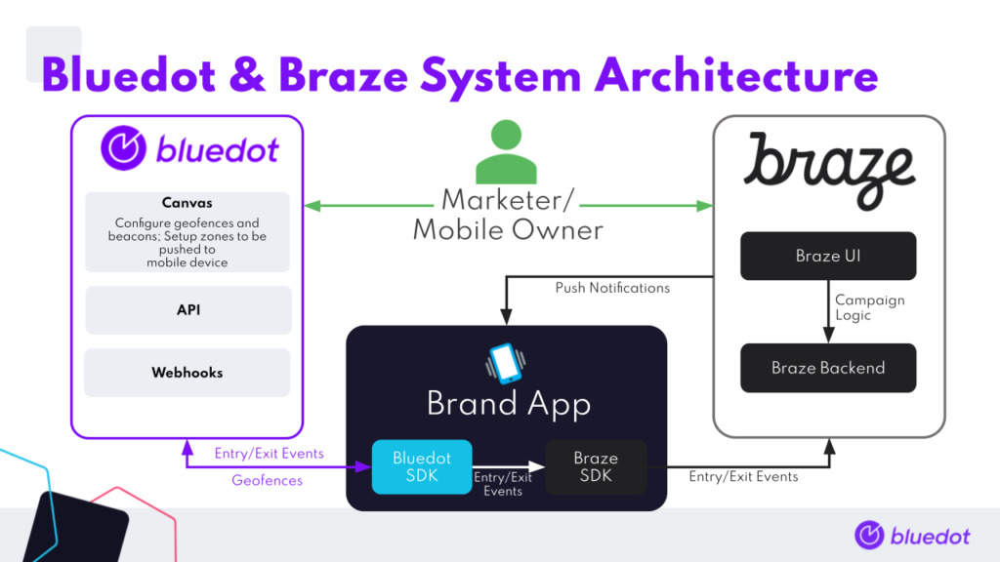

Braze Integration
=================

With the combination of Braze’s leading mobile engagement platform and Bluedot Innovation’s best in class location technology, mobile engagement is taken to the next level. Combine the power of Braze with the precision and scalability of Bluedot’s location services to accelerate growth, drive loyalty engagement and revenue in your app and beyond.

Bluedot’s location marketing platform delivers a solution 20x more accurate, with negligible battery drain, unlimited locations and best in class privacy making it the only option that can deliver location-based 1:1 segmentation no matter how large your audience is.

Connectivity is at the heart of this new chapter for mobile. But it’s more than just the ability to engage. It’s also about connecting to mobile users with discernment and insight. That’s what mobile engagement is about, and it’s exciting what we can now do.

- [Braze Integration](#braze-integration)
  - [Integration architecture diagram](#integration-architecture-diagram)
  - [Bluedot setup](#bluedot-setup)
    - [**Creating a new Project**](#creating-a-new-project)
    - [**Adding a Zone**](#adding-a-zone)
  - [Braze setup](#braze-setup)
    - [Add an App](#add-an-app)
    - [Set up push in your App](#set-up-push-in-your-app)
  - [Integration setup in the app](#integration-setup-in-the-app)
    - [**Android**](#android)
    - [**iOS**](#ios)
  - [**Integration examples**](#integration-examples)

Integration architecture diagram
--------------------------------

The is an SDK-to-SDK integration and you’ll need to install both the Bluedot Point SDK and Braze SDK. Location events generated by the Bluedot Point SDK will be passed to the Braze SDK as Custom Events ([Android](https://www.braze.com/docs/developer_guide/platform_integration_guides/android/analytics/tracking_custom_events/#tracking-custom-events) | [iOS](https://www.braze.com/docs/developer_guide/platform_integration_guides/swift/analytics/tracking_custom_events/)) and Braze will handle the User Segmentation based on your Braze Campaign configuration, and sending notifications to your users.



Bluedot setup
-------------

### **Creating a new Project**

Creating a Project is your first step. All your Zones and all geofeatures exist within a Project. More information on adding and managing Bluedot Canvas project can be found [here](../../Canvas/Creating%20a%20new%20project.md).

### **Adding a Zone**

You’ll need to create a **Zone** before you can start adding in specific **Geofeatures**. Each Zone can have one or many **Geofeatures** – that’s up to you and your use-case. More information on adding and managing Zones can be found [here](../../Canvas/Add%20a%20new%20zone.md).

Braze setup
-----------

### Add an App

If you have just registered for a Braze account select the **Add your app** button. If you have an existing account then either choose the app you wish to use, or select the **New app** button in the upper right corner of the dashboard to create a new one. More information on setting up an App can be found [here](https://www.braze.com/docs/developer_guide/platform_wide/app_group_configuration/).

### Set up push in your App

*   Add the Google Cloud Messaging (FCM) API key in Apps Settings that are located in the Manage Settings section. For further information refer to [Braze Android Documentation](https://www.braze.com/docs/developer_guide/platform_integration_guides/android/push_notifications/integration/)
*   Add the Apple Push Notification Service (APNs) Certificate in the Quickstart Guide iOS tab. It is located at the end of the screen. For further information refer to [Braze iOS Documentation](https://www.braze.com/docs/developer_guide/platform_integration_guides/swift/push_notifications/integration/)


> **Note:** It is vital to set up the APNs certificate for iOS and FCM API Key for Android platforms, to utilize the push based automated messages in Braze engagement platform.

**More information**

More information on adding and updating your Braze App can be found [here](https://www.braze.com/docs/user_guide/administrative/app_settings/).

Integration setup in the app
----------------------------

The application needs to be configured to send custom events to Braze when a Bluedot entry or exit trigger occurs.

### **Android**

The Android/Kotlin implementation for passing up entry events is as follows, using the [onZoneEntryEvent](https://android-docs.bluedot.io/-bluedot-s-d-k/au.com.bluedot.point.net.engine/-geo-triggering-event-receiver/index.html#%5Bau.com.bluedot.point.net.engine%2FGeoTriggeringEventReceiver%2FonZoneEntryEvent%2F%23au.com.bluedot.point.net.engine.ZoneEntryEvent%23android.content.Context%2FPointingToDeclaration%2F%5D%2FFunctions%2F-762893342) callback:

```kotlin
override fun onZoneEntryEvent(geoTriggerEvent: GeoTriggerEvent, context: Context) {
    println("Zone ${geoTriggerEvent.zoneInfo.name}, fence ${geoTriggerEvent.entryEvent()?.fenceName} entered at: ${Date()}")

    val eventProperties = BrazeProperties()
    eventProperties.addProperty("zone_id", geoTriggerEvent.zoneInfo.id)
    eventProperties.addProperty("zone_name", geoTriggerEvent.zoneInfo.name)
    eventProperties.addProperty("latitude", geoTriggerEvent.entryEvent()?.locations?.get(0)?.latitude)
    eventProperties.addProperty("longitude", geoTriggerEvent.entryEvent()?.locations?.get(0)?.longitude)
    eventProperties.addProperty("fence_id", geoTriggerEvent.entryEvent()?.fenceId)
    eventProperties.addProperty("fence_name", geoTriggerEvent.entryEvent()?.fenceName)

    geoTriggerEvent.zoneInfo.customData?.forEach { data ->
            eventProperties.addProperty(data.key, data.value)
        }

    Braze.getInstance(context).logCustomEvent(customEventEntry, eventProperties)
}
```

To pass up Bluedot exit triggers, a similar code should be added for the [onZoneExitEvent](https://android-docs.bluedot.io/-bluedot-s-d-k/au.com.bluedot.point.net.engine/-geo-triggering-event-receiver/index.html#%5Bau.com.bluedot.point.net.engine%2FGeoTriggeringEventReceiver%2FonZoneEntryEvent%2F%23au.com.bluedot.point.net.engine.ZoneEntryEvent%23android.content.Context%2FPointingToDeclaration%2F%5D%2FFunctions%2F-762893342) callback.

```kotlin
override fun onZoneExitEvent(geoTriggerEvent: GeoTriggerEvent, context: Context) {
    println("Zone ${geoTriggerEvent.zoneInfo.name}, fence ${geoTriggerEvent.exitEvent()?.fenceName} exited at: ${Date()}")

    val eventProperties = BrazeProperties()
    eventProperties.addProperty("zone_id", geoTriggerEvent.zoneInfo.id)
    eventProperties.addProperty("zone_name", geoTriggerEvent.zoneInfo.name)
    eventProperties.addProperty("dwellTime", geoTriggerEvent.exitEvent()?.dwellTime)
    eventProperties.addProperty("fence_id", geoTriggerEvent.exitEvent()?.fenceId)
    eventProperties.addProperty("fence_name", geoTriggerEvent.exitEvent()?.fenceName)

    geoTriggerEvent.zoneInfo.customData.forEach { data ->
      eventProperties.addProperty(data.key, data.value)
    }

    Braze.getInstance(context).logCustomEvent(customEventExit, eventProperties)
}
```

### **iOS**

The Swift implementation for passing up entry events is as follows, using the [didEnterZone](https://ios-docs.bluedot.io/Protocols/BDPGeoTriggeringEventDelegate.html#/c:objc(pl)BDPGeoTriggeringEventDelegate(im)didEnterZone:) callback:

```swift
func didEnterZone(_ triggerEvent: GeoTriggerEvent) {
    // Name the custom event
    let customEventName = "bluedot_entry"

    // Map the Location and Bluedot Zone attributes into a properties dictionary
        var properties = [
            "zone_id": "\(triggerEvent.zoneInfo.id)",
            "zone_name": "\(triggerEvent.zoneInfo.name)",
            "latitude": "\(triggerEvent.entryEvent?.locations[0].coordinate.latitude ?? 0.0)",
            "longitude": "\(triggerEvent.entryEvent?.locations[0].coordinate.longitude ?? 0.0)",
            "speed": "\(triggerEvent.entryEvent?.locations[0].speed ?? 0.0)",
            "bearing": "\(triggerEvent.entryEvent?.locations[0].course ?? 0.0)",
            "timestamp": "\(triggerEvent.entryEvent?.eventTime.timeIntervalSince1970 ?? 0.0)",
        ]
        
        // Map the Custom Data attributes into properties
        let customData = triggerEvent.zoneInfo.customData
        if !customData.isEmpty {
            customData.forEach { data in properties["\(data.key)"] = "\(data.value)"}
        }
        
        // Log the Custom Event in Braze
        AppDelegate.braze?.logCustomEvent(name:customEventName, properties: properties)
}
```

To pass up Bluedot exit triggers, a similar code should be added for the [didExitZone](https://ios-docs.bluedot.io/Protocols/BDPGeoTriggeringEventDelegate.html#/c:objc(pl)BDPGeoTriggeringEventDelegate(im)didExitZone:) callback.

**Integration examples**
------------------------

Android – [https://github.com/Bluedot-Innovation/PointSDK-BrazeIntegrationExample-Android](https://github.com/Bluedot-Innovation/PointSDK-BrazeIntegrationExample-Android)

iOS – [https://github.com/Bluedot-Innovation/PointSDK-BrazeSDK-IntegrationExample-iOS](https://github.com/Bluedot-Innovation/PointSDK-BrazeSDK-IntegrationExample-iOS)