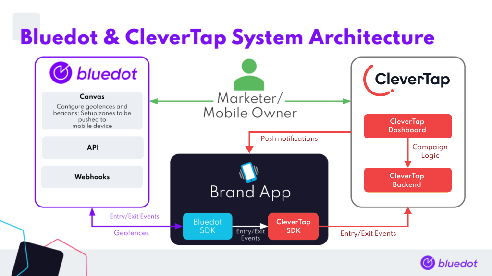
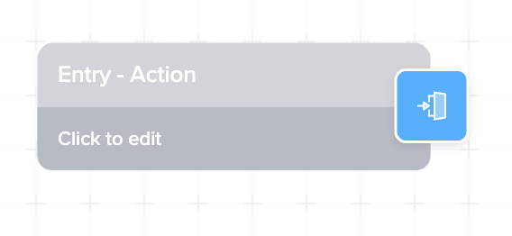
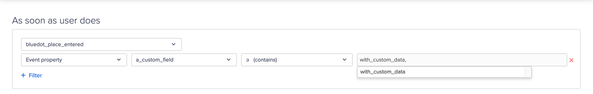
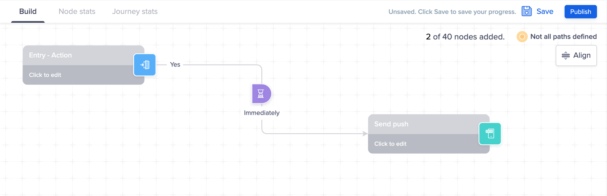

Overview
=====================

**Background**
--------------

Rezolve is a location platform that provides an accurate and simple geofencing platform for apps. After integrating the Rezolve Point SDK and setting geofences, customers can create personalized location-based experiences for their users.

CleverTap enables mobile marketers to analyze, segment, engage, and measure their mobile marketing efforts. The mobile marketing platform combines real-time customer insights, an advanced segmentation engine, and powerful engagement tools into one intelligent marketing platform, making it easy to collect, analyze, and act on customer insights in milliseconds.

**Integration architecture diagram**
------------------------------------

**Rezolve setup**
-----------------

### Creating a new Project

Creating a Project is your first step. All your Zones and all geofeatures exist within a Project. More information on adding and managing the Rezolve Canvas project can be found [here](../../Canvas/Creating%20a%20new%20project.md).

### Adding a Zone

You’ll need to create a Zone before you can start adding in specific Geofeatures. Each Zone can have one or many Geofeatures – that’s up to you and your use-case. More information on adding and managing Zones can be found [here](../../Canvas/Add%20a%20new%20zone.md).

**CleverTap setup**
-------------------

We use custom events to trigger Campaigns in CleverTap. Once you follow the steps above under Rezolve Setup, you will start seeing Rezolve events arriving in the CleverTap dashboard as Rezolve zones are triggered. Once those events have been registered with CleverTap, you can then use these in analytics and to kick off engagement journeys.

#### **Setting up a CleverTap journey powered by Rezolve**

To set up a CleverTap journey triggered by a user entering or exiting a location, drag and drop an “Action” into the entry criteria field. Once the entry criteria look like the image above, click it and fill out the basic requirements for the journey. In the second section, select “+ Create an ad-hoc segment”.  

Here, you can select the `bluedot_place_entered` or `bluedot_place_exited` events as the triggering event, and add filters to specify under which circumstances a journey should be triggered (in the above example, when the `a_custom_field attribute` equals `with_custom_data`, which might be populated from Rezolve zone custom data).  

Once the action entry criteria is setup, standard CleverTap behaviors can be defined, all triggered by the user’s interaction with a physical location.

More information on CleverTap Journeys can be found [here](https://docs.clevertap.com/docs/journeys).

**Integrating SDK to Android App**
----------------------------------

A detailed step by step guideline is available [here](./Android.md).

**Integrating SDK to iOS App**
------------------------------

A detailed step by step guideline is available [here](./iOS.md).

**Integration examples**
------------------------

Android – [https://github.com/Bluedot-Innovation/PointSDK-CleverTapIntegrationExample-Android](https://github.com/Bluedot-Innovation/PointSDK-CleverTapIntegrationExample-Android)

iOS – [https://github.com/Bluedot-Innovation/PointSDK-CleverTapSDK-IntegrationExample-iOS](https://github.com/Bluedot-Innovation/PointSDK-CleverTapSDK-IntegrationExample-iOS)

