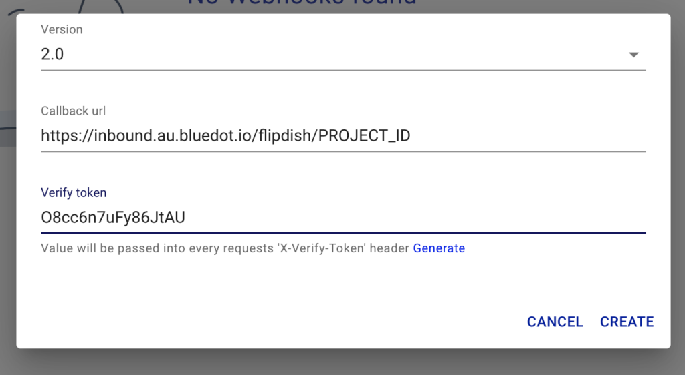
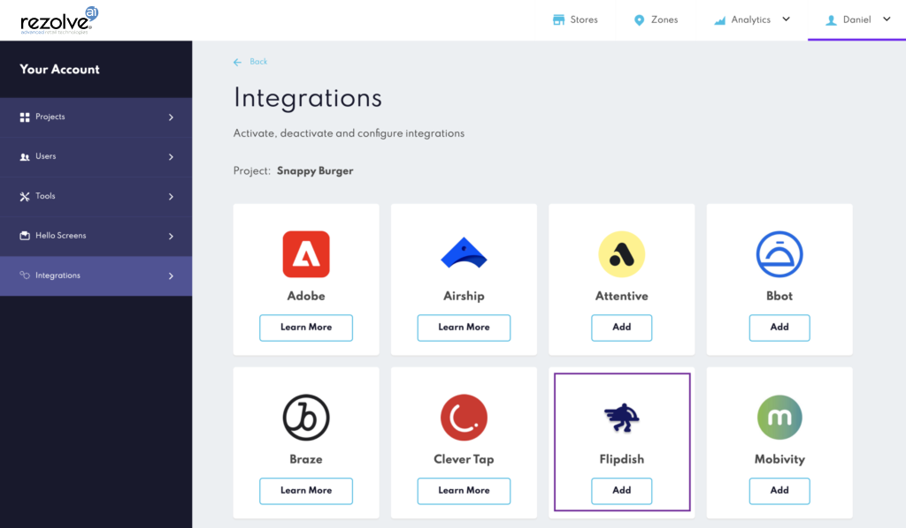
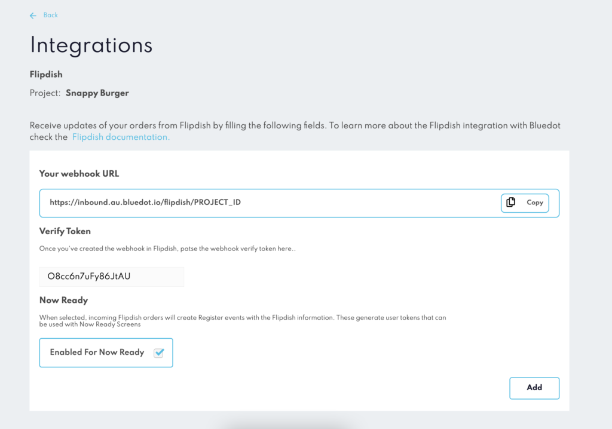
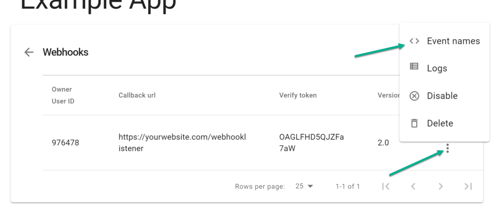
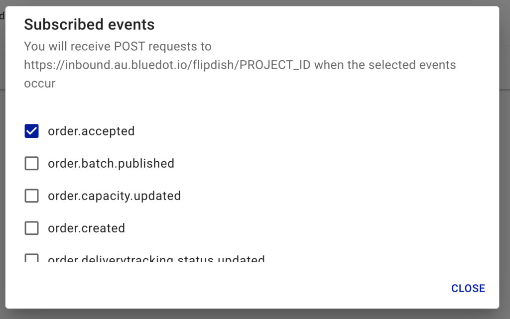
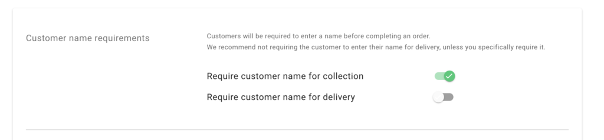

Flipdish Integration
====================

With Bluedot’s first-class arrival toolkit and Flipdish, you can offer your customers a great curbside or pickup experience. You can track customers’ arrival at your restaurant with Hello Screens, informing your staff when a customer is on the way or has arrived to pick up their order.

Create a Webhook in Flipdish
----------------------------

To set up a webhook on Flipdish, head over to Flipdish’s portal and click on the **Developer tools** link (under your avatar). For more information, please check Flipdish’s **[Creating webhooks documentation.](https://developers.flipdish.com/docs/creating-webhooks)** You can get all the details to fill Create Webhook form from Canvas. More details in the next step.

:::info
When creating the Flipdish webhook please make sure to select **version 2.0**. The Bluedot integration only supports this webhooks version.
:::

Find Bluedot Webhook URL
------------------------

To fill out the _Create Webhook_ form, the first step is to get Bluedot’s webhook URL, which you will use when creating the Webhook in Flipdish.

From Canvas, go to the integrations section and select Flipdish.

Copy the Bluedot Webhook URL from the Your webhook URL section and paste it into Flipdish’s Create Webhook form.

Also, paste the **verify token** in Canvas. This token allows us to ensure that requests sent to the callback URL are secure and coming from Flipdish.

Add the `order.accepted` event on Flipdish’s webhook
----------------------------------------------------

The next step is to add the `order.accepted` event. Click the _hotdog_ menu icon and **Event names.**

Select the `order.accepted` event.

Once configured the Webhook and added the `order.accepted` event , you can set up your stores in Canvas. Make sure to use the Flipdish Store Id when adding the Destination ID to your stores. To learn more about creating your stores in Canvas, check [Canva’s Store Management documentation](../Canvas/Stores/Store%20management.md).

:::info
To get your Store IDs please contact Flipdish support team at [help.flipdish.com](https://help.flipdish.com/)
:::

Additional Settings
-------------------

From the Order settings menu, please select the Customer Name required for collection. We’ll display the customer’s name to the store staff on Hello Screens.

If you have any questions, contact us at [help@bluedot.io](mailto:help@bluedot.io)