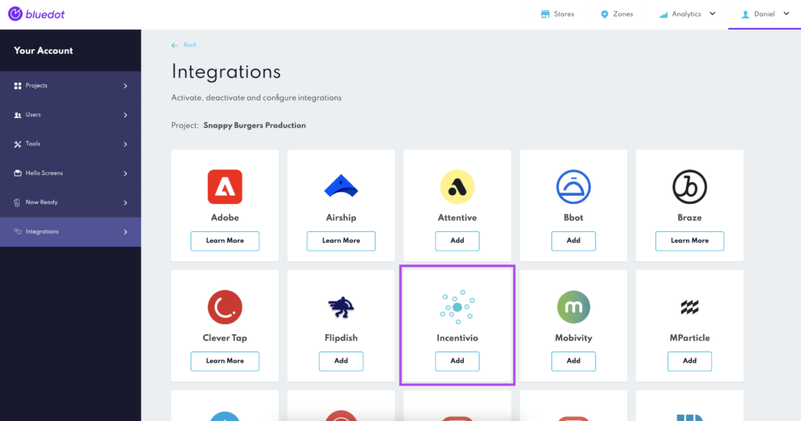
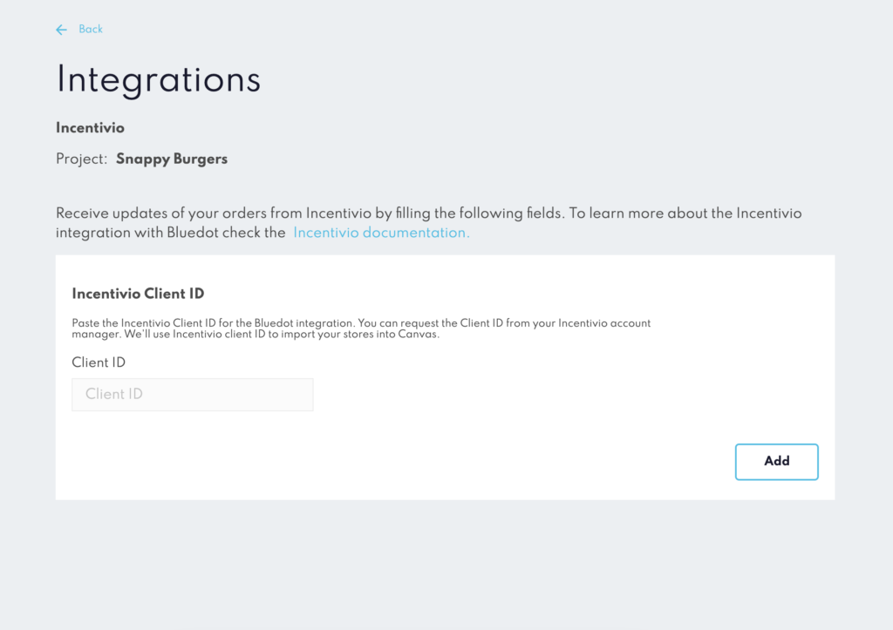

Incentivio Integration
======================

With Rezolve's first-class arrival toolkit and Incentivio, you can offer your customers a great curbside or pickup experience. You can track customers’ arrival at your restaurant with Hello Screens, informing your staff when a customer is on the way or has arrived to pick up their order.

Get your Incentivio Customer ID
-------------------------------

To enable the Incentivio integration, you must input your Incentivio Customer ID. Contact your Incentivio representative to get your Customer ID.

Enable the integration in Canvas
--------------------------------

Once you’ve got your Incentivio Customer ID, you’re ready to enable the Rezolve - Incentivio integration. From Canvas, go to the integrations section and select Incentivio.

Then copy/paste your Incentivio Client ID and click on save. And that’s all! Really, you don’t need to do anything else.

Importing your Stores details to Canvas
---------------------------------------

Once you’ve enabled the Incentivio integration, Canvas will import all Stores’ details you already set in Incentivio. Canvas will automatically sync with Incentivio every 24 hours to update any change you might make or add new stores.

Setting up Hello Screens for your stores
----------------------------------------

After Canvas have imported all your store’s data from Incentivio. Now you’re ready to start [setting up Hello Screens in your stores](../Canvas/Stores/Store%20management.md) and [configure the branding for Now Ready](../Now%20Ready/Configure%20Now%20Ready.md).