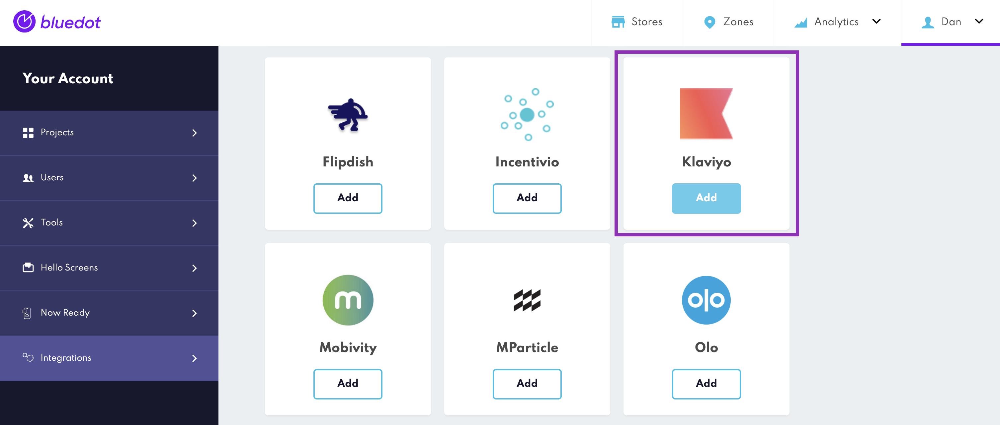

Klaviyo Integration
======================

Bluedot is a location platform that provides an accurate and simple geofencing platform for apps. After integrating the Bluedot SDK and setting geofences, customer’s can create personalised location-based experiences for their users.

Klaviyo, a marketing automation platform, excels in using real-time data for personalized email and SMS campaigns, focusing on customer engagement and retention.

Integrating Bluedot with Klaviyo combines accurate, privacy-compliant location data with targeted marketing automation. This allows for location-triggered emails and SMS, enhancing customer engagement through timely and relevant communications, and linking physical locations with digital marketing actions seamlessly.

Enable the integration in Canvas
--------------------------------

From Canvas, go to the integrations section and select Klaviyo.

Enter Klaviyo API Key
---------------------

Authentication with Klaviyo requires entering a Klaviyo API Key in Canvas. This key is necessary for each project to enable the integration. To learn more the Klayvio API Key please refer to the [Klaviyo Authentication documentation](https://developers.klaviyo.com/en/reference/api_overview#authentication)

Select Bluedot Events
---------------------

You can select specific Bluedot events ([Geo-triggering](../Point%20SDK/iOS/Geo-triggering.md), [Tempo](../Tempo/Overview.md), [Wave](../APIs/Wave%20API/Overview.md), and [Hello Orders](../Hello%20Screens/Overview.md)) to send to Klaviyo to send messages. If you want to know which events are best suited for your use case, please consult with your Bluedot CX representative.

Custom Event Meta Data: It's essential to include at least one profile identifier with the prefix `klaviyo_` in the Custom Event Meta Data of the Bluedot events:
   - `klaviyo_id`
   - `klaviyo_email`
   - `klaviyo_phone_number`

Check the [Custom Event Meta Data documentation](../Custom%20Event%20Metadata.md) to learn more.

:::info
**Klaviyo API Rate Limits**
To ensure seamless event transmission from Bluedot to Klaviyo, it's crucial to understand Klaviyo's API rate limits that apply to your account. These limits affect how many events you can send within a given timeframe. We strongly advise familiarizing yourself with these limits to guarantee that all your Bluedot-triggered events are successfully received by Klaviyo without interruption. For detailed rate limit information, please visit [Klaviyo's API documentation](https://developers.klaviyo.com/en/docs/rate_limits_and_error_handling).
:::

If you have any questions, please reach out to our team at [help@bluedot.io](mailto:help@bluedot.io)