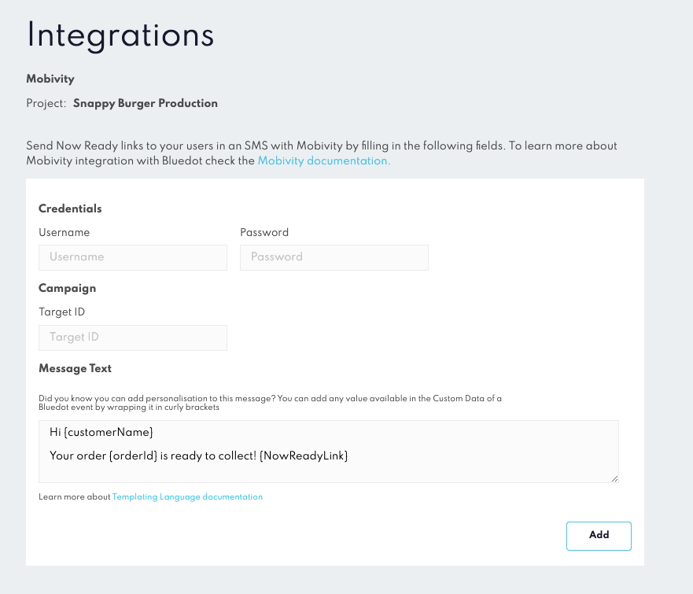

Mobivity Integration
====================

Take your Curbside & Pickup experience to the next level with Mobivity’s leading message marketing platform and Rezolve’s best-in-class customer arrival technology. 

Send a personalized SMS to your customers to collect their curbside pickup orders with a link to our pre-built web app _Now Ready__,_ to let a store know when they’re on their way and when they’ve arrived.

How does it work?
-----------------

When a new order is registered, Rezolve will call Mobivity’s Messaging Platform API to send an SMS to the mobile number included on the Register Order event and the message content set on Canvas.

You can register orders from one of our Order Management partners (I.E. Olo) or [Rezolve’s Register Order API](https://events-docs.bluedot.io/#operation/registerOrder).

Configuration
-------------

On the Mobivity’s Recurrency Platform, copy your REST API _username_ and _password_, and then copy the t_arget ID_ of the messaging campaign. 

Then, on the Canvas Integrations page under _Mobivity,_ paste your _username_, _password_ and _target ID._

On the “_Message_ _Content”_ field, create your personalized message. You can add any value in the [Custom Event Meta Data](../Custom%20Data.md) of a Rezolve event by wrapping it in curly brackets. Don’t forget to include the value {NowReadyLink} in the template where you want the link to appear.

