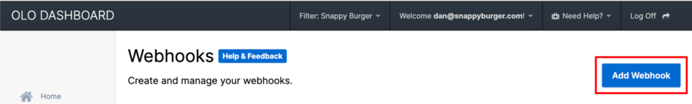
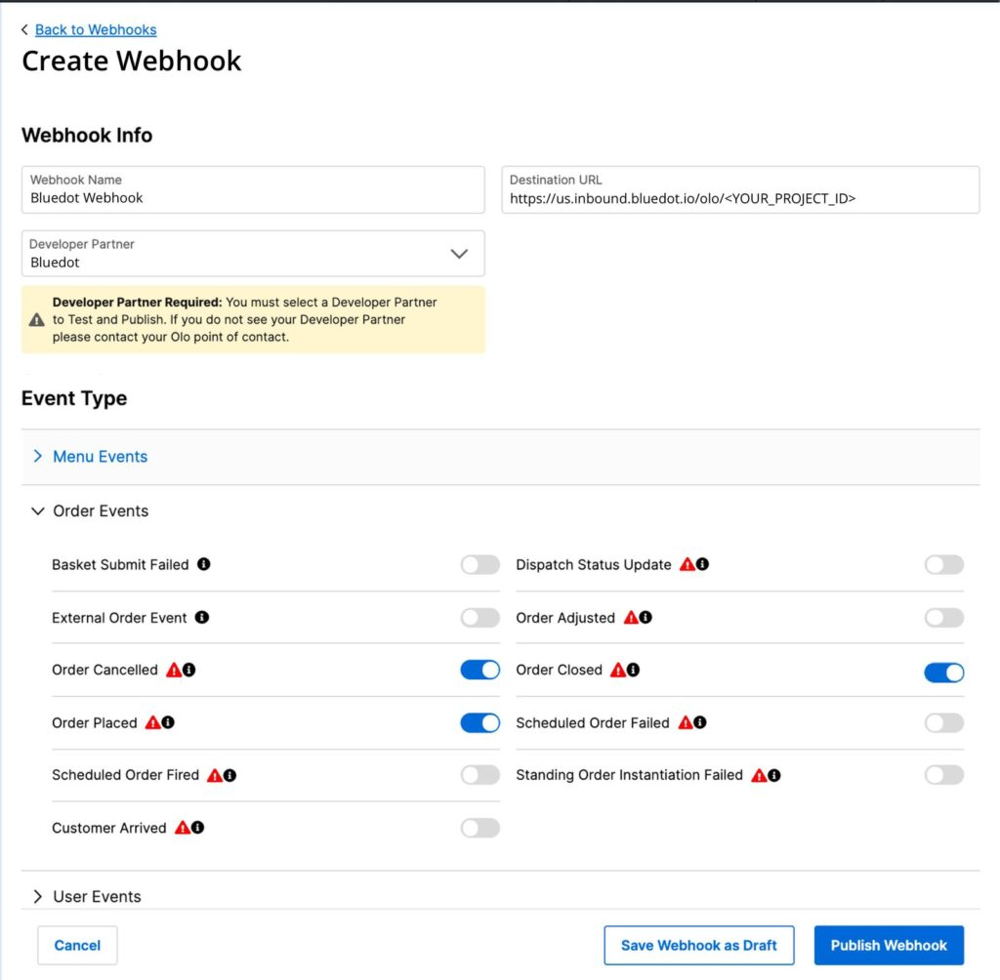
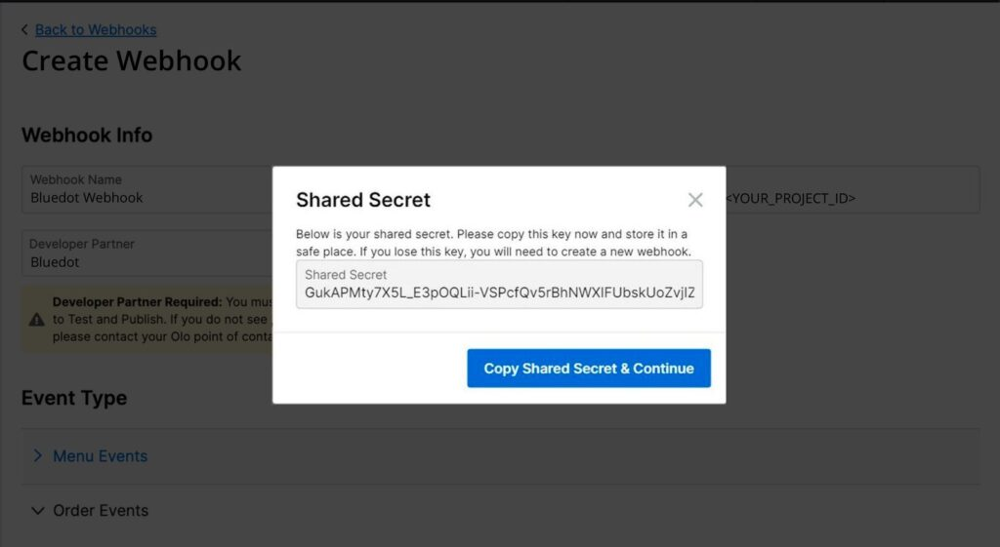

Olo Integration
===============

With Rezolve’s first-class arrival toolkit and Olo, you can offer your customers a great curbside or pickup experience. You can track customers’ arrival at your restaurant with Hello Screens, informing your staff when a curbside order has been placed, completed or cancelled.

How does it work?
-----------------

When a customer places a curbside or pickup order, Olo fires a webhook event to Rezolve to track the order. Then you can follow the customer’s journey to collect the order. You’ll get customers’ live updates using the Point SDK in your mobile app or our pre-built web-based experience: Now Ready.

Configure the Olo Webhooks
--------------------------

### Find Rezolve Webhook Destination URL

The first step is to get Rezolve's webhook URL; we will use it later when creating the Webhook in Olo.

Get the `projectId` in the Projects section in Canvas to complete the Webhook URL based on the region where your account is located.

| **Region**    | **Webhook URL**                                |
|---------------|------------------------------------------------|
| North America | https://us.inbound.bluedot.io/olo/<PROJECT_ID> |
| Europe        | https://eu.inbound.bluedot.io/olo/<PROJECT_ID> |
| APAC          | https://au.inbound.bluedot.io/olo/<PROJECT_ID> |

### Create a Webhook in Olo

In Olo’s Dashboard add a new webhook from the _Dev Tools_ section. 

Fill the following fields:

*   **Webhook Name:** This is a description to recognize Rezolve's webhook.
*   **Destination URL:** Use Rezolve's Webhook URL covered in the previous step here.
*   **Developer Partner:** Select the “_Bluedot_” option.

From the Order Events section, enable the following events:

*   Order Placed
*   Order Cancelled
*   Order Closed

Once you are ready to Publish the webhook, first select “Test Webhook”.  This will bring up the Shared Secret modal. Pass the _Shared Secret_ to Rezolve to ensure your account is secured.

Configure the Hello Orders Webhooks:
------------------------------------

You’ll need the `userId` in the “_Register Order_” webhook event to track the customer’s journey. When using the Point SDK, you’ll include the `userId` in the [Custom Event Meta Data](../Custom%20Data.md) before starting Tempo, and when using Now Ready, you’ll use the `userId` to create the URL to Now Ready.

Learn more about [Hello Order Webhooks here.](../Webhooks/Hello-order.md)

Point SDK: Tempo
----------------

With Tempo, you can accurately track the customer’s ETA to collect its order in real-time. To use the service, you must implement the Point SDK into your mobile app and include the `userId` in the Custom Event Meta Data before starting Tempo. You can get the `userId` from the Hello Order Webhooks, as mentioned above.

Once Tempo is running, your store staff will see the customer’s ETA updates on Hello Screen.

To learn more, check [Tempo’s Documentation](../Tempo/Overview.md).

Now Ready
---------

Once Rezolve receives the order details from Olo, the Hello Orders Webhooks will fire a Register Order event with a `userId`. You will use that `userId` to generate the URL for the Now Ready experience you’ll share with your customer. From Now Ready, customers will inform the store when they’re on their way to collect the order and when they arrive. To generate the Now Ready URL for an order, you simply add the \`userId\` as a parameter to the Now Ready base URL: `https://us.nowready.io/<USER_TOKEN>`

To learn more, [check Now Ready’s Documentation](../Now%20Ready/Overview.md).

:::info
You can also use any of our SMS Messaging integrations to send the Now Ready link to your users. When implementing any of the SMS integration, we’ll take care of creating the Now Ready URL. You just need to craft the content of the message.

To learn more, check out our [Integrations documentation.](./Overview.mdx)
:::
