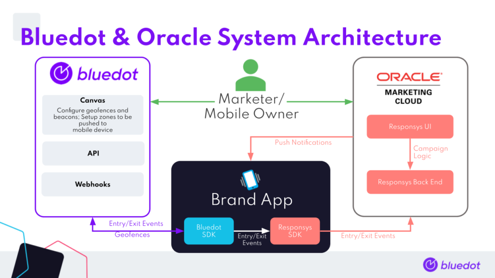

Oracle Responsys Integration
============================

Introduction
------------

The Rezolve Point SDK integration with Oracle Responsys Mobile App Platform Cloud Service enables mobile apps to take advantage of the power of Cloud services and the superior accuracy, Geofence and Geolines™ triggering capabilities of the Rezolve Point SDK. To take full advantage of the Oracle Cloud services, it is mandatory to integrate needed libraries/frameworks generally called SDKs to your mobile app. At this moment, only iOS and Android mobile apps are supported by the SDK. This page contains steps on how to update your mobile app’s source and integrate the app with Rezolve Point SDK.

Integration system architecture
-------------------------------

-------------------------------------------------------------------------------------------------------

Integration prerequisite
------------------------

To start with integration we need to first gather the two necessities for the integration of SDK.

*   The most important one is to add the SDK framework to the app source code, which can be either achieved by adding the artifacts via the online repository or copy-pasting the SDK artifacts files to the project.
*   The second important element is the credentials needed to authorize or authenticate the SDK. These credentials are unique for each account or application.

It is assumed that Responsys SDK is integrated into the project with the required credentials. If this is not the case, then an extra step is required that involves integrating Responsys SDK into the project. Detailed documentation is available here for [Android](https://docs.oracle.com/en/cloud/saas/marketing/responsys-develop-mobile/android/android.htm) and [iOS](https://docs.oracle.com/en/cloud/saas/marketing/responsys-develop-mobile/ios/ios.htm).

Integrating SDK to Android App
------------------------------

A detailed step by step guideline is available [here](../../Point%20SDK/Android/Overview.md).

Integrating SDK to iOS App
--------------------------

A detailed step by step guideline is available [here](../../Point%20SDK/iOS/Overview.md).