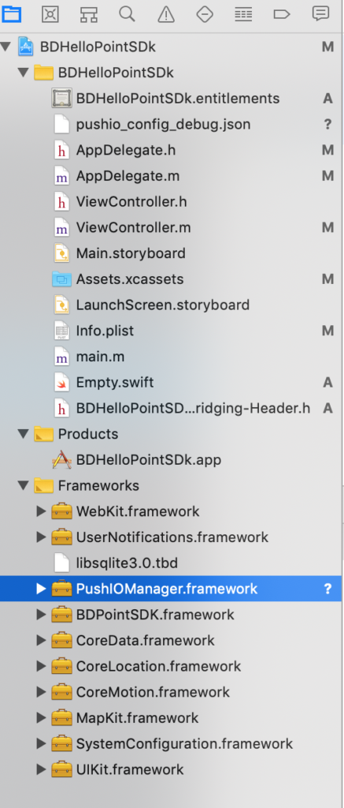

Oracle iOS Integration
======================

Integrate your project with Oracle Responsys SDK
------------------------------------------------

Add `PushIOManager.framework`  in Linked frameworks & `pushio_config_debug.json` in your project as below:



Integrate your project with Rezolve Point SDK
---------------------------------------------

To integrate PointSDK, please refer to the integration steps documented [here](../../Point%20SDK/iOS/Quick%20Start.md)

Interaction between the Responsys SDK and Rezolve Point SDK
===========================================================

Setup Rezolve Location Services
-------------------------------

1\. Import required header files.
```swift
import BDPointSDK
import PushIOManager
```

2\. Implement Bluedot [`BDPGeoTriggeringEventDelegate`](https://ios-docs.bluedot.io/Protocols/BDPGeoTriggeringEventDelegate.html):

```swift
YourClass: BDPGeoTriggeringEventDelegate { 
    func didEnterZone(_ enterEvent: GeoTriggerEvent) 
    { 
        // Your logic when the device enters a Rezolve Zone 
    } 

    func didExitZone(_ exitEvent: GeoTriggerEvent) 
    { 
        // Your logic when the device leaves a Rezolve Zone 
    } 
}
```

3\. Assign GeoTriggeringEvent delegate with your implementation
```swift
let instanceOfYourClass = YourClass() 
BDLocationManager.instance()?.geoTriggeringEventDelegate = instanceOfYourClass
```

4\. Authenticate with the Rezolve services

```swift
BDLocationManager.instance()?.initialize(withProjectId: projectId) { error in
     guard error == nil else {
        print("There was an error initializing the Rezolve Point SDK: \(error.localizedDescription)")
        return
     }
}
```

5\. Start Oracle Responsys within the `application:didFinishLaunchingWithOptions` method. For a detailed setup guide, please refer to Oracle Responsys Documentation [here](https://docs.oracle.com/en/cloud/saas/marketing/responsys-develop-mobile/ios/step-by-step.htm)

```swift
// Configure the SDK        
var configName = "YOUR_PRODUCTION_CONFIG_FILE_NAME.json"

#if DEBUG
configName = "YOUR_DEBUG_CONFIG_FILE_NAME.json"
#endif

PushIOManager.sharedInstance().configure(withFileName: configName, completionHandler: { (configError, response) in
    if let error = configError {
        print("Not able to configure the sdk \(error.localizedDescription)")
        return
    }
})
```

6\. Send event to Oracle Reponsys via Rezolve [didEnterZone](https://ios-docs.bluedot.io/Protocols/BDPGeoTriggeringEventDelegate.html#/c:objc(pl)BDPGeoTriggeringEventDelegate(im)didEnterZone:) / [didExitZone](https://ios-docs.bluedot.io/Protocols/BDPGeoTriggeringEventDelegate.html#/c:objc(pl)BDPGeoTriggeringEventDelegate(im)didExitZone:) callbacks.

```swift
func didEnterZone(_ enterEvent: GeoTriggerEvent) {
	let geoRegion = PIOGeoRegion(
            geofenceId: entryEvent.fenceId.uuidString,
            geofenceName: entryEvent.fenceName,
            speed: enterEvent.entryEvent?.locations[0].speed ?? 0.0,
            bearing: enterEvent.entryEvent?.locations[0].course ?? 0.0,
            source: "Rezolve Point SDK",
            zoneId: enterEvent.zoneInfo.id.uuidString,
            zoneName: enterEvent.zoneInfo.name,
            dwellTime: 0,
            extra: enterEvent.zoneInfo.customData)

	PushIOManager.sharedInstance().didEnter(region: geoRegion) { error, _ in
		if error == nil {
			print("Geofence Entry Event triggered successfully")
		} else {
			print("Unable to send Geofence Entry Event, reason: \(String(describing: error?.localizedDescription))")
		}
	}
}

func didExitZone(_ exitEvent: GeoTriggerEvent) {
	let geoRegion = PIOGeoRegion(
		geofenceId: exitEvent.fence.id,
		geofenceName: exitEvent.fence.name,
		speed: 0.0,
		bearing: 0.0,
		source: "Rezolve Point SDK",
		zoneId: exitEvent.zoneInfo.id.uuidString,
		zoneName: exitEvent.zoneInfo.name,
		dwellTime: Int(exitEvent.exitEvent?.dwellTime ?? 0),
		extra: exitEvent.zoneInfo.customData)

	PushIOManager.sharedInstance().didExit(region: geoRegion) { error, _ in
		if error == nil {
			print("Geofence Exit Event triggered successfully")
		} else {
			print("Unable to send Geofence Exit Event, reason: \(String(describing: error?.localizedDescription))")
		}
	}
}
```

**GitHub Sample Project**

A sample project which demonstrates the integration of Responsys SDK and Rezolve Point SDK is available on **[GitHub](https://github.com/Bluedot-Innovation/OracleMinimalApp-iOS)**.