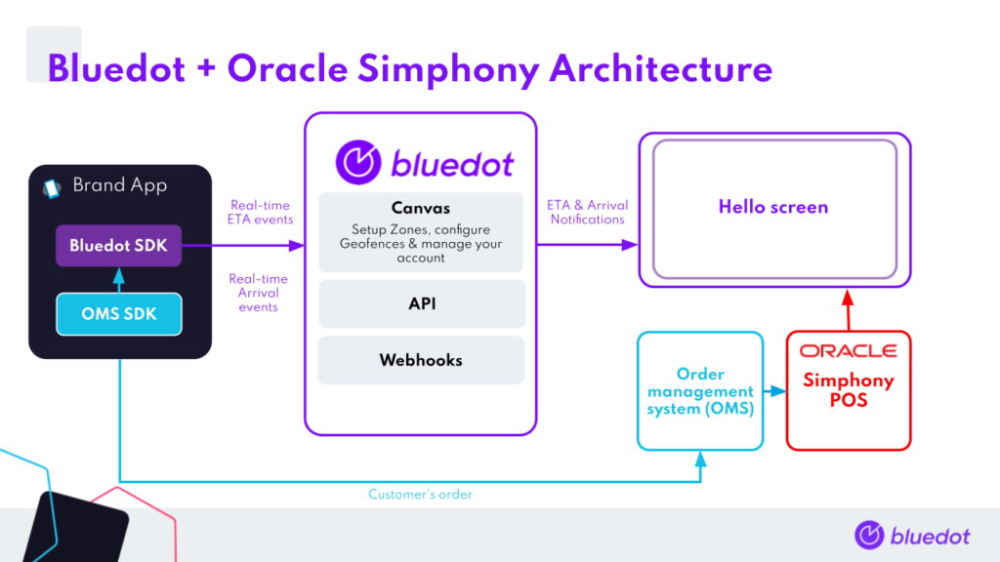

Oracle Simphony POS Integration
===============================

This integration between Oracle Simphony and Bluedot will enable your brand to understand the estimated time of arrival (ETA) and real-time Arrival of your mobile customers. Store Associates can use these insights, for efficient order preparation and a seamless, contactless, curbside pick-up experience.

The real-time updates for your customer’s ETA and actual Arrival can be viewed:

*   In your POS (using our webhook service),
*   Through an existing integration partner, or
*   On Hello screens

Notes
-----

*   Before starting your Bluedot Oracle Simphony implementation, a few important notes:
*   You need to have an Order management system (OMS) implemented which creates orders in the Simphony POS
*   Your brand app must pass the `OrderID` from the OMS to the Bluedot SDK
*   The OMS should add the `OrderId` to `PCheckInfoLines` of the Simphony POS check.
*   Implement Tempo for ETA & Arrival notifications
*   You’ll continue to use your POS to view the actual order details and make adjustments (additional items, cancellations, refunds etc.)

Integration Architecture
------------------------



Integration Steps
-----------------

1\. Integrate the Bluedot SDK within your mobile app:

a. [iOS integration guide](../Point%20SDK/iOS/Quick%20Start.md)

b. [Android integration guide](../Point%20SDK/Android/Quick%20Start.md)

2\. For every order, the app will have to define the following fields in the [custom event metadata](../Custom%20Event%20Metadata.md).

Mandatory

*   OrderId (this should be the OrderID generated using the OMS)
*   CustomerName

:::info
***Optional***
You can attach any of the following customer information to each ETA and Arrival Event to help your in-store team understand the customer and power a seamless curbside experience.

The type of information you may want to attach includes Customer MobileNumber, VehicleModel, VehicleColor, VehicleRegistration._
:::

**Android example**
```java
class TestApplication extends Application
{
    @Override
    public void onCreate() {
        ...
        Map<String, String> metaData = new HashMap<>();
        //Mandatory
        metaData.put("hs_OrderId", <OMS OrderID>);
        metaData.put("hs_CustomerName", <Customer Name>);
        //Optional
        metaData.put("hs_MobileNumber", <Mobile Number>);
        metaData.put("hs_VehicleModel", <Vehicle Model>);
        metaData.put("hs_VehicelColor", <Vehicle Color>);
        metaData.put("hs_VehicelPlate", <Vehicle Plate>);
        // Setting metaData object in setCustomEventMetaData with BlueDotPointService.
        getServiceManager().setCustomEventMetaData(metaData);
        // Authenticate.
        getServiceManager().sendAuthenticationRequest(projectId, listener, restartMode)
    }
}
```

**iOS example**
```swift
func application(\_ application: UIApplication, didFinishLaunchingWithOptions launchOptions: [UIApplication.LaunchOptionsKey: Any]?) -> Boo {
    ...
    // Setting meta data in setCustomEventMetaData.
    BDLocationManager.instance()?.setCustomEventMetaData([
        "hs_OrderId" : "The Olo order id",
        "hs_CustomerName": "The user's name",
        "hs_MobileNumber": "The user's mobile number",
        "hs_VehicleModel": "The user's vehicle model",
        "hs_VehicleColor": "The user's vehicle color", 
        "hs_VehiclePlate": "The user's vehicle plate" ])

    // Authenticate
    BDLocationManager.instance()?.authenticate(withApiKey: projectId, requestAuthorization: BDAuthorizationLevel.authorizedAlways)
    ...
   return true
}
```

3\. When an order is placed, the app will start [Tempo](../Tempo/Integrate%20the%20Point%20SDK%20in%20your%20app.md) on the Bluedot SDK.

4\. The order for the particular OrderID and its ETA will update in real-time on your Hello screen.

* * *

If you have any questions about this guide or implementing Bluedot & Oracle Simphony together, reach out to our Engineering Support Team [help@bluedot.io](mailto:help@bluedot.io).